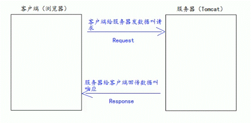
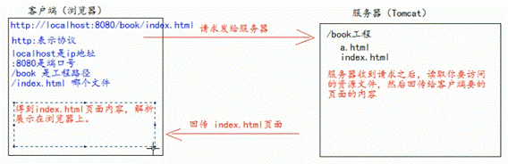
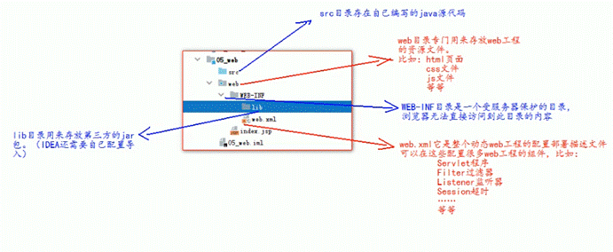

# 一、JavaWeb与Tomcat

## （1）什么是JavaWeb

- JavaWeb是指，所有通过Java语言编写可以通过浏览器访问的程序的总称，叫JavaWeb。
- JavaWeb是基于请求和响应来开发的。
    - 什么是请求
        - 请求是指客户端给服务器发送数据，叫请求（Request）。
        - 如：html页面from表单发送请求给服务器。
    - 什么是响应
        - 响应是指服务器给客户揣回传数据，叫响应（Response）。
    - 请求和响应的关系
        - 请求和响应是成肉出现的，有请求就有响应。

## （2）Tomcat在Javaweb中扮演的角色



## （3）Web资源的分类

- web资源按实现的技术和呈现的效果的不同，又分为静态资源和动态资源两种。
- 静态资源：html、css、js、txt、mp4、jpg...
- 动态资源：jsp页面、Servlet程序

## （4）常用的Web服务器

- Tomcat、Jboss、GlassFish、Resin、WebLogic

# 二、Tomcat服务器

## (1)Tomcat启动方式

- 通过tomcatGUI启动
- cmd启动
    - cd到Tomcat的安装目录下
    - 输入命令catalina run

## （1.1）Tomcat启动成功验证

- http://localhost:8080
- http://127.0.0.1:8080
- http://本机电脑真实ip:8080

## （1.2）Tomcat关闭

- GUI关闭
- 关闭cmd

## （1.3）修改Tomcat默认端口号

- 修改Tomcat安装目录下conf目录的server.xml文件：将Connector标签的port属性值更改即可
- 小知识：所有http协议的网址默认端口为80，即当端口号为80时可被系统自动省略，如http://www.baidu.com域名所对应的ip后面会加:80

## （2）部署web工程到tomcat中的方式

### 方案一、通过tomcat安装目录部署

- 在tomcat安装目录下的webapps文件中创建自己的工程文件夹。
- 将自己的工程文件（模块下的文件）拷贝进去即可。
- 访问方式：http://localhost:8080/工程文件夹/文件
    - 原理：localhost:8080本质是访问到安装目录下的webapps文件
- localhost启动成功验证界面原理：当8080/后面不接工程文件夹时，将默认访问webapps中的root工程的index界面“即tomcat登陆验证成功界面”。

### 方案二、在conf/Catalina/localhost文件夹中添加配置文件

- 在该目录下添加xxx.xml配置文件（xxx为该项目的名称）
- xml文件中书写配置信息：
```xml
<Context path="/abc" docBase="F:\text" />  // 其中path表示浏览器的访问路径,docBase表示工程文件夹的路径

// 上述表示工程文件夹在F盘中的text文件夹中,可通过http://localhost:8080/abc进行访问
```


## （2.1）部署原理：（直接打开html文件和用tomcat打开html文件有什么区别）

- 直接打开一般页面的网址为：file:///盘符://路径...
    - 这使用的是file://协议，即表示告诉浏览器直接读取file:协议后的路径解析显示即可

- 而tomcat打开是通过服务器请求回传的网页：



# 三、Tomcat与Intellij idea

## （1）动态web工程目录



## （2）idea部署原理

- 将Tomcat配置文件复制到本地的一个专门部署项目的文件夹中
    - 专门部署的文件夹：工程部署后在服务器硬盘上的绝对路径

- 将web目录下你的所有文件都复制过去，并将其他的java程序编译复制过去。
- 采用Tomcat部署方案二，书写xml配置文件进行tomcat部署

 

 

 