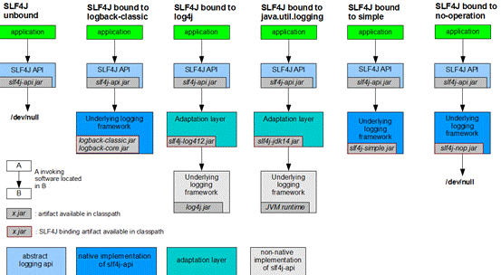

# 一、概述

- 一个日志门面层框架

- 官方文档：http://www.slf4j.org/manual.html

- 旧API适配支持：http://www.slf4j.org/legacy.html

- API实现类图：（导入不同的实现类适配）




 

# 二、使用

## 1、导入依赖
```xml
<!-- https://mvnrepository.com/artifact/org.slf4j/slf4j-api -->
<dependency>
  <groupId>org.slf4j</groupId>
  <artifactId>slf4j-api</artifactId>
  <version></version>
</dependency>
```
## 2、导入其实现类依赖并编写实现类

- 具体可以参考实现类图


## 3、API

- 具体可以参考Logger类源码。

- 以下均以Info级别API进行示例。

- 日志级别：在SLF4J中，一共将日志分成5个级别

    - error：严重的错误


    - warn：警告


    - info：描述指明信息


    - debug：调试打印信息


    - trace：程序运行轨迹信息


## 4、HelloWorld
```java
public static void main(String[] args) {
    // 通过日志工厂获取一个日志对象
    // 指定当前日志输出类为当前类，即HelloWorld类
    Logger logger = LoggerFactory.getLogger(HelloWorld.class);

    // 输出info级别日志
    logger.info("Hello World");
}
```
## 5、占位符填充

- 在SLF4J中，使用loggerAPI可以用占位符的形式进行日志的输出。

    - 使用{}进行占位，在后方可变参数中按顺序输出即可。

```java
// 这是hello，这是world
logger.info("这是{}，这是{}", "hello", "world");
```
## 6、最佳实践

- 将获取日志类语句书写在类属性中：

```java
public class HelloWorld {

  private final Logger logger = LoggerFactory.getLogger(HelloWorld.class);

  public void serviceFun() {
     logger.info("测试日志输出");
  }  
}
```
- 使用lombok直接创建日志对象

    - 使用Slf4j注解直接创建了日志对象（log），具体可以参考lombok框架官方文档。

```java
@Slf4j
public class HelloWorld {
  public void serviceFun() {
     log.info("测试日志输出");
  }  
}
```
- 日志级别的提前判断

    - 根据阿里规范，在输出trace/debug/info级别日志时，需要提前进行日志级别的判断，防止性能损耗。具体为底层框架会进行字符串拼接的无意义操作。

```java
public class HelloWorld {
  ...
  public void serviceFun() {
     // 日志级别判断
     if(logger.isInfoEnabled()) {
       logger.info("测试日志输出");
     }
  }  
}
```


