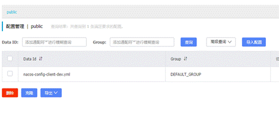

# 一、基本概念

- Nacos（NamingConfigurationService）（命令配置服务）
- 官方文档：https://nacos.io/zh-cn/docs/what-is-nacos.html
- Nacos是一个更易于构建云原生应用的动态服务发现、配置管理和服务管理平台。
    - 即Nacos = 服务注册中心 + 配置中心 的组合
    - Nacos = Eureka + Config + Bus
- 安装：
    - github上下载安装包解压后启动即可。
    - 使用docker compose安装，在使用example中的mysql模板时，需要注意，卷轴挂载的目标文件，需要手动改为对应的build/conf/application.properties。其mysql相关的配置是从application.properties中读取，然后application.properties中的配置则是从env中的模板读取.
```shell
// 以单机模式启动
sh startup.sh -m standalone
```
- 连接默认端口为8848。2.x.x版本以上改为9848

- 监控页访问：（默认账号密码都为nacos）

```http
GET http://<ip>:8848/nacos
```


# 二、服务注册中心

- 与Eureka、Consul等服务注册中心类似。


## 1、客户端实例

- 引入依赖：

```xml
<dependency>
  <groupId>com.alibaba.cloud</groupId>
  <artifactId>spring-cloud-starter-alibaba-nacos-discovery</artifactId>
  <version></version>
</dependency>
```
- 主类开启功能：

```java
// 与Consul等注册中心使用同一个开启注解
@EnableDiscoveryClient
public class OrderNacosMain83 {
  public static void main(String[] args) {
      SpringApplication.run(OrderNacosMain83.class, args);
  }
}
```
- 配置application：

```yaml
spring:
  cloud:
    nacos:
      discovery:
        # nacos服务地址
        server-addr: <ip:port>
```
- 服务实例启动成功后将会在nacos监控页服务管理中看到。

- 注意：nacos与Ribbon进行了整合，使用传统的服务调用即可直接使用负载均衡。


## 2、服务注册架构

- nacos在CAP模型中可以CP或AP自由切换。

```http
PUT ip:port/nacos/v1/ns/operator/switches?entry=serverMode&value=AP|CP
```
- AP或CP代表：


- 与其他服务注册框架的对比：


# 三、配置中心

- Nacos作配置中心其原理与SpringCloudConfig类似。并且Nacos自带动态刷新功能，修改配置文件内容后注册的服务实例自动刷新，无需给具体实例发送请求进行刷新或者使用bus进行主题广播刷新。


## 1、客户端实例

- 引入依赖：

```xml
<dependency>
  <groupId>com.alibaba.cloud</groupId>
  <artifactId>spring-cloud-starter-alibaba-nacos-config</artifactId>
  <version></version>
</dependency>
```
- application与bootstrap配置：

```yaml
# bootstrap ==>
spring:
  cloud:
    nacos:
      config:
        # nacos服务地址 
        server-addr: <ip:port>
        # 指定读取配置文件的拓展名格式，如properties,yum
        file-extension: yml
# 健康检查 - 暴露服务刷新端点
management:
  endpoints:
    web:
      exposure:
        include: "*"


# application ==>
spring:
  profiles:
    # 表示当前的开发环境，进行配置文件的选择，与SpringCloudConfig一致
    active: dev
```
- 引用远程配置文件的Bean对象上配置健康检查刷新注解：

```java
@Component
@RefreshScope
public class ConfigClient {
  @Value("${config.info}")
  private String configInfo;
}
```
## 2、服务端实例

- 在Nacos监控页-配置列表中添加配置，并按照指定命名DataId即可。




- DataId命名规则：

    - 服务实例名-开发环境-文件后缀，命名即可。

    - ${spring.application.name}-${spring.profile.active}.${spring.cloud.nacos.config.file-extension}


## 3、命名空间和组和数据标识

- Nacos服务配置提供区分部署环境的配置文件分区。类似Java中的模块与包与类的关系。

    - 默认Namespace=public，并且public命名空间无法被删除。

    - 默认Group=DEFAULT_GROUP。

    - 默认Cluster=DEFaULT。


- 客户端配置实例：

```yaml
spring:
  cloud:
    config:
      file-extension: yml
      group: <组名>
      namespace: <命名空间UUID，在nacos控制台中获取>
```


# 四、集群高可用和持久化存储

- 集群架构，使用Nginx作为代理转发至各个Nacos实例：


## 1、配置nacos持久化数据库

- Nacos默认使用嵌入式数据库（derby数据库）实现数据的存储，并且在高版本的Nacos中支持使用derby数据库进行集群部署。

- 具体参考官方文档https://nacos.io/zh-cn/docs/cluster-mode-quick-start.html

- 使用外置数据库（仅支持Mysql数据库）：

    - 默认nacos中conf目录下有一个mysql的数据库nacos-mysql.sql文件。在mysql中建立数据库（数据库名nacos_config）执行即可完成nacos数据库的创建。

    - 修改配置文件迁移数据库（从derby数据库转移到mysql数据库）。

    - 默认在nacos中conf目录下application.properties文件中修改使用自带数据库即可。

- 注意：2.x版本以上的nacos数据库有变动，需要添加密钥字段，否则会在添加配置文件的时候报（发布失败）错

```properties
#*************** Config Module Related Configurations ***************#
### If use MySQL as datasource:
spring.datasource.platform=mysql

### Count of DB:
db.num=1

### Connect URL of DB:
db.url.0=jdbc:mysql://127.0.0.1:3306/nacos?...
db.user.0=nacos
db.password.0=nacos
```
## 2、集群配置

- 在nacos中conf目录下有cluster.conf配置文件，将其中每行改为nacos实例的ip:port即可。

    - 注意：ip不能使用localhost等，必须使用hostmame -i命令能识别的ip。

```properties
# ip:port
200.8.9.16:8848
200.8.9.17:8848
200.8.9.18:8848
```
- 配置Nginx：

```nginx
# 使用负载均衡组upstream配置所有实例
upstream cluster {
  server 200.8.9.16:8848;
  server 200.8.9.17:8848;
  server 200.8.9.18:8848;
}

# 反向代理ip到负载均衡组cluster中
server {
  listen ...;
  server_name ...;
  location / {
      proxy_pass http://cluster;
  }
}
```
- Nacos实例启动：

```shell
# 使用内置数据库启动
sh startup.sh -p embedded

# 使用外置数据库启动
sh startup.sh
```
- 微服务实例注册使用Nginx代理ip进行注册即可。


 

 

 