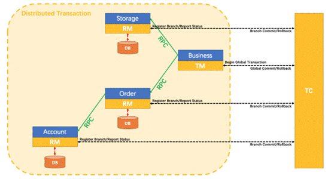

# 一、概念

## 1、分布式事物

- 传统单体应用中基本采用一个应用程序对应一个数据库，其中使用Spring管理数据库事物即可操作一个数据库进行数据的提交回滚。
- 在分布式事物中，单体应用被拆分成多个微服务，其数据库也被拆分成多个，其中一个微服务和数据库的关系可以是1:1、1:N、N:1，而在多个数据库中，无法使用一个微服务进行事物的控制。如订单模块、仓储模块、支付模块分别为三个数据库，而调用则只需要使用订单模块关联调用即可。

## 2、Seata

- Seata 是一款开源的分布式事务解决方案，致力于提供高性能和简单易用的分布式事务服务。Seata 将为用户提供了 AT、TCC、SAGA 和 XA 事务模式，为用户打造一站式的分布式解决方案。
- 官网http://seata.io/zh-cn/docs/overview/what-is-seata.html

# 二、AT模式搭建

- 架构图：



- TC（Transaction Coordinator）事务协调者
    - n 维护全局和分支事务的状态，驱动全局事务提交或回滚。
- TM（Transaction Manager）事务管理器
    - 定义全局事务的范围：开始全局事务、提交或回滚全局事务。
- RM（Resource Manager）资源管理器
    - 管理分支事务处理的资源，与TC交谈以注册分支事务和报告分支事务的状态，并驱动分支事务提交或回滚。

## 1、服务端搭建

- 需要搭建一个Seata的服务端总控，即TC事物协调者。

### （1）安装

- 官网下载seata-server即可。

### （2）配置文件修改

- 修改file.conf文件可用于选择使用mysql-db作为seata的存储。
- 修改registry.conf文件registry块可用于向注册中心注册seata-server服务。

### （3）使用mysql作为seata数据保存

- 需要三张表，具体在官方文档中查看建立。默认数据库名为seata。
```mysql
-- the table to store GlobalSession data
drop table if exists `global_table`;
create table `global_table` (
 `xid` varchar(128) not null,
 `transaction_id` bigint,
 `status` tinyint not null,
 `application_id` varchar(32),
 `transaction_service_group` varchar(32),
 `transaction_name` varchar(128),
 `timeout` int,
 `begin_time` bigint,
 `application_data` varchar(2000),
 `gmt_create` datetime,
 `gmt_modified` datetime,
 primary key (`xid`),
 key `idx_gmt_modified_status` (`gmt_modified`, `status`),
 key `idx_transaction_id` (`transaction_id`)
);

-- the table to store BranchSession data
drop table if exists `branch_table`;
create table `branch_table` (
 `branch_id` bigint not null,
 `xid` varchar(128) not null,
 `transaction_id` bigint ,
 `resource_group_id` varchar(32),
 `resource_id` varchar(256) ,
 `lock_key` varchar(128) ,
 `branch_type` varchar(8) ,
 `status` tinyint,
 `client_id` varchar(64),
 `application_data` varchar(2000),
 `gmt_create` datetime,
 `gmt_modified` datetime,
 primary key (`branch_id`),
 key `idx_xid` (`xid`)
);

-- the table to store lock data
drop table if exists `lock_table`;
create table `lock_table` (
 `row_key` varchar(128) not null,
 `xid` varchar(96),
 `transaction_id` long ,
 `branch_id` long,
 `resource_id` varchar(256) ,
 `table_name` varchar(32) ,
 `pk` varchar(36) ,
 `gmt_create` datetime ,
 `gmt_modified` datetime,
 primary key(`row_key`)
);
```


## 2、客户端搭建

- 使用分布式事物的所有服务实例都为seata的客户端，即RM、TM。

    - 事物的开启者服务为RM，参与事物的服务为TM。

- 客户端需要与seata-server在同一个注册中心。


### （1）引入依赖
```xml
<dependency>
  <groupId>com.alibaba.cloud</groupId>
  <artifactId>spring-cloud-starter-alibaba-seata</artifactId>
  <!-- seata-all 依赖版本一定要和seata-server版本一致，不一致可以剔除 -->
  <exclusions>
      <exclusion>
        <groupId>io.seata</groupId>
        <artifactId>seata-all</artifactId>
      </exclusion>
  </exclusions>
</dependency>

<!-- 引入自己版本的seata-all依赖 -->
<dependency>
  <groupId>io.seata</groupId>
  <artifactId>seata-all</artifactId>
  <version>1.4.2</version>
</dependency>
```
### （2）添加客户端配置文件

- 在resources目录下添加file.conf文件即可，文件内容与seata-server一致。即修改为数据库存储。


### （3）为服务下需要控制的数据源新增seata数据表进行数据存储

- 所有seata客户端需要控制的数据库都需要增加。

```mysql
CREATE TABLE `undo_log` (
 `id` bigint(20) NOT NULL AUTO_INCREMENT,
 `branch_id` bigint(20) NOT NULL,
 `xid` varchar(100) NOT NULL,
 `context` varchar(128) NOT NULL,
 `rollback_info` longblob NOT NULL,
 `log_status` int(11) NOT NULL,
 `log_created` datetime NOT NULL,
 `log_modified` datetime NOT NULL,
 `ext` varchar(100) DEFAULT NULL,
 PRIMARY KEY (`id`),
 UNIQUE KEY `ux_undo_log` (`xid`,`branch_id`)
) ENGINE=InnoDB AUTO_INCREMENT=1 DEFAULT CHARSET=utf8;
```
### （4）配置application

- 事物分组名可以自定义，必须要和seata-server中的事物分组名配置后缀一致。

- service.vgroupMapping.my_test_tx_group=default。所以事物组为my_test_tx_group。

```yaml
seata:
  # 默认为my_test_tx_group
  tx-service-group: my_test_tx_group
  # 注册seata客户端
  registry:
    type: nacos
    nacos:
      server-addr: tracejp.top:8848
      group: "SEATA_GROUP"
      namespace: "65090f86-29ef-41cc-96dd-7acca4bfcf8b" 
```
### （5）在需要开启事物的方法上（RM）加入注解即可

- 示例采用订单模块 -> 库存模块 ，订单模块 -> 账户模块。当注解方法出现异常时，管理模块下的所有数据源都将进行回滚操作。

```java
@GlobalTransactional  // 全局事物开启，与spring事物@Transactional类似
public void createOrder(Order order) {
  // 新建订单
  add(order);
  // 库存减少
  storageService.decrease(order.getId(), "已扣减，数据库已经被修改");
  // 用户扣钱
  accountService.decrease(1L, "用户已经扣钱，数据库被修改");
  // 修改订单
  order.setValue("订单已经完成");
  update(order);
}
```


# 三、使用Nacos-Config作为配置中心

- 使用nacos作配置中心，否则每个客户端都需要有一份自己的配置文件。


## 1、Nacos配置文件推送

- seata将所有配置全部拆开为每个dataID，所以需要通过脚本批量推送到nacos配置中心。

- 需要下载config文件config.txt，脚本文件nacos-config.sh。

- 下载地址https://github.com/seata/seata/tree/develop/script/config-center

- 文件存放路径：

```
--- config.txt
  --- script目录
   --- nacos-config.sh
```
- 根据文件存放目录后执行shell脚本即可批量推送配置：

```shell
sh nacos-config.sh
# 指定nacos的ip-port  -h -p
# 指定nacos组和命名空间  -g -t
# 指定用户名密码  -u -w-u -w
```
## 2、Seata-Server配置使用Nacos

- 修改seata-server中registry.conf文件的config块，可以使用nacos作为配置中心读取配置文件。


## 3、Seata-Client配置使用Nacos

- 在application中配置config即可。

```yaml
seata:
  tx-service-group: my_test_tx_group
  # 使用nacos配置中心
  config:
    type: nacos
  nacos:
    server-addr: tracejp.top:8848
    group : "SEATA_GROUP"
    namespace: "65090f86-29ef-41cc-96dd-7acca4bfcf8b"
  registry:
    type: nacos
    nacos:
      server-addr: tracejp.top:8848
      group: "SEATA_GROUP"
      namespace: "65090f86-29ef-41cc-96dd-7acca4bfcf8b"
```


