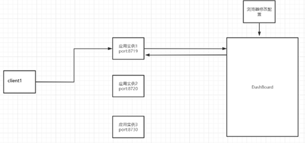

# 一、基本概念

## 1、概念

- Sentinel 是面向分布式服务架构的流量控制组件，主要以流量为切入点，从流量控制、熔断降级、系统自适应保护等多个维度来保障微服务的稳定性。
- 并且支持直接监控页细粒度统一配置。即更加细粒化的Hystrix。
    - Hystrix：规则配置和出错处理都在代码实例中。
    - Sentinel：规则配置在监控页中，出错处理在代码实例中。
- 官方文档：https://sentinelguard.io/zh-cn/docs/introduction.html

## 2、监控页安装

- Sentinel可以分为Sentinel核心库和Dashboard监控页，且核心库不依赖Dashboard。阿里云官网也提供了公用的云上监控页AHAS-Dashboard。
- dashboard监控页直接下载jar包运行即可。监控页默认端口为8080。使用http://ip:8080即可访问。默认账号密码都为sentinel。
- 监控页默认采用懒加载机制，只有在与客户端连接后，并且请求过一次REST接口才会显示数据。

## 3、客户端配置

- 引入依赖：
```xml
<!-- sentinel -->
<dependency>
   <groupId>com.alibaba.cloud</groupId>
   <artifactId>spring-cloud-starter-alibaba-sentinel</artifactId>
</dependency>
```
- application配置：

```yaml
spring:
  cloud:
    sentinel:
      transport:
        # sentinel 监控页服务地址,如果不配置则默认不连接监控页
        dashboard: <ip:port>
        # 配置监控端口，当前客户端启动后将会启动一个新的线程监听8719端口
        # 此端口用于与监控页交互或接收REST请求配置
        # 默认8719端口，如果端口被占用则端口号+1直到找到未占用的端口
        port: 8719
```
- 新增REST接口并请求即可。

- 8719端口与8080端口：



# 二、服务规则配置

## 1、流控规则

- 服务流控，即流量控制。与服务降级类似，但只是针对请求流量进行控制，并不会对响应超时、异常等情况进行处理。


### （1）图形化配置属性概念

- 资源名：唯一，相对路径接口请求地址。

- 针对来源：填微服务名，可以针对调用者进行限流，默认值default（限制所有）。

- 阈值类型：

    - QPS：以每秒请求数进行判断，每秒请求数超过单击阈值则触发限流。

    - 线程数：以总连接线程数进行判断，连接线程数超过单击阈值则触发限流。

        - 线程数类型无法配置监控效果，只能为快速失败。

- 单机阈值：以秒为单位的最大值，为阈值类型的具体数值。

- 是否集群：是以单个实例作为阈值总和，还是以服务下的所有实例作为阈值总和。

- 流控模式：

    - 直接：接口到达限流条件时，将接口限流。

    - 关联：当关联的资源（接口）触发限流后，就限流自己。如支付模块触发限流后将下单模块进行限流。

    - 链路：将调用者单独区分计算，针对请求的来源（链路）单独统计信息和限流。客户端A和客户端B的限流统计分开。

- 监控效果：

    - 快速失败：直接响应失败字符串“Blocked by Sentinel(flow limiting)”。

        - 源码com.alibaba.csp.sentinel.slots.block.flow.controller.DefaultController

    - WarmUp：

        - 预热/冷启动：当系统长期压力较小，突然一次上升到高压力会瞬间压垮系统，所以需要让流量缓慢增加，在配置预热时长（单位秒）内逐渐增加到阈值上限。

        - 预热公式：阈值除以coldFactor（冷加载因子，默认值为3）等于预热阶段阈值。

        - 假设QPS配置为9，预热时长为5：表示最初阈值为9/3=3，5秒阈值后改为原配置9。

    - 排队等待：

        - 请求超过阈值时，后续请求暂时不进行限流处理，而使用漏桶桶算法对请求进行匀速排队处理。如果排队时长超过配置的超时时间，再进行限流处理。

        - 类似流量削峰。用于处理间隔性突发流量，如每几秒一波大流量，并希望能在系统空闲时间逐渐处理请求，而不是在第一秒直接进行限流处理。


## 2、熔断降级规则

- 类似Hystrix的服务熔断和服务降级整合版。在Sentinel架构中，断路器没有Hystrix的半开状态，只有断开和关闭的状态。所以无法区分熔断和降级。实例熔断后抛出DegradeException异常。


## （1）图形化配置属性概念

- 资源名：唯一，相对路径接口请求地址。

- 降级策略：

    - 慢比例调用：

        - 选择以慢调用比例作为阈值，即响应时长的平均值。

        - 最大RT（RoundTrip响应时间）：请求时间大于最大RT，则判定为慢比例调用。

        - 比例阈值：慢比例调用请求占请求总和阈值，取0.0-1.0。

    - 异常比例：

        - 异常比例占请求占请求总和的阈值，取0.0-1.0。

    - 异常数：

        - 即异常比例的个数版。超过配置的个数则进行熔断。

- 熔断时长（窗口期）：闸刀断开时长，熔断时长过后才会进行闭合尝试。

- 最小请求数：至少需要有多少请求才能触发熔断降级。

- 统计时长：在统计时长内统计数据进行是否超过阈值的判断。


## 3、热点规则

- 即服务流控的细粒度化限流。通过配置热点规则，可以具体到接口传入的参数进行限流控制，其限流模式仅支持QPS模式和快速失败。

- 如一个REST接口，其中包含三个参数int a,int b,int c。此时可以指定参数索引1（int b）进行限流，那么将只针对接收带了int b参数的请求进行限流。


### （1）图形化配置属性概念

- 资源名：唯一，相对路径接口请求地址。

- 参数索引：

    - 当前接口的热点参数索引，即方法参数从左至右的索引。

- 单击阈值：请求限流最大值。

- 统计窗口时长：即统计时长。

- 是否集群：与服务监控是否集群属性一致。


### （2）热点规则附加项

- 当配置完接口具体参数限流后，可以通过修改热点规则中高级选项，新增多个对例外的具体值的限制，如传入值为3时限流阈值为多少等。

- 参数类型：参数的数据类型，只能为Java基本类型。

- 参数值：例外项参数具体值。

- 限流阈值：该值对应的限流阈值。


## 4、授权规则（来源访问控制）

- 可以根据调用方来限制资源是否通过。即服务A可以不让服务B调用。


### （1）图形化配置属性概念

- 资源名：唯一，相对路径接口请求地址。

- 流控应用：调用方的服务名，多个服务名用逗号分隔。

- 白名单/黑名单：若配置白名单则只有请求来源位于白名单内时才可通过，若配置黑名单则请求来源位于黑名单时不通过，其余的请求通过。


## 5、系统规则

- 可以将整个服务实例系统进行限流保护，结合应用的Load、总体平均RT、入口QPS和线程数等几个维度的监控指标进行限流。与其他规则不一样，其他规则是接口级别的，而系统规则是整个服务实例级别的。


### （1）图形化配置属性概念

- 阈值类型：

    - LOAD：自适应，仅支持linux系统生效，当系统 load1 超过阈值，且系统当前的并发线程数超过系统容量时才会触发系统保护。系统容量由系统的 maxQps * minRt 计算得出。设定参考值一般是 CPU核数 * 2.5。

    - RT：

        - 当单台机器上所有入口流量的平均 RT 达到阈值即触发系统保护，单位是毫秒。

    - 线程数：

        - 当单台机器上所有入口流量的并发线程数达到阈值即触发系统保护。

    - 入口QPS：

        - 当单台机器上所有入口流量的 QPS 达到阈值即触发系统保护。

    - CPU使用率：

        - 当系统 CPU 使用率超过阈值即触发系统保护（取值范围 0.0-1.0）。

- 阈值：对应阈值类型的具体值。


# 三、自定义失败处理

- 使用注解支持的@SentinelResource可以用于定义资源，即定义具体方法的兜底方案。当监控页配置后触发限流、降级熔断、热点规则、授权策略时，将执行自定义的方法，即进行兜底方法的处理。

- @SentinelResource注解与Hystrix的@HystrixCommand注解几乎一致。但是对于服务流控降级的处理和出现异常的处理进行了区分。即Sentinel严格区分了对于监控页规则和出现异常时的处理方法。

    - blockXXX只针对监控页配置违规进行处理。主要只拦截BlockException异常。

    - fallbackXXX只针对Java运行时异常进行处理。并且如果blockXXX方法未配置，也会拦截BlockException异常。

    - 即先blockXXX方法再fallbackXXX方法。

- 监控页资源名（图形化配置监控页资源名）

    - 可以是@SentinelResource注解的value属性值，也可以直接配置REST相对路径请求地址。


## 1、@SentinelResource配置实例

- 与Hystrix配置类似。

```java
// value：唯一id，用于监控页配置
// blockHandler：指定监控页配置违规处理方法
@SentinelResource(value = "testAAA",blockHandler = "blockException")
@GetMapping("/testA")
public String testA(String arg) {
  return "testA";
}

// * 注意：blockXXX方法必须方法签名相同
// 且最后一个形参中必须加上BlockException形参，否则无法找到方法
public String blockException(String arg, BlockException e) {
  return "blockXXX 出错拉";
}
```
- 在其他类中配置兜底方法：

```java
// XxxController类方法
@SentinelResource(value = "testAAA",
  // 指定方法具体类
  blockHandlerClass = SentinelException.class,
  blockHandler = "blockException")
@GetMapping("/testA")
public String testA(String arg) {
  return "testA";
}

// SentinelException类方法
// 方法必须为public且为static,可以引入AspectJ进行aop代理,即可使用private
public static String blockException(String arg, BlockException e) {
  return "blockXXX 出错拉";
}
```
- 其他属性指定：

    - blockXXX方法指定：针对监控页违规。

    - fallbackXXX方法指定：针对系统运行时异常。

    - exceptionsToTrace和exceptionsToIgnore：只捕获指定异常和不捕获指定异常。

```java
@SentinelResource(value = "testBBB",
      blockHandlerClass = SentinelException.class, blockHandler = "blockException",
      fallbackClass = SentinelException.class, fallback = "fallbackException"
)
// ...
```
## 2、监控页配置违规处理流程

- 监控页中可以分别针对REST接口进行规则配置和针对@SentinelResource注解唯一id进行配置。并且其中的效果不同。

- 针对REST规则配置：

    - 违规后默认直接返回失败提示字符串。

    - 可以自定义实现BlockExceptionHandler接口返回自定义的提示字符串。

- 针对@SentinelResource注解规则配置：

    - 监控页规则违规：

        - 先查找是否有配置blockXXX方法，如果有则使用blockXXX方法处理。

        - 否则判断是否配置了fallbackXXX方法，如果配置则按fallbackXXX方法进行处理返回。

        - 如果都未配置则直接抛出异常提示信息。并且springboot全局异常处理无法捕获

    - 出现系统运行时异常：

        - 未配置fallbackXXX则直接抛出异常信息，配置了fallbackXXX方法则按方法进行处理并返回。


# 四、与OpenFeign和Rabbion整合

- 与Hystrix和OpenFeign和Rabbion整合一致，具体参考Hystrix笔记。


# 五、规则持久化

- sentinel的所有规则都是配置在客户端的，所以sentinel客户端服务实例一旦宕机，则监控页中配置的规则将会丢失。

- 支持数据库、redis、文件、zookeeper、Nacos。

    - 可以将限流配置持久化进Nacos保存，所以只要Nacos配置不删除，则客户端配置将持续有效。


## 1、保存至Nacos

- 可以直接在Nacos配置管理中配置json规则即可，服务每次启动后，规则将会从Nacos中进行读取。即可实现Sentinel的持久化就是Nacos的持久化。

- 引入依赖（sentinel-nacos持久化）：

```xml
<dependency>
   <groupId>com.alibaba.csp</groupId>
   <artifactId>sentinel-datasource-nacos</artifactId>
</dependency>
```
- 配置application：

```yaml
spring:
  cloud:
    sentinel:
      # 持久化配置
      datasource:
        # nacos存储
        nacos:
          # nacos服务地址
          server-addr: tracejp.top:8848
          # nacos配置管理 - id
          dataId: cloudalibaba-sentinel-service
          # nacos配置管理 - group
          groupId: DEFAULT_GROUP
          # nacos配置管理 - 文件格式
          data-type: json
          # 规则类型：flow流
          rule-type: flow
```
- 在Nacos中添加规则配置：

    - config文件中dataId，groupId，文件格式指定为sentinel客户端配置的值。

    - 其中配置的选项可以参考官方文档XXXRule配置Field进行json配置即可。

```json
[
  {
      // k-v键值对：key为fieId，value为配置具体值
      "resource" : "",
      "limitApp" : "",
      ...
  }
]
```


