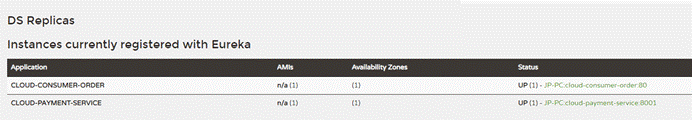

# 一、Eureka的两个组件

- Eureka-Server
- Eureka-Client

## 1、EurekaServer提供服务注册服务

- 各个微服务节点通过配置启动后，会在EurekaServer中进行注册，这样EurekaServer中的服务注册表中将会存储所有可用服务节点的信息，服务节点的信息可以在界面中直观看到。

## 2、EurekaClient通过注册中心进行访问

- 是一个Java客户端，用于简化Eureka Server的交互，客户端同时也具备一个内置的、使用轮询(round-robin)负载算法的负载均衡器。在应用启动后，将会向Eureka Server发送心跳(默认周期为30秒)。如果Eureka Server在多个心跳周期内没有接收到某个节点的心跳，EurekaServer将会从服务注册表中把这个服务节点移除（默认90秒)

# 二、新旧版本的依赖变化
```xml
<!-- 旧版本中，server和client依赖都集成在一起 -->
<dependency>
  <groupId>org.springframework.cloud</groupId>
  <artifactId>spring-cloud-starter-eureka</artifactId>
</dependency>

<!-- 新版本server和client依赖分开，根据需要导入 -->
<dependency>
  <groupId>org.springframework.cloud</groupId>
  <artifactId>spring-cloud-starter-netflix-eureka-server</artifactId>
</dependency>
<dependency>
  <groupId>org.springframework.cloud</groupId>
  <artifactId>spring-cloud-starter-netflix-eureka-client</artifactId>
</dependency>
```


# 三、服务端配置

1、引入eureka-server依赖

2、配置pom

```yaml
server:
  port: 7001
eureka:
  instance:
  hostname: localhost  # eureka服务端实例名称
  client:
    # false表示不向注册中心注册自己
    register-with-eureka: false
    # false表示自己就是注册中心，负责维护服务实例，不需要去检索服务
    fetch-registry: false
  service-url:
    # eureka-server交互地址 - server.port单独区分时需要为7001
    defalutZone: http://${eureka.instance.hostname}:${server.port}/eureka/
```
3、在启动类中加上eureka-server标识注解

```java
@SpringBootApplication
@EnableEurekaServer
public class EurekaMain7001 {
  public static void main(String[] args) {
     SpringApplication.run(EurekaMain7001.class, args);
  }
}
```
4、访问项目地址

- 如http://localhost:7001，即可访问到eureka服务管理页面。

# 四、客户端配置

1、引入eureka-client依赖

2、配置pom

```yaml
server:
  port: 8001
eureka:
  client:
  # false表示不向注册中心注册自己（默认true）
  register-with-eureka: true
  # false表示自己就是注册中心，负责维护服务实例，不需要去检索服务（默认true）
  fetch-registry: true
  service-url:
    # 设置注册到哪个eureka-server中
    defalutZone: http://localhost:7001/eureka
spring:
 application:
   # 此处name为 服务别名 ，也是Eureka中注册服务的唯一标识
   name: cloud-payment-service   
```
3、在启动类中加上eureka-client标识注解

```java
@SpringBootApplication
@EnableEurekaClient
public class PaymentMain8001 {
  public static void main(String[] args) {
     SpringApplication.run(PaymentMain8001.class, args);
  }
}
```
4、再次访问eureka服务管理页面即可看到注册的客户端服务。



# 五、集群与Eureka架构实现

- 单击版的Eureka只有一个服务注册中心，并且也只有一个生产者，所以在微服务中非常不稳定，假设此时服务中心宕机，那么将导致整个服务环境不可用，并且当消费者消费过度时，生产者无法供给。

- 所以需要满足Eureka架构，可以建立集群，即多个服务注册中心和多个生产者，实现负载均衡+故障容错。


## 1、集群注册中心

- 集群注册中心概念：

    - 互相注册，相护守望

    - 通过你注册我，我注册你的方式（A注册BC，B注册AC，C注册AB）来保证所有服务信息的存储，并且相互守望，并对外暴露出一个整体（内部是多个注册中心，对于其他微服务就是一个注册中心）。

- 配置集群：

    - 只需要在配置文件中修改交互地址即可，并且服务端实例名称不能相同。

```yaml
eureka:
  instance:
    hostname: eureka7001.com
  client:
    register-with-eureka: false
    fetch-registry: false
    service-url:
      # （交互地址，即守望的地址）另外一个注册中心服务地址，多个用逗号隔开
      defalutZone: http:eureka7002.com:7002/eureka/

# ------------------- #

eureka:
  instance:
    hostname: eureka7002.com
  client:
    register-with-eureka: false
    fetch-registry: false
    service-url:
    # 7001守望7002，7002守望7001
      defalutZone: http:eureka7001.com:7001/eureka/   
```
- DS Replicas（副本）将互相显示即配置成功。


## 2、客户端注册进集群

- 原本客户端只注册一个服务端，但集群有多个，所以客户端也需要分别注册到多个服务端之中。

```yaml
server:
  port: 8001
eureka:
  client:
    register-with-eureka: true
    fetch-registry: true
    service-url:
      # 使用逗号分隔分别填写需要注册的eureka-server地址即可 
      defalutZone: http://eureka7001.com:7001/eureka, http://eureka7002.com.7002/eureka
spring:
  application:
    name: cloud-payment-service  
```


## 3、生产者集群

- 同一个生产者可以注册多个微服务，相当于对应的一个微服务下有多个实例。

- 直接将生产者部署端口或地址更改，然后通过eureka客户端注册即可。可以使用ip:端口区分每个生产者。

- 消费者调用问题：

    - 当一个消费者调用一个生产者时，是采用RestTemplate使用Http://<注册服务名>进行调用的。

    - 而当一个消费者调用多个生产者时，调用将出现异常，因为消费者无法确定是哪个具体的生产者。所以需要在RestTemplate依赖注册Configuration方法中添加@LoadBalanced开启负载均衡即可。Eureka将通过负载均衡算法自动选择调用。此负载均衡是通过Ribbon实现的，具体可用参考-服务调用与负载均衡Ribbon笔记。


## 4、微服务信息配置
```yaml
eureka:
  instance:
    instance-id: {显示在管理页面中的服务名} 
    prefer-ip-address: true  # 访问路径是否显示ip地址
```

# 六、服务发现

- 客户端可以通过服务发现功能获取服务端中的注册成功的信息列表，如客户端可以知道其他服务的地址等。

- 并且在Eureka中，服务发现功能已经默认注入在容器中DiscoveryClient对象。只需要通过@Autowired注入依赖即可。

```java
@Autowired
private DiscoveryClient discoveryClient;

// 获取所有已经注册的微服务名称
List<String> discoveryClient.getServices();

// 获取指定微服务名称下的所有实例
List<ServiceInstance> discoveryClient.getInstances("<微服务名称>");

// 获取实例的具体信息（实例对应服务名，ip端口等）
serviceInstance.getServiceId();  // getHost(); ...
```


# 七、自我保护机制

## 1、保护机制概述

- Eureka保护机制是基于CAP理念中的AP分支而设计的。这也是与其他服务注册框架的差异之一。

- 自我保护：

    - 某个时刻一个微服务突然宕机了，Eureka-Server不会立刻清理该微服务的注册信息，依旧会对该微服务的信息进行保存。

    - 因为微服务注册到Eureka中时是通过间端发送心跳来确保服务是否存活的，而EurekaServer突然接收不到心跳可能有两种原因，出于Availability可用性考虑，Eureka不会因为几次心跳未收到而真的把注册成功的服务剔除。

        - 服务真的死亡了。

        - 服务是健康的，只是因为网络原因接收到的心跳延迟了。

    - 类似 房东收房租，如果其中有一户在当月1号未能及时交房租，Eureka将会处于可用性考虑，不会立刻把你赶出去，而是会宽限几天，到7号之前交房租就可以。

- 宁可保留错误的服务注册信息，也不盲目注销任何可能健康的服务实例。


## 2、禁用保护机制

- 在eureka-server中配置关闭即可

```yaml
eureka:
 server:
  # 关闭保护机制 
  enable-self-preservation: false
  # 逐出服务的时间，即在n秒内未收到心跳则逐出-默认90秒
  eviction-interval-timer-in-ms: <毫秒>
```
- 配置eureka-client发送心跳时间间隔：

```yaml
eureka:
 instance:
   # 向服务端发送心跳间隔-默认30秒 
   lease-renewal-interval-in-seconds: <秒> 
```

 

 

