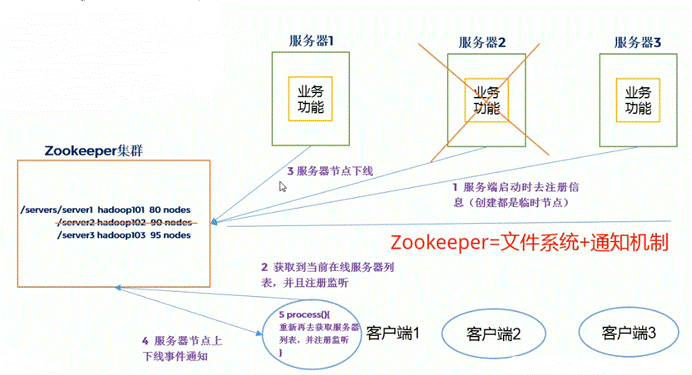
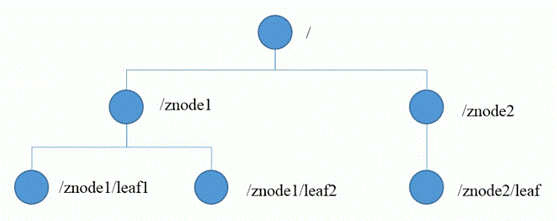

# 一、代替Eureka

## 1、Zookeeper概念

- Zookeeper是一个基于观察者模式设计的分布式服务管理框架，负责存储和管理数据，接受观察者的注册，一旦数据的状态发生变化，Zookeeper就将通知已经在Zookeeper上注册的观察者做出反应。
- Zookeeper是一个大数据下配合Hadoop的框架，但在SpringCloud中可以用来做微服务的注册与发现功能。



## 2、底层数据结构

- Zookeeper采用与Unix文件系统类似的数据结构，即树结构。整体上看作树，每个节点称为一个ZNode，每个ZNode默认能存储1MB数据，每个ZNode都可以通过其路径唯一标识。



- 节点类型：
    - 持久（Persistent）：客户端和服务器端断开连接后，创建的节点不会删除
    - 短暂（Ephemeral）：客户端和服务器端断开连接后，创建的节点自动删除

## 3、服务端基本命令

- 启动Zookeeper服务端：
```shell
./zkServer.sh start
```
- 查看当前ZNode下的所有内容（类似linux命令ls）

```shell
ls <path> [watch]
```
- 查看当前节点数据和详细数据（类似linux命令ll或ls-l）

```shell
ls2 <path> [watch]  // 新版本改为ls -l
```
- 创建节点

```shell
create  // -s含有序列，-e临时节点（重启或超时删除）
```
- 获取节点的值

```shell
get <path> [watch]
```
- 设置节点的具体值

```shell
set
```
- 查看节点状态

```shell
stat
```
- 删除节点

```shell
delete
```
- 递归删除节点

```shell
rmr
```


# 二、Zookeeper集群

- Zookeeper由一个领导者（Leader）和多个跟随者（Follower）组成集群。

- 基于ACP理论中的CP理论设计，Zookeeper集群将保持全局数据一致，保证更新请求顺序执行和数据更新的原子性。


## 1、集群选举机制

- 半数机制：集群中半数以上存活，则集群可用。

- Zookeeper虽然在配置文件中没有指定Master和Slave，但是在Zookeeper工作时，是有一个节点为Leader，其他为Follower的，而此Leader就是通过内部的选举机制临时产生的。

- 选举状态：

    - LOOKING：竞选状态。

    - FOLLOWING：随从状态，同步leader状态，参与投票。

    - OBSERVING：观察状态，同步leader状态，不参与投票。

    - LEADING：领导者状态。

- 选举机制：

    - 目前有5台服务器，每台服务器均没有数据，它们的编号分别是1,2,3,4,5,按编号依次启动，它们的选择举过程如下：

    - 服务器1启动，给自己投票，然后发投票信息，由于其它机器还没有启动所以它收不到反馈信息，服务器1的状态一直属于Looking(选举状态)。

    - 服务器2启动，给自己投票，同时与之前启动的服务器1交换结果，由于服务器2的编号大所以服务器2胜出，但此时投票数没有大于半数，所以两个服务器的状态依然是LOOKING。

    - 服务器3启动，给自己投票，同时与之前启动的服务器1,2交换信息，由于服务器3的编号最大所以服务器3胜出，此时投票数正好大于半数，所以服务器3成为领导者，服务器1,2成为小弟。

    - 服务器4启动，给自己投票，同时与之前启动的服务器1,2,3交换信息，尽管服务器4的编号大，但之前服务器3已经胜出，所以服务器4只能成为小弟。

    - 服务器5启动，后面的逻辑同服务器4成为小弟。


# 三、微服务注册

- 微服务注册进Zookeeper服务端时，会成为Zookeeper的一个ZNode被管理，并且采用临时的节点类型。


## 1、引入客户端依赖
```xml
<dependency>
  <groupId>org.springframework.cloud</groupId>
  <artifactId>spring-cloud-starter-zookeeper-discovery</artifactId>
  <version></version>
</dependency>
```
- 客户端版本不一致时会导致jar包冲突：

    - 解决方案一：修改服务端版本即可。

    - 解决方案二：修改客户端版本。

```xml
<!-- 1 排除springcloud中的zookeeper依赖 -->
<exclusions>
  <exclusions>
      <groupId>org.apache.zookeeper</groupId>
      <artifactId>zookeeper</artifactId>
  </exclusions>
</exclusions>  

<!-- 2 添加符合服务端版本的zookeeper依赖 -->
<dependency>
  <groupId>org.apache.zookeeper</groupId>
  <artifactId>zookeeper</artifactId>
  <version></version>
</dependency>
```
## 2、在Application中配置
```yaml
spring:
  application:
    name: cloud-provider-payment  # 服务名
  cloud:
    zookeeper:
      conect-string: <zookeeper服务端地址>    
```
## 3、在主启动类上添加客户端标识
```java
@SpringBootApplication
// 该注解用于向consul或zookeeper作为注册中心时注册服务
@EnableDiscoveryClient
public class PaymentMain8004 {
  public static void main(String[] args) {
      SpringApplication.run(PaymentMain.class, args);
  }
}
```


