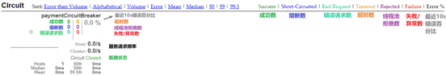
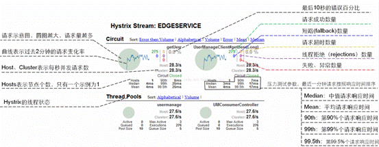

# 一、概念

- Hystrix是一个用于处理分布式系统的延迟和容错的开源库，在分布式系统里，许多依赖不可避免的会调用失败，比如超时、异常等，Hystrix能够保证在一个依赖出问题的情况下，不会导致整体服务失败，避免级联故障，以提高分布式系统的弹性。

- “断路器”本身是一种开关装置，当某个服务单元发生故障之后，通过断路器的故障监控（类似熔断保险丝)，向调用方返回一个符合预期的、可处理的备选响应（FallBack），而不是长时间的等待或者抛出调用方无法处理的异常，这样就保证了服务调用方的线程不会被长时间、不必要地占用，从而避免了故障在分布式系统中的蔓延，乃至雪崩。


# 二、服务降级

## 1、引入依赖
```xml
<dependency>
  <groupId>org.springframework.cloud</groupId>
  <artifactId>spring-cloud-starter-netflix-hystrix</artifactId>
  <version></version>
</dependency>
```
## 2、主类开启Hystrix断路器
```java
// 开启hystrix支持
@EnableCircuitBreaker
public class PaymentHystrixMain8001 {
  public static void main(String[] args) {
      SpringApplication.run(PaymentHystrixMain8001.class, args);
  }
}
```
## 3、配置生产者服务降级

- 正常运行时，若请求后该方法执行超过3秒钟，则会判定超时，即触发服务降级，按Hystrix配置将调用fallback指定方法返回。

```java
// 1 添加需要服务降级的方法
@HystrixCommand(

      // 2 选择兜底方法FallBack
      fallbackMethod = "paymentInfoTimeOutHandler",

      // 3 设置触发命令
      commandProperties = {

          // 4 命令：超时3秒则触发失败
          @HystrixProperty(name = "execution.isolation.thread.timeoutInMilliseconds", value = "3000")
      }
)

public String paymentInfoTimeout(Integer time) {
  // int a = 10/0;  // 出现运行时异常时也会触发服务降级
  // 暂停线程
  TimeUnit.SECONDS.sleep(time);
  return "正常访问---" + "耗时(秒)" + time;
}

// 时间暂停正常访问(兜底方案) !注意:兜底方法签名必须要与原方法一致
public String paymentInfoTimeOutHandler(Integer id) {
  return "服务器忙，稍后再试！";
}
```
## 4、配置消费者服务降级

- 与生产者服务降级配置类似，在可能需要进行服务降级的方法上配置@hystrixCommand注解，指定fallback方法，并且设置断路器命令即可。

- 生产者与消费者：

    - 在生产者中配置服务降级类似与自我保护机制。

    - 而在消费者中配置服务降级则类似与期望的预期调用。


## 5、类全局配置

- 一般的服务降级配置时，都需要单个方法对应单个fallback方法。不能起到全局配置的效果。

- 全局配置：

    - 可以使用@DefaultProperties注解将类中公共的配置资源抽离。指定过命令则用自己的，无指定的则用默认的。

```java
// 1 类全局的默认资源配置,其中包括commandProperties属性
@DefaultProperties(defaultFallback = "globalFallback")
public class DefaultOrderHystrix {

  // 方法1 无注解添加，即无服务降级配置
  public String test1(Integer time) {...}

  // 方法2 只有HystrixCommand注解，开启服务降级，并使用默认配置
  @HystrixCommand
  public String test2(Integer id) {...}

  // 方法3 存在自己的资源配置，就近原则使用自己的配置
  @HystrixCommand(
        fallbackMethod = "aloneFallback",
        commandProperties = {
             @HystrixProperty(name = "...", value = "..."),
        }
  )
  public String test3(Integer time) {...}

  // --------------服务降级方法
  public String aloneFallback() {return "这是单独服务降级方法";}
  public String globalFallback() {return "这是全局服务降级方法";}

}
```
## 6、与Feign整合配置

- SpringCloud将Hystrix与Feign进行整合，即可以实现在消费者处使用feign接口实现类的方式进行fallback的配置。此时，调用feign接口时开启的服务降级的fallback方法将会与实现类方法一一匹配，即如果接口调用出错，则会使用实现类对应的方法作为hystrix的fallback方法。

- application在feign中开启hystrix：

```yaml
feign:
  hystrix:
    enabled: true
```
- 配置feign接口：

```java
@Component
// 1 注解使用fallback属性指定哪个实现类作为fallback集合
@FeignClient(value = "<注册服务名>", fallback = PaymentHystrixServiceImpl.class)
public interface PaymentHystrixService {

  @GetMapping("/payment/hystrix/ok/{id}")
  String paymentInfoOK(@PathVariable("id") Integer id);

  @GetMapping("/payment/hystrix/timeout/{time}")
  String paymentInfoTimeout(@PathVariable("time") Integer time);
}

// 接口实现类：要求继承feign接口，springbean组件
@Component
public class PaymentHystrixServiceImpl implements PaymentHystrixService {
  @Override
  public String paymentInfoOK(Integer id) {
      return "fallback------ok";
  }
  @Override
  public String paymentInfoTimeout(Integer time) {
      return "fallback------timeout";
  }
}
```


# 三、服务熔断

- Hystrix配置服务熔断的过程与配置服务降级是类似的，其不一样的地方在于使用@HystrixCommand注解中指定的触发命令commandProperties 不一致而已。


## 1、配置熔断

- 以下配置的断路器参数表示：请求最大数超过总共阈值（10次）并且达到错误的阈值占比（60%->6次），则触发熔断。在熔断窗口期间内（10秒），请求都将直接调用fallback方法。直到窗口期结束，断路器进入半开状态进行判定。

```java
@HystrixCommand(
      fallbackMethod = "paymentCircuitBreakerHandler",
      commandProperties = {

          // 1 开启服务熔断功能
          @HystrixProperty(name = "circuitBreaker.enabled", value = "true"),

          // 2 请求总共阈值（次）：10
           @HystrixProperty(name = "circuitBreaker.requestVolumeThreshold", value = "10"),

          // 3 错误阈值百分比（百分比%）：60
          @HystrixProperty(name = "circuitBreaker.errorThresholdPercentage", value = "60")

          // 4 熔断窗口期（毫秒）：10000
          @HystrixProperty(name = "circuitBreaker.sleepWindowInMilliseconds", value = "10000"),
      }
)
public String paymentCircuitBreaker(Integer number) {
  return "正常访问----" + "耗时(秒)" + time;
}

// ... fallback方法paymentCircuitBreakerHandler略
```

# 四、其他配置

## 1、使用继承方式配置服务降级

- 继承HystrixCommand抽象类，指定泛型，重写run方法，在方法内调用对应的api编写命令逻辑即可。

- 优势：通过继承抽象类，重写指定的方法可用更加明确调用的逻辑，如需要缓存请求，则重写getCacheKey即可等。

- 劣势：需要继承类，代码耦合。


## 2、command和observer

- HystrixCommand与HystrixObservableCommand对象

- HystrixCommand用于返回单个操作结果。并且存在两种执行方式。

    - execute()：同步执行。从依赖的服务返回一个单一的结果对象，或是在发生错误的时候抛出异常。

    - n queue()：异步执行。直接返回一个Future对象，其中包含了服务执行结束时要返回的单一结果对象。

- HystrixObservableCommand 用于返回多个操作结果（发布订阅模式）。并且存在两种执行方式。

    - observe()：返回Obervable对象，他是一个HotObservable

    - toObservable()：返回Observable对象，但它返回的是一个Cold Observable。


## 3、请求折叠

- 请求折叠：

    - 可以将多个请求批处理成单个HystrixCommand实例执行。即将多个请求合并成一个服务调用，执行并返回。


- 配置请求折叠：

```java
// 1 添加请求折叠注解
@HystrixCollapser(

      // 2 配置折叠执行方法
      batchMethod = "hystrixBatch",

      // 3 配置折叠范围：GLOBAL全局折叠
        // GLOBAL全局折叠，不同的请求共用一个收集队列
        // REQUEST局部折叠，每个请求分别使用独立收集队列
      scope = com.netflix.hystrix.HystrixCollapser.Scope.GLOBAL,

      // 4 配置触发命令
      collapserProperties = {

       // 计时器延迟:累计收集多少秒的请求后调用批处理方法
      @HystrixProperty(name = "timerDelayInMilliseconds", value = "5000"),

      // 累计收集完请求后（计时器延迟结束），再将请求交给单次批处理的最大处理数
      // 如：请求数为2时，如果3秒收集了5个请求，则分别会调用3次批处理方法221
      @HystrixProperty(name = "maxRequestsInBatch", value = "2")
})

// ！原方法只能传入一个参数，可以使用pojo包装
public String paymentCollapser(String id) {
  // 原方法体不会被执行，静默返回即可
  return null;
}

// 4 折叠方法必须添加@HystrixCommand注解，可选择给折叠方法配置服务降级
@HystrixCommand
// 5 折叠方法签名必须为java.util.List method(java.util.List)
public List<String> hystrixBatch(List<String> list) {

  // List形参为每个请求传入的参数
  // 返回值List为每个请求对应的响应值
  // 形参List泛型和返回值List泛型需要和原方法对应类型匹配
  // 返回值List集合个数必须与传入的List集合个数匹配
}
```


# 五、commandProperties来源

- 在Hystrix注解@HystrixCommand和@HystrixCollapser中可以配置服务降级，服务熔断，请求折叠等功能，其触发都是通过属性collapserProperties进行命令配置的指定。

    - 命令中@HystrixProperty的name属性字符串来源配置类。

    - 对功能的配置不仅限于时间，错误率等配置。还可以配置如根据线程池状态的服务降级熔断等。

- 所有触发指令都有默认配置。

- 官方配置文件解析：https://github.com/Netflix/Hystrix/wiki/Configuration

- 命令配置类：

    - 基本命令配置类com.netflix.hystrix.HystrixCommandProperties

    - 请求折叠命令配置类com.netflix.hystrix.HystrixCollapserProperties


# 六、工作流程

- 官方原理解析：https://github.com/Netflix/Hystrix/wiki/How-it-Works#RequestCollapsing

- 基本流程解读：

    - 服务调用时，将会构造一个HystrixCommand或ObservableCommand对象。

    - 并且可以选择用同步或异步的形式调用。

    - 存在请求缓存时直接返回。

    - 检查断路器是否是跳闸打开状态，打开则进入fallback

    - 检查是否有可用线程资源执行，无可用线程则进入fallback

    - 根据继承类中重写run方法执行自己编写的代码，即执行注解配置的原方法。

    - 执行原方法过程是否异常或超时，存在一个则进入fallback，不存在则返回响应。


 

# 七、图形化监控

- Hystrix整合spring健康检查spring-boot-starter-actuator可以对服务的流量以及断路器状态，服务成功失败次数等进行实时监控。


## 1、引入依赖

```xml
<!-- hystrix图形监控依赖 -->
<dependency>
  <groupId>org.springframework.cloud</groupId>
  <artifactId>spring-cloud-starter-netflix-hystrix-dashboard</artifactId>
  <version></version>
</dependency>

<!-- 被监控服务及当前服务必须引入spring健康检查依赖 -->
<dependency>
  <groupId>org.springframework.boot</groupId>
  <artifactId>spring-boot-starter-actuator</artifactId>
  <version></version>
</dependency>
```
## 2、主类开启功能
```java
@SpringBootApplication
// 开启图形化监控功能
@EnableHystrixDashboard
public class HystrixDashboardMain9001 {
  public static void main(String[] args) {
      SpringApplication.run(HystrixDashboardMain9001.class, args);
  }
}
```
## 3、访问监控页

- 直接访问ip:端口/hystrix，如localhost:9001/hystrix。

- 在监控页面中填写需要访问监控的服务实例地址。Delay监控延迟，Title标题


- 监控页元素：

    - 7色1圈1线
        - 7色：右上角对应的请求状态
        - 1圈：左上角的圆圈，其中颜色健康度根据绿色<黄色<橙色<红色递减，其圆圈大小根据实例的请求流量变化，流量越大圈越大。
        - 1线：浮动的线，代表实时请求的流量波峰。



 



 


