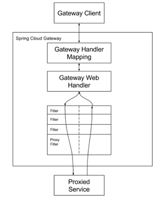
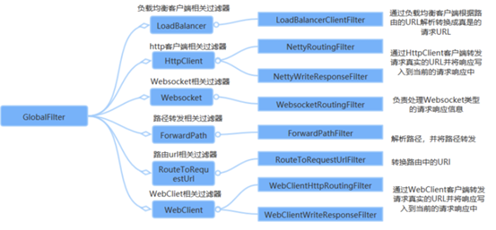

# 一、概念

## 1、基本概念

- Geteway是SpringCloud的一个全新项目，是基于Spring5+SpringBoot2和ProjectReactor等技术开发的网关，旨在为微服务架构提供一种简单有效的统一API路由管理方式。

- Geteway底层是基于WebFlux框架（异步非阻塞式）实现的，即底层采用的是高性能的Reactor模式的Netty服务器。


## 2、三大核心

- 路由（Route）：

    - 路由是构建网关的基本模块，由ID，目标URI，一系列断言和过滤链组成。如果断言为true则匹配该路由

- 断言（Predicate）：

    - 类似Java中的断言机制，可以断言请求中的内容（如请求头，请求体）与期望值相匹配，如果匹配则进行路由。

- 过滤（Filter）：

    - 指Spring框架中GatewayFilter的实例，使用过滤器可以在请求被路由之前或之后对请求和响应进行修改。


## 3、执行逻辑

- 路由转发+执行过滤链。




# 二、服务路由

## 1、引入依赖

- 注意：因为Geteway底层采用Netty框架，所以不能引入web场景启动器。

```xml
<dependency>
  <groupId>org.springframework.cloud</groupId>
  <artifactId>spring-cloud-starter-gateway</artifactId>
  <version></version>
</dependency>
```
## 2、配置路由

- 通过application配置

```yaml
spring:
  cloud:
    gateway:
      routes:  # 路由映射：集合，可以配置多个路由映射
        - id: payment_route  # 路由唯一id：唯一即可
      uri: http://localhost:8001  # 匹配后提供服务的路由地址
      predicates:  # 断言规则：集合，可以配置多个断言
        - Path=/payment/get  # 匹配请求的路径(支持通配符)
```
- 通过Configuration配置

```java
@Bean
public RouteLocator customRouteLocator(RouteLocatorBuilder routeLocatorBuilder) {
  RouteLocatorBuilder.Builder routes = routeLocatorBuilder.routes();

  // 传入两个参数
  // 路由唯一id，对应application中id；
  // java8函数：函数方法对应routes的所有属性
  routes.route("path_route", r -> r.path("").uri("")).build();

  // ...builder其他路由映射
  return routes.build();
}
```
## 3、动态路由

- Geteway通过服务注册中心获取对应的地址从而达到RestTemplate根据服务注册名调用的效果。并且使用lb作为请求协议时将开启请求的负载均衡，默认使用轮询算法。

```yaml
spring-cloud-geteway-routes:
  - id: payment_route1
  # lb://<服务名>  lb对应指协议：即负载均衡协议
  uri: lb://cloud-payment-service
  predicates:
    - Path=/payment/get
```


# 三、断言

## 1、概念

- 配置服务路由中的配置的spring-cloud-geteway-routes-predicates

- 网关接收请求后，会通过检查配置的路由表中每个路由项（spring-cloud-geteway-routes）。然后对路由项中配置的每个断言项（spring-cloud-geteway-routes-predicates）进行判断，如果全部断言为true，则匹配该路由，即交给该路由项中的uri进行执行。

    - 为了实现一组匹配规则，让请求找到合适的路由项进行处理。

- 伪代码：

```java
while(配置路由表) {
  if (路由项[i].断言[0] && ...路由项[i].断言[n]) {
     request(路由项[i].uri);
  }
}
```
## 2、断言项

- 常见的断言项配置：

    - 时间有效期之前、时间有效期之后、cookie验证、请求头验证、请求方法验证、请求参数验证等。

- 参考官方文档：https://docs.spring.io/spring-cloud-gateway/docs/current/reference/html/#gateway-request-predicates-factories

- 常见断言项解读：

    - 时间有效期之前：

```yaml
spring-cloud-geteway-routes:
  - id: payment_route2
  uri: lb://cloud-payment-service
  predicates:
  # 断言表示请求地址必须为ip:port/payment/get/xxx，且在指定时间以后
    - Path=/payment/get/**
  # 此时间串为ZonedDateTime格式
    - After=2017-01-20T17:42:47.789-07:00[Asia/Shanghai]
```


# 四、过滤器

## 1、概念

- 路由过滤器用于修改进入的（即匹配断言之后的）HTTP请求和返回的HTTP响应，并且可以配置在每个路由项中。

- Gateway内置了多种路由过滤器，都由GatewayFilter的工厂类产生。

- 过滤器类别：

    - GatewayFilter（普通过滤器）：针对每个路由项进行配置

    - GlobalFilter（全局过滤器）：对所有路由项进行配置

- 生命周期：

    - pre（请求前）、post（响应后）

- 参考官方文档：https://docs.spring.io/spring-cloud-gateway/docs/current/reference/html/#gatewayfilter-factories


## 2、配置普通过滤器

- 配置添加请求头过滤器

```yaml
spring-cloud-geteway-routes:
  - id: payment_route3
  filters:
  # 请求接收后将会给请求加上 X-Request-Id=1024 请求头
    - AddRequestParameter:X-Request-Id,1024 
```
## 3、全局过滤器

- 全局过滤器无需配置，会在网关启动时自动加载到每个路由项中。具体可以参考官方文档。




## 4、自定义全局过滤器

- 自定义过滤器需要继承两个接口。

    - GatewayFilter和GlobalFilter接口中选择一个，控制过滤器类别

    - Ordered，控制过滤器执行顺序

- 并且其GetewayFilter的过滤器架构是按照责任链进行设计的，其官方自带的过滤器也是继承了对应的接口，并且实现类名约定为XXXGatewayFilterFactory。

- 配置全局过滤器：

```java
@Component  // 配置全局过滤器时直接通过bean注册
// 将GlobalFilter换为GatewayFilter并去掉@Component即为普通过滤器
// 通过编码方式new注册即可
public class MyLogGateWayFilter implements GlobalFilter, Ordered {

  @Override
  // ServerWebExchange：包装了reuqest，response，session等对象
  // GatewayFilterChain：回调过滤链
  public Mono<Void> filter(ServerWebExchange exchange, GatewayFilterChain chain) {
     // ...过滤器执行代码

     // * 拦截并直接响应
     return exchange.getResponse().setComplete();
    
     // * 通过并交给下个责任链
     return chain.filter(exchange);
  }

  @Override
  public int getOrder() {
     // 返回数越小优先级越高
  }

}
```


