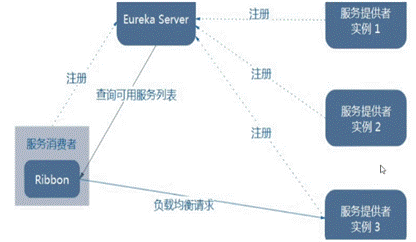
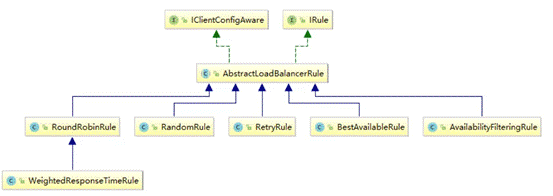

# 一、概念

- SpringCloudRibbon是基于NetflixRibbon实现的一套**客户端**负载均衡的工具。
- 主要功能是提供客户端的软件负载均衡算法和服务调用。Ribbon客户端组件提供一系列完善的配置项如连接超时，重试等。简单的说，就是在配置文件中列出Load Balancer（简称LB）后面所有的机器，Ribon会自动的帮助你基于某种规则（如简单轮询，随机连接等）去连接这些机器。我们很容易使用Ribbon实现自定义的负载均衡算法。
- 目前Ribbon项目进入维护状态。未来将会被SpringCloudStarterLoadbalancer项目代替。
- 架构：
    - 其Ribbon就是一个软负载均衡的客户端组件，可用和其他所需请求的客户端结合使用，如和eureka服务发现配合使用。



# 二、开启负载均衡

## 1、引入依赖

- 在常见的服务注册中心场景启动器依赖中已经包含了Ribbon的依赖，所以引入Eureka、Zookeeper、Consul依赖后无需添加Ribbon依赖。
```xml
<dependency>
  <groupId>org.springframework.cloud</groupId>
  <artifactId>spring-cloud-starter-ribbon</artifactId>
  <version></version>
</dependency>
```
## 2、整合RestTemplate

- 在Rest远程调用注册Bean上标识Ribbon注解。

```java
// 采用restTemplate框架作为RPC调用处理。
@Bean
@LoadBalanced  // 开启Ribbon负载均衡
public RestTemplate restTemplate() {
  return new RestTemplate();
}
```


# 三、负载均衡策略

## 1、策略结构



- 在Ribbon中，使用IRule接口作为定义LoadBalancer（负载均衡器）规则的接口。即用于定义负载均衡的策略的接口。

```java
// 选择对应的服务方法
public Server choose(Object key);
public void setLoadBalancer(ILoadBalancer lb);
public ILoadBalancer getLoadBalancer(); 
```
- 其中抽象类AbstractLoadBalancerRule实现IRule接口，并且定义ILoadBalancer属性，所以其子类负载均衡算法只需要实现choose()方法即可。

```java
private ILoadBalancer lb;

@Override
public void setLoadBalancer(ILoadBalancer lb){
  this.lb = lb;
}

@Override
public ILoadBalancer getLoadBalancer(){
  return lb;
}   
```
## 2、七大策略实现类

- RoundRobinRule（默认规则）：轮询

    - 按服务列表依次选择服务。

- RandomRule：随机

    - 随机数选择服务

- RetryRule：重试

    - 按轮询策略获取服务，如果获取失败则在指定时间内重试并获取可用服务

- WeightedResponseTimeRule（已过时）：响应时间权重

    - 对轮询策略的扩展，响应速度越快的实例选择的权重越大，即越容易被选择。

- BestAvailableRule：最好权重

    - 会先过滤由于访问故障而处于断路器跳闸状态的服务，然后选择一个并发量小的服务。

- AvailabilityFilteringRule：可用过滤

    - 先过滤掉故障的服务，再选择并发较小的服务。

- ZoneAvoidanceRule：区域可用过滤

    - 先过滤掉区域中所有故障的服务，再选择并发较小的服务。


## 3、轮询算法

- RoundRobinRule采用原子整型属性作为请求次数的记录，从服务启动开始计数。

```java
private AtomicInteger nextServerCyclicCounter;
```
- 然后将当前请求次数与服务可用实例数量取模。


```java
// modulo-服务实例数
private int incrementAndGetModulo(int modulo) {

  // 自旋锁
  for (;;) {
     // 获取当前请求次数
     int current = nextServerCyclicCounter.get();
     // * 取模返回
     // 假设实例为3个，0%3=0，1%3=1，2%3=2，3%3=0,4%3=1 ...
     // 即最后返回的一定是0123012301...即轮询
     int next = (current + 1) % modulo;
     if (nextServerCyclicCounter.compareAndSet(current, next)) {
         return next;
     }
  }
}
```


## 4、策略替换

- Ribbon客户端负载均衡策略通过对调用的单个服务的特殊化配置，以起到不同服务不同策略的效果。

- 基于application.xml文件配置：

```yaml
// 1 直接通过<注册服务名>-ribbon-NFLoadBalancerRuleClassName配置即可
// users为注册服务名
// 全类名如：com.netflix.loadbalancer.WeightedResponseTimeRule
users:
  ribbon:
    NFLoadBalancerRuleClassName: <具体策略实现全类名，即继承IRule接口的类>
    # ...<其他注册服务名>
  ribbon:
    NFLoadBalancerRuleClassName: ...
```
- 基于注解配置：

    - 注意：新建的配置类不能被主类@ComponentScan扫描，否则会将所有调用的服务都生效，达不到特殊化定制的目的。

```java
// 1 新建配置类中配置对应策略实现类
@Configuration
public class MySelRule {
  // 2 返回对应策略实现类对象
  @Bean
  public IRule myRule() {
     return new RandomRule();
  }
}

// 3 在主类上添加注解引入配置类
// 加s中包含RibbonClient注解，即多个RibbonClient订制
@RibbonClients(@RibbonClient(...),...)

// name|value:服务注册名,configuration：对应配置类
@RibbonClient(name = "<服务注册名>",configuration = MySelRule.class)
public class OrderMain80 {
  public static void main(String[] args) {
     SpringApplication.run(OrderMain80.class, args);
  }
}
```


