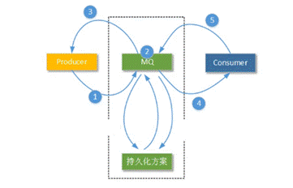
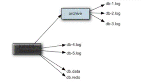
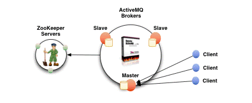
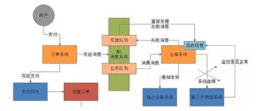

 

# 一、搭建服务端

## 1、安装

- 在Linux下下载安装ActiveMQ


## 2、常见服务命令

- 在ActiveMQ中bin目录下执行


- 默认进程端口为61616以提供Java消息服务。

```shell
// 启动服务
./activemq start

// 按指定配置文件启动服务
./activemq start xbean:file:<配置文件路径>

// 停止服务
./activemq stop
```
## 3、进入监控页

- 默认监控页端口为8161。通过访问ip:8161即可进入ActiveMQ监控页。

- 默认用户名和密码都为admin。

- 注意：

    - activeMQ监控页默认只允许本机访问，外部访问时需要修改conf/jetty.xml文件。

```xml
<bean id="jettyPort" class="org.apache.activemq.web.WebConsolePort"
  init-method="start">
  <!-- 将host修改为0.0.0.0即可 -->
  <property name="host" value="127.0.0.1"/>
  <property name="port" value="8161"/>
</bean>
```


# 二、嵌入Java服务端

- ActiveMQ-Broker相当于一个ActiveMQ服务实例，可以以代码形式将MQ嵌入到java代码中，形参微服务启动。


## 1、引入依赖
```xml
<dependency>
  <groupId>org.springframework.boot</groupId>
  <artifactId>spring-boot-starter-activemq</artifactId>
  <version></version>
</dependency>

<!-- 额外引入fastjson依赖避免序列化问题 -->
<dependency>
  <groupId>com.fasterxml.jackson.core</groupId>
  <artifactId>jackson-databind</artifactId>
  <version></version>
</dependency>
```
## 2、主启动类编码

- 启动主类后即可成为一个ActiveMQ服务端。

```java
public void startBroker() throws Exception {
  BrokerService brokerService = new BrokerService();
  brokerService.setUseJmx(true);
  // 绑定连接器
  brokerService.addConnector("tcp://localhost:61616");
}
```


# 三、传输协议

## 1、协议配置

- ActiveMQ客户端和服务端之间的连接可以有不同的协议（调优）。

- 具体协议参考官网：https://activemq.apache.org/configuring-transports

- 协议配置路径：

    - ActiveMQ默认使用tcp协议，即配置项中tcp对应的name=openwire。

```xml
apache-activemq-<version>/conf/activemq.xml
<!-- ... -->
<transportConnectors>
 <!-- DOS protection, limit concurrent connections to 1000 and frame size to 100MB -->
 <transportConnector name="openwire" uri="tcp://0.0.0.0:61616?maximumConnections=1000&amp;wireFormat.maxFrameSize=104857600"/>
 <transportConnector name="amqp" uri="amqp://0.0.0.0:5672?maximumConnections=1000&amp;wireFormat.maxFrameSize=104857600"/>
 <transportConnector name="stomp" uri="stomp://0.0.0.0:61613?maximumConnections=1000&amp;wireFormat.maxFrameSize=104857600"/>
 <transportConnector name="mqtt" uri="mqtt://0.0.0.0:1883?maximumConnections=1000&amp;wireFormat.maxFrameSize=104857600"/>
 <transportConnector name="ws" uri="ws://0.0.0.0:61614?maximumConnections=1000&amp;wireFormat.maxFrameSize=104857600"/>

 <!-- 在此处配置协议即可 -->
 <!-- nio -->
 <transportConnector name="nio" uri="nio://localhost:61618?trace=true"/>
</transportConnectors>
```
## 2、协议对比

- 在Java中常见的协议为Tcp和Nio协议。不同的协议连接有不同的代码，如在mqtt协议中需要通过MqttClient对象进行连接。其连接的方式不同。

- 在大量客户端连接过程中，在一般的情况下建议使用NIO协议，NIO比TCP需要更少的线程执行，并且面对迟钝的网络传输，NIO比TCP能提供更好的性能。

- 在每个协议中都可以附加自己的配置属性，如配置协议的超时时间等，如tcp:localhost:61616?xxx=xxx&xxx=xxx。具体属性可以参考官方文档。


# 四、消息存储持久化

## 1、存储持久化

- 存储持久化是为了避免意外宕机后丢失信息，需要做到重启后恢复消息队列，如redis中的rdb、aof持久化类似。持久化形式：AMQ、KahaDB、JDBC、LevelDB。




- 配置持久化形式：

    - https://activemq.apache.org/persistence

```xml
<persistenceAdapter>
 <!-- 将kahaDB标签替换成对应持久化标签即可，具体标签参考官方文档 -->
 <kahaDB directory="${activemq.data}/kahadb"/>
</persistenceAdapter>
```
## 2、持久化过程

- 在消息中心将消息发送出去后，消息中心需要：

    - 首先将消息存储到本地数据文件、内存数据库或者远程数据库中。

    - 然后再试图将消息发送给接收者。

    - 如果成功发送则将消息从存储中删除，失败则继续尝试发送。

    - 消息中心启动以后首先要检查指定的存储位置，如果有未发送成功的消息，则需要将消息发送出去。


## 3、KahaDB持久化（5.4版本后默认持久化插件）

- KahaDB（基于日志文件，类似redis-aof）

- KahaDB目录下的文件（4文件1锁）：db-1.log \ db.data \ db.free \ dv.free \ db.redo \ lock

- 消息存储使用一个事物日志和一个索引文件来存储所有的地址

    - 其中消息以``db-<number>.log``存储到预定义大小的数据记录文件中，当文件已满后，将创建一个新的文件继续存储，其number数增加，如db-1、db-2...。当不再有引用（索引）到数据文件中的任何消息时，文件会被删除或归档。

    - db.data文件中包含了持久化的B-Tree（B树）索引，记录消息索引和.log文件之间的关系。

    - db.free用于记录db.data中哪些页是空闲的，保证索引连续性，类似辅助索引。

    - db.redo用于进行消息恢复，用于恢复B-Tree索引。

    - lock文件锁，用于获取kahadb读写权限的broker。类似mysql中的悲观锁。




## 4、JDBC持久化（长时间存储推荐）

- 直接将消息存储进mysql数据库，稳定。

- 配置连接：

    - 需要将mysql-jdbc-drive驱动jar包添加到activemq/lib目录中

    - 在conf/activemq.xml中persistenceAdapter中替换为jdbc持久化标签。

```xml
// dataSource：将要引用数据库的bean名称，类似spring中bean标签的ref属性
  // 与spring不同的是使用#引用id
// createTablesOnStartup：默认true，首次启动时自动创建数据库表
<jdbcPersistenceAdapter dataSource="#my-ds" createTablesOnStartup="true"/>
```
- 配置数据源：（与java项目配置jdbc连接一致）

    - 注意：默认使用dbcp连接池，如果要使用其他连接池需要在lib目录下新增其他jar

```xml
<bean id="my-ds" class="<数据库连接池>" destroy-mothod="close">
 <property name="driverClassName" value="com.mysql.jdbc.Driver"></property>
 <!-- url,username,password... -->
</bean>
```
- 手动建立数据库：名字与配置源一致即可。官方推荐name=activemq。重启activemq后会自动连接数据库生成表。

- 数据库表说明（3张）：

    - ACTIVEMQ_MSGS（存放消息信息）

        - ID：自增的数据库主键

        - CONTAINER：消息的Destination

        - MSGID_PROD：消息发送者客户端的主键

        - MSG_SEQ：是发送消息的顺序，MSGID_PROD+MSG_SEQ可以组成JMS的MessageID

        - EXPIRATION：消息的过期时间，存储的是从1970-01-01到现在的毫秒数

        - MSG：消息本体的Java序列化对象的二进制数据

        - PRIORITY：优先级，从0-9，数值越大优先级越高

    - ACTIVEMQ_ACKS（存放主题信息）

        - CONTAINER：消息的Destination

        - SUB_DEST：如果是使用Static集群，这个字段会有集群其他系统的信息

        - CLIENT_ID：每个订阅者都必须有一个唯一的客户端ID用以区分

        - SUB_NAME：订阅者名称

        - SELECTOR：选择器，可以选择只消费满足条件的消息。条件可以用自定义属性实现，可支持多属性AND和OR操作

        - LAST_ACKED_ID：记录消费过的消息的ID。

    - ACTIVEMQ_LOCK（只有在集群中才会使用，记录集群主从关系）
        - ID：activemq实例id
    
        - BROKER_NAME：activemq实例名
    


## 5、JDBC With Journal（最佳存储推荐）

- 只使用JDBC进行持久比较慢，所以建议在mq和jdbc中挡一层高速缓存，不必每次都读写数据库，即ActiveMQ Journal。

- 当消费者的消费速度很快的情况下，此时journal还未同步时到数据库中就已经被消费了，则不需要同步了。

- 当消费者消费速度慢，则journal文件可以使消息批量写入数据库。

- 配置：替换persistenceAdapter标签

```xml
<persistenceFactory>
 <journalPersistenceAdapterFactory
   journalLogFiles="4"
   journalLogFileSize="32768"
   useJournal="true"
   useQuickJournal="true"
   dataSource="#my-ds"
   dataDirectory="activemq-data"/>
</persistenceFactory>
```
## 6、AMQ持久化（5.3版本之后已弃用）

- AMQ（AMQ Message Store文件存储方式）

- 消息被存储在一个个文件中，当文件中的消息被全部消费则文件标识为可删除，在下个清除阶段删除。特点：写速度快、容易恢复。


## 7、LevelDB（5.8版本后引进，未来趋势）

- 与KahaDB非常相似，也是基于文件的本地数据库存储形式，提供比KahaDB更快的持久性。底层不是使用B-Tree实现的索引，而是使用LevelDB索引。


# 五、集群高可用

- 基于Zookeeper和LevelDB搭建ActiveMQ集群，提供主从机高可用集群功能，避免单点故障。如图：一主二从，并使用Zookeeper串联节点监控服务实例。其中只有主机提供服务，从机处于待机状态，当主机宕机后，将通过Zookeeper的选举机制进行投票选举下一个主机。




 

# 六、特性

## 1、异步发送

- 默认都是使用异步发送，除非客户端指定了使用同步发送模式，或者在没有使用事物且发送持久化消息的时候，则每次发送都是同步，且会阻塞生产者直到服务实例返回一个确认，表示消息已经安全持久化到磁盘。

- 可能出现：生产>消费。造成消息积累在mq实例中。

- 其异步发送不能确保消息发送成功，在useAsyncSend=true的情况下客户端可以容忍消息丢失的可能。


## 2、保证异步发送成功

- 在异步发送后，生产者默认都认为自己发送成功，而此时mq实例宕机，消息将丢失。所以需要在生产者代码中接收回调方法，接收一个mq实例的回执，表示mq实例已接到消息。

- 解决方案实例：

    - 对每个消息都编制一个唯一ID设置到消息头中，然后发送时指定有回调的发送方法，当服务器成功接收后将回调指定的方法，回调后通过唯一ID进行判断即可判断对某条消息的操作。

    - SpringJms可以使用execute等重载方法进行回调发送。

```java
ActiveMQMessageProducer activeMQMessageProducer = (ActiveMQMessageProducer) producer;
activeMQMessageProducer.send(message, new AsyncCallback() {
  @Override
  public void onSuccess() {
      // 成功回调
  }
  @Override
  public void onException(JMSException exception) {
      // 失败回调
  }
});
```
## 3、延迟投递

- 需要在mq服务实例配置文件activemq.xml中开启对延迟投递的支持：

```xml
// 需要加上schedulerSupport=true开启
<broker schedulerSupport="true">
...
</broker>
```
- 额外设置消息属性Property：


| 属性名（ScheduledMessage类） | 数据类型 | 属性值                           |
| ---------------------------- | -------- | -------------------------------- |
| AMQ_SCHEDULED_DELAY          | long     | 延迟投递的时间                   |
| AMQ_SCHEDULED_PERIOD         | long     | 重复投递的时间间隔               |
| AMQ_SCHEDULED_REPEAT         | int      | 重复投递次数                     |
| AMQ_SCHEDULED_CRON           | string   | Cron表达式（类似spring定时任务） |

## 4、消息重发（消息重复消费后续）

- 消息重发机制，应当是消息重复消费的兜底机制，防止消息被一直重复消费。而标记异常消息的一种机制。

- 当消费者消费消息时发生以下任何一种情况时，消息将重新发送给消费者：

    - 开启事物后rollback()。

    - 事务在commit()调用之前关闭。

    - 会话正在使用CLIENT_ACKNOWLEDGE（手动签收）并被Session.recover()调用（重发方法）。

    - 客户端连接超时（可能正在执行的代码比配置的超时时间更长）。

    - 默认消息重发6次，时间间隔1秒。

    - 具体配置参考https://activemq.apache.org/redelivery-policy

- 死信队列与有毒消息：

    - 一个消息被重发超过默认的最大重发次数时，消费端会给MQ发送一个poison ack（有毒消息）表示这个消息有毒，告诉mq实例不要再发了。这个时候mq实例会把这个消息放到DLQ（死信队列）。

- 消息重发过程：

    - 假设生产者生产了一条消息，然后消费者消费该消息并触发了消息重发，那么此时将进行计数1，此时消费者再此消费消息并触发消息重发，那么将进行计数2....如果计数到6之前，消息仍然存在（还未被消费到）。那么消费端将给mq发送一个poison ack。然后mq实例将会把这条消息放到DLQ之中。当消费者第7次消费此消息时，因为该消息在死信队列中，所以无法消费的到。需要进行人工干预对死信队列进行处理。

- 生产环境实例：

    - 在使用mq时一般设计两个队列，一个是核心业务队列，一个是死信队列。即正常执行和出错执行。




- 重复消费解决方案：

    - 如果消息仅是做数据库插入操作，则给消息做唯一索引或主键即可。

    - 使用redis记录消费，给消息分配一个全局id，以id-message记录消费，查询消费记录即可。


## 5、复合目的地

- 多目的地名称使用逗号分隔，即可实现一条消息发送到不同目的地中。

- 多混合目的地类型，可以使用queue://或topic://进行区分


 

 

 