# 一、概念

- Rabbitmq基于AMQP协议，由Erlang语言编写。
- ActiveMQ和RabbitMQ区别：
    - AMQP是协议（类似TCP\UDP等），JMS是java规范api（类似JDBC等）。
    - active只有两种模型（队列、发布订阅模型），rabbit有7种。
    - active分发方式只有轮询分发，rabbit可以自由定制且支持模糊匹配。

# 二、安装

- 先安装erlang语言环境、再安装socat依赖、再装rabbitmq。（注意linux版本对齐和erlang语言版本）。activemq和rabbitmq不能同时启动。
    - 默认服务端口：5672
    - 监控页端口：15672
- 监控页插件安装
```shell
rabbitmq-plugins enable rabbitmq_management
```
- 创建账号：

    - 监控页默认账号密码是guest，只能localhost本机访问。
    - 账号相关命令：

```shell
// 创建rabbit用户
rabbitmqctl add_user {用户名} {密码}

// 设置权限
rabbitmqctl set_user_tags {用户名} {权限名}

//删除用户
rabbitmqctl delete_user {用户名}

//修改用户密码
rabbitmqctl change_password {用户名} {密码}
```
- 权限等级：


| 权限名                      | 作用域                                                    |
| --------------------------- | --------------------------------------------------------- |
| none（无）                  | 不能登录控制台。 只能作为生产者消费者登录操作。           |
| management（普通管理者）    | 只能查看自己相关的节点信息。                              |
| policymaker（策略制定者）   | 包括management权限 能查看其他用户部分信息和全局统计信息。 |
| administrator（超级管理员） | 最高权限（类似root用户）                                  |

# 三、AMQP与Rabbit架构

## 1、AMQP协议

- AMQP：（Advanced Message Queuing Protocol最高消息队列协议）。是应用层协议其中一个开发标准，为面向消息中间件设计。

- 生产者与协议交互流程：


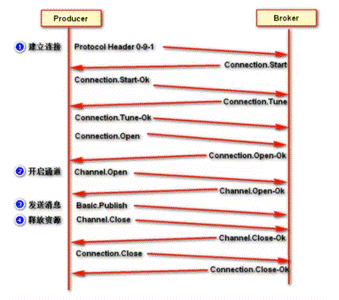

- 消费者与协议交互流程：


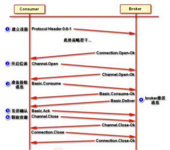

## 2、基本架构

- 核心组成部分：

    - Server：又称Broker ,接受客户端的连接，实现AMQP实体服务。

    - Connection：连接，应用程序与Broker的网络连接TCP/IP/三次握手和四次挥手。

    - Channel：信道，几乎所有的操作都在Channel中进行，Channel是进行消息读写的通道，客户端可以建立对各Channel，每个Channel代表一个会话任务。

    - Message：消息服务与应用程序之间传送的数据，由Properties和body组成，Properties可是对消息进行修饰，比加消息的优先级，延迟等高级特生，Body则就是消息体的内容。

    - Virtual Host：虚拟地址，用于进行逻辑隔离，最上层的消息路由，一个虚拟主机理由可以有若千个Exhange和Queueu，同一个虚拟主机里面不能有相同名字的Exchange

    - Exchange：交换机，接受消息，根据路由键发送消息到绑定的队列。（不具备消息存储的能力）。

    - Bindings：Exchange和Queue之间的虚拟连接，binding中可以保护多个routing key。

    - Routing key：一个路由规则，虚拟机可以用它来确定如何路由一个特定消息。

    - Queue：队列，也成为Message Queue,消息队列，保存消息并将它们转发给消费者。


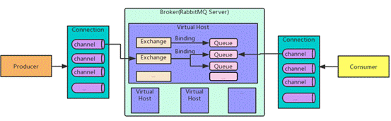

- 消息发送与普通的MQ的不同：

    - Rabbit使用交换机（Exchange ）进行消息的分发，并且通过长连接方式，其操作基本交给信道进行完成。注意：消息生产的接收者一定是交换机，然后再由交换机分发给队列。


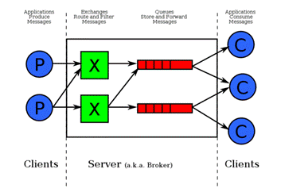

# 四、六种模型实例

- 6种消息格式https://www.rabbitmq.com/getstarted.html

## 1、传统队列模型

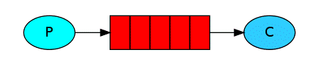

- 生产者实例：

```java
public void producer() throws IOException, TimeoutException {

  // 1 创建连接工厂- 并设置连接信息
  ConnectionFactory connectionFactory = new ConnectionFactory();
      // ...setXXX主机、端口、虚拟主机、用户名、密码等

  // 2 获取连接
  Connection connection = connectionFactory.newConnection();

  // 3 通过连接获取信道 - 并配置通道连接信息
  Channel channel = connection.createChannel();

  // 4 通过信道声明（创建）一个队列
      // queue：队列名
      // durable：是否持久化
      // exclusive：排他性，是否独占
      // autoDelete：随着最后一个消费者消费完毕后是否将队列自动删除
      // Map arguments：其他附加参数
  channel.queueDeclare("queue1", false, false, false, null);
  // - 4.1 通道提供临时队列：一断开连接就会被删除，返回一个随机字符串队列名
      // String channel.queueDeclare().getQueue();

  // 5 使用信道生产消息到队列
      // exchange：交换机，为空字符串则选用默认交换机
      // routingKey：路由键，指定发送匹配到哪个队列中
      // props：指定消息具体属性
        // 使用AMQP.BasicProperties().builder().build();即可构建相关属性
      // byte[] body：消息内容
      // ！当前exchange="",routingKey="queue1"
      // 说明发到了默认交换机再由交换机转发到了"queue1"队列
  channel.basicPublish("", "queue1", null, "这是一条消息：HelloWorld".getBytes());

  // 6 关闭信道和连接
  channel.close();
  connection.close();
  connectionFactory.clone();
}
```
- 消费者实例：


```java
public void consumer() throws IOException, TimeoutException {

  // 1 创建连接工厂- 并设置连接信息
  ConnectionFactory connectionFactory = new ConnectionFactory();
  connectionFactory.setXXX();

  // 2 获取连接
  Connection connection = connectionFactory.newConnection();

  // 3 通过连接获取信道 - 并配置通道连接信息
  Channel channel = connection.createChannel();

  // 4 通过信道从队列中 持续监听 消费消息：
      // queue：队列名
      // autoAck：是否自动签收
  channel.basicConsume("queue1", true,
        // deliverCallback：消费消息处理函数 - 可用lambda表达式
        new DeliverCallback() {
          @Override
          public void handle(String consumerTag, Delivery message) throws IOException {
            log.info("消息{}被消费--->{}", consumerTag, new String(message.getBody(), StandardCharsets.UTF_8));
          }
        },

        // cancelCallback：当消息消费被取消时处理函数
        new CancelCallback() {
          @Override
          public void handle(String consumerTag) throws IOException {
            log.info("消息接收取消了，消息标签为--->{}", consumerTag);
          }
        }
  );
  System.in.read();
    
  // 5 关闭信道和连接
  channel.close();
  connection.close();
  connectionFactory.clone();
}
```


## 2、工作队列模型（队列的分发）

- 代码与队列模型一致，但存在多个消费者，消费者以唯一轮询方式消费消息。就是单纯的生产者和消费者一对多时的模型关系。


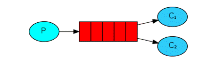

### （1）不公平分发策略

- 通过设置消费者的“服务质量”可以使得mq在分发消息的时候按“服务质量”的值进行合理分发，而不是传统的轮询分发。

    - 预取值（最大值）：预取值的大小关系就取决于消费者的服务质量，即指消费者能提供怎么样的服务，让mq再质量比例将消息分发给消费者。

    - 预取值分为prefetchSize（内容预取值），prefetchCount（消息数预取值）。

    - 如mq发送给消费者的消息达到了预取值后，那么将不会再发消息给该消费者，直到消费者处理完了消息后预取值下降。

- 注意：只能针对消费者进行设置。

```java
// 指定当前消费者不公平分发的比例 - 预取计数必须介于 0 和 65535 之间
  // prefetchSize：服务器将提供的最大内容量（以八位字节为单位），如果没有限制则为 0
  // prefetchCount：服务器将传递的最大消息数，如果没有限制则为 0，所有消费者都设置为0就为轮询。
  // global：是否为全局比例，false为当前消费者，true为整个信道都应用该比例。
channel.basicQos(int, int, boolean);
```
- 能者多劳模式：

    - 如果将一个队列中的所有消费者prefetchCount都设置为1。那么将成为能者多劳模式，即处理快的消费者会消费更多的消息。

```java
channel.basicQos(1, true);
```
## 3、传统发布\订阅模型

- 与activemq的区别：

    - rabbitmq发布订阅模型是基于交换机队列的，即用户自行决定消息的分发。

    - 而activemq的发布订阅则是通过生产者发送消息后自行分发给订阅的消费者，这是由mq实例进行完成的。


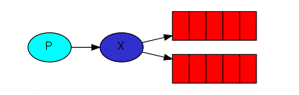

- 生产者实例：

```java
// 声明创建一个交换机 - 类型为fanout扇出类型
  // exchange：交换机名
  // type：交换机类型 - BuiltinExchangeType类枚举
  // durable：是否持久化
  // autoDelete：是否自动删除
  // internal：是否是内部交换机，内部交换机不能由客户端直接发布
  // arguments：其他参数
channel.exchangeDeclare("exchange1", BuiltinExchangeType.FANOUT, false, false, null);

// 声明创建2个临时队列
String queueName1 = channel.queueDeclare().getQueue();
String queueName2 = channel.queueDeclare().getQueue();

// 将2个队列和1个交换机进行绑定
  // queue：队列名
  // exchange：交换机名
  // routingKey：路由key
  // Map arguments：其他绑定参数
channel.queueBind(queueName1, "exchange1", "", null);
channel.queueBind(queueName2, "exchange1", "", null);

// 发送一条消息
// 消息指定为发送到exchange1交换机上，且不指定路由Key
// 1消息将发送到交换机上
// 2交换机再发送到两个绑定的队列中
// 3消费者即可通过消费自己的队列，达到一条消息多次消费的效果
channel.basicPublish("exchange1", "", null, "".getBytes());
```
## 4、路由模型（发布订阅的选择）

- 发布订阅的关键词匹配版本。消息发送时指定发送到的交换机及路由键即可让交换机进行消息的动态选择分发。注意：同一个交换机可以多次绑定同一个队列。


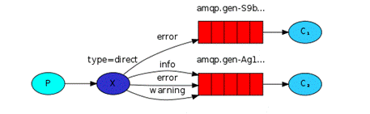

- 生产者实例代码：

```java
// 声明创建一个交换机 - 类型为direct直接交换机
channel.exchangeDeclare("exchange2", BuiltinExchangeType.DIRECT, false, false, null);

// 声明创建2个临时队列
String queueName1 = channel.queueDeclare().getQueue();
String queueName2 = channel.queueDeclare().getQueue();

// 将2个队列和交换机进行绑定 - 并指定其路由键的差异
channel.queueBind(queueName1, "exchange2", "error", null);
channel.queueBind(queueName2, "exchange2", "info", null);
channel.queueBind(queueName2, "exchange2", "error", null);
channel.queueBind(queueName2, "exchange2", "warning", null);

// 发送一条消息
// 消息指定为发送到exchange1交换机上，且指定了routingKey
// routingKey=error -> 1、2队列都接收
// routingKey=info -> 2队列接收
channel.basicPublish("exchange1", "<routingKey>", null, "".getBytes());
```
## 5、主题模型（发布订阅的模糊选择）

- 路由模型的模糊匹配版本。模糊匹配，如mysql-like匹配。根据通配符*#进行模糊，只要路由键和绑定键相匹配即可。

    - 注意：同一个队列的多次绑定都匹配时，只会接收一次。如lazy.111.rabbit同时匹配两次Q2队列，此时Q2只收一条消息。


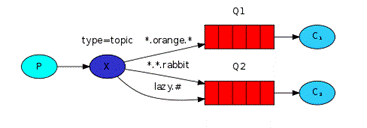

- 实例代码：

```java
// 声明创建一个交换机 - 主题交换机
channel.exchangeDeclare("exchange3", BuiltinExchangeType.TOPIC, false, false, null);

// 声明创建2个临时队列
String queueName1 = channel.queueDeclare().getQueue();
String queueName2 = channel.queueDeclare().getQueue();

// 将2个队列和交换机进行绑定 - 并指定其路由键的差异
channel.queueBind(queueName1, "exchange3", "*.orange.*", null);
channel.queueBind(queueName2, "exchange3", "*.*.rabbit", null);
channel.queueBind(queueName2, "exchange3", "lazy.#", null);

// 发送一条消息
// 消息指定为发送到exchange1交换机上，且指定了routingKey
// routingKey="lazy.111.222" -> 2收到
// routingKey="111.orange.111" -> 1、2收到
channel.basicPublish("exchange1", "<routingKey>", null, "".getBytes());
```


## 6、RPC（请求回复）模型

- 类似传统RPC框架的客户端服务器请求响应模型，发起请求到队列，服务器消费后再响应回到队列。

- 避免使用和不推荐使用。请使用传统RPC框架进行调用。


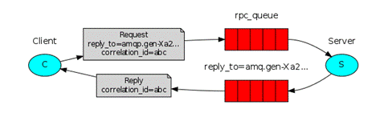

# 五、交换机与绑定概念

## 1、交换机（exchange）

- 在rabbitmq中，生产者发送消息其本质上是交给了交换机。然后由交换机选择消息分发（可以发给一个，也可以发给多个，也可以丢弃）到对应的队列之中。而消费者消费自己的队列消息。


## 2、绑定（binding）

- 绑定是交换机与队列之间的桥梁，通过绑定键（BindKey）表示交换机与队列之间的关系。然后可以通过路由键（routekey）控制消息分发的走向。

    - 绑定键：是指交换机和队列。

    - 路由键：是指消息发送时指定的路由规则。通过此规则和绑定键的匹配机制从而达到动态选择分发。


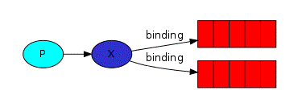

## 3、交换机类型

| 类型            | 实例模型         | 作用                                                         |
| --------------- | ---------------- | ------------------------------------------------------------ |
| 无名（默认）    | 传统队列模型     | 即一个空字符串的默认交换机。 本身也不是一个交换机，所以什么事情都不做。 |
| 直接（direct）  | 路由模型         | 直接交换机将判断routekey参数是否与每个绑定队列的routekey完全匹配（相同）。 如果匹配则将消息分发给对应队列，无任何匹配则丢弃此消息。 |
| 主题（topic）   | 主题模型         | 主题交换机与直接交换机类似，但是是模糊匹配。 模糊匹配规则：采用三段两点关键字进行模糊，即xxx.xxx.xxx。 通配符：*任意单个关键字；#任意多个关键字。 |
| 标题（headers） | 无模型           | 不依赖绑定键和路由键。 标题交换机通过解析消息头中键值对进行匹配分发。 |
| 扇出（fanout）  | 传统发布订阅模型 | 扇出交换机将忽略routekey参数。 将消息分发到所有绑定到此交换机的队列中。 |

# 六、消息可靠性

## 1、应答机制

- 针对于消费者接收消息后的应答机制。类似JMS接口签收机制，只针对消费者，即告诉mq这条消息已经被消费者成功处理了。

- 如果应答过程中，消费者实例宕机，则mq会将该消息交付给其他在线的消费者之一处理。

```java
// 监听消费消息
  // 将autoAck设置为false 即手动应答
channel.basicConsume("queue1", false,
      (consumerTag, message) -> {
        log.info("消息{}被消费--->{}", consumerTag, new String(message.getBody()));
          
        // * 应答消息
          // 1 deliveryTag：应答消息的唯一标签
          // 2 multiple：是否批量应答，批量应答则会将信道中所有的消息（包括标签本身）都进行应答。
        channel.basicAck(message.getEnvelope().getDeliveryTag(), false);
      },
                     
      (consumerTag) -> {
        log.info("消息接收取消了，消息标签为--->{}", consumerTag);
      }
);
```
## 2、持久化

- 与jms接口持久化类似，都是用于保证mq实例宕机恢复，但是jms接口持久化没有区分队列持久化和消息持久化，而是笼统设置为消息持久化。

- 队列持久化和消息持久化：

    - 队列持久化和消息持久化是不一样的。队列持久化只是保证整个队列不会被丢失。即队列持久化了，而消息没有持久化，则消息依旧会存在丢失可能。

- 队列持久化：

- 创建一个队列，并设置durable=true为持久化队列即可。注意已存在的队列名如果是非持久化，则再此声明持久化队列时不能覆盖。

```java
channel.queueDeclare("queue1", durable:true, false, false, null);
```
- 消息持久化：

- 发布一个消息，并在props（消息属性）中设置持久化属性 MessageProperties类带PERSISTENT（持久）字样的枚举即可。

```java
channel.basicPublish("", "queue1",
  props:MessageProperties.PERSISTENT_TEXT_PLAIN, "message".getBytes());
```
## 3、发布确认

- 当生产者发送消息到mq时，mq宕机，此时消息正发送到一半（发送途中），那么即使设置了队列或者消息持久化，该消息依然会丢失。所以rabbitmq需要满足3点，队列持久化、消息持久化、发布确认 才能真正保证每条消息都能成功发送到mq中，并且不会丢失。

- 使用发布确认前提：必须设置队列和消息都是持久化。并且需要使用信道开启发布确认功能。

```java
channel.confirmSelect();
```
### （1）同步确认

- waitForConfirms同步确认会将信道上所有的消息进行确认。

    - 所以如果需要单个确认那么就发一条消息确认一次，批量确认就发多个消息确认一次即可。

    - 单个确认：速度慢，准确，因为消息发布一次确认就要等mq服务响应一次。

    - 批量确认：速度快，不准确，因为多个消息合并成一起确认，如果有一个消息出问题，无法确定是多条消息具体的某条。

```java
// 单个 for(xxx) { channel.basicPublish(...); channel.waitForConfirms(); }
// 批量 for(xxx) { channel.basicPublish(...); } channel.waitForConfirms();
// 返回true则确认发到，false未发到
boolean channel.waitForConfirms();
```
### （2）异步监听确认

- 使用监听器进行消息的异步确认，效率最高，因为生产者只管发送消息，无需等待mq实例响应确认，具体确认交给异步监听器即可。

- 确认消息解决方案：使用redis或并发线程队列等操作保存deliveryTag等信息即可。

```java
// 异步监听确认 - 效率最高，通过回调函数进行确认
  // 回调函数都是一模一样的接口，根据addConfirmListener方法传入的参数不同
  // 第一个为ack（确认收到回调），第二个为nack（未确认收到回调）
channel.addConfirmListener(
      // ack（确认收到）
      new ConfirmCallback() {
        @Override
        // deliveryTag消息编号，multiple是否是批量的确认
        // multiple=true时deliveryTag返回其中最小的编号
        public void handle(long deliveryTag, boolean multiple) throws IOException {
        }
      },

      // nack（未确认收到）
      new ConfirmCallback() {
        @Override
        public void handle(long deliveryTag, boolean multiple) throws IOException {
        }
      }
);
```


# 七、死信队列与延迟队列

## 1、死信队列

- 与activemq死信机制类似：

    - activemq：activemq死信只存放消费失败的消息。是由mq实例自己管理的队列。

    - rabbitmq：可以存放过期消息，溢出消息，拒绝消息。由用户自己声明创建并且管理的队列。

- 成为死信的条件：

    - 消息TTL过期，可以直接设置消息的过期时间，也可以设置指定队列中所有消息的过期时间。

    - 队列到达最大长度，队列满了，消息无法入队。

    - 消息被拒绝。

- 死信队列配置：

    - 管理创建队列将其视为一个死信队列，并且通过设置队列的附加属性从而指定队列的死信。

    - 队列常用附加属性：


| 标签                    | 属性名                    | 含义                        | 监控页缩写 |
| ----------------------- | ------------------------- | --------------------------- | ---------- |
| Message TTL             | x-message-ttl             | 队列中所有消息的过期时间    | TTL        |
| Auto expire             | x-expires                 | 队列未使用时的过期时间      | Exp        |
| Max length              | x-max-length              | 队列的最大消息条数          | Lim        |
| Max length bytes        | x-dead-letter-exchange    | 队列消息的最大字节数        | Lim B      |
| Dead letter exchange    | x-dead-letter-exchange    | 转发到的死信交换机          | DLX        |
| Dead letter routing key | x-dead-letter-routing-key | 转发到的死信路由键          | DLK        |
| Maximum priority        | x-max-priority            | 队列支持优先级（值为0-255） | Pri        |

- 死信队列架构图：


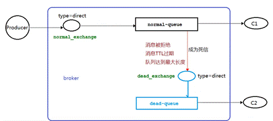

- 生产消费者实例：

```java
// 创建用于死信的队列、交换机、绑定 ，然后由消费者消费死信队列即可。
channel.exchangeDeclare("dead_exchange", BuiltinExchangeType.DIRECT, false, false, null);
channel.queueDeclare("dead_queue", false, false, false, null);
channel.queueBind("dead_queue", "dead_exchange", "dead_route", null);

// 创建普通的队列、交换机、绑定
channel.exchangeDeclare("exchange1", BuiltinExchangeType.DIRECT, false, false, null);

// *** 设置参数以将消息移动到死信队列中
Map<String, Object> arguments = new HashMap<>();

// * 死信消息的转发
  // 消息死亡后转发到的死信交换机
arguments.put("x-dead-letter-exchange", "dead_exchange");

  // 转发到死信交换机的路由key，与路由模型一致
arguments.put("x-dead-letter-routing-key", "dead_route");

// * 可能成为死信原因之一的设置
  // 设置队列中消息的过期时间为100毫秒
arguments.put("x-message-ttl", 100);

  // 设置队列的最大长度
arguments.put("x-max-length", 6);
channel.queueDeclare("queue1", false, false, false, arguments);
channel.queueBind("queue1", "exchange1", "", null);

// 发送一条消息 并指定其过期时间 - 可能成为死信原因之一
AMQP.BasicProperties props = new AMQP.BasicProperties().builder()
      .expiration("1000").build();
channel.basicPublish("exchange1", "", props, "".getBytes());

// 监听消费 - 拒绝消息 - 可能成为死信的原因之一
channel.basicConsume("queue1", false,
      (consumerTag, message) -> {
        String msg = new String(message.getBody(), StandardCharsets.UTF_8);
        if ("refuse".equals(msg)) {
            
          // basicReject拒绝消息 - 需要开启手动应答功能
          // deliveryTag消息唯一标识
          // requeue：是否重新放回队列,false则判断是否有死信队列,有就放进死信,无就丢弃
          channel.basicReject(message.getEnvelope().getDeliveryTag(), false);
          log.info("一条refuse消息被拒绝");
        } else {
          log.info("消息{}被消费--->{}", consumerTag, msg);
          channel.basicAck(message.getEnvelope().getDeliveryTag(), true);
        }
      },
      consumerTag -> log.info("消息接收取消了，消息标签为--->{}", consumerTag)
);
```


## 2、延迟队列

- 延迟队列业务需求：

    - 支付超时的业务，订单开始时发送一条消息到延迟队列中，延迟时间到了之后，判断此订单是否已经被支付，如果没有被支付那么设置为失效订单。

- 延迟队列是死信队列的一种。

    - 可以通过死信队列和队列的ttl完成。

    - 也可以通过rabbitmq延迟队列插件完成（推荐）。


### （1）基于死信队列

- 逻辑：

    - 设置消息发送到的队列没有消费者，此时消息发送后没有任何人消费。再设置队列的ttl，那么该消息就会在队列中等到超时死去为止。死了之后将转发到死信队列之中，将此条死信队列视为一个延迟队列，然后死信队列的消费者处理这条消息，此时这个死信队列也就变成了延迟处理的队列。


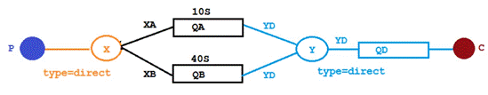

- 基于死信的延迟队列出现的问题：

    - 延迟队列是需要排队的，所以当如果有一个延迟3秒的消息在延迟100秒的消息之后发，那么3秒就得等这100秒先排队消费完。因为rabbitmq只会检查队列中首个的消息是否过期，如果过期则丢如死信或重发，即第二个消息如果是已经ttl过期了的，但却不会被队列察觉然后做出反应。其并不会优先得到执行。


### （2）基于插件

- 逻辑：

    - rabbitmq延迟队列插件提供了一个新的交换机类型，由该模式的交换机进行延迟时间的设置。消息生产后发送到交换机上，交换机等待延迟后再将消息转发给对应的队列。


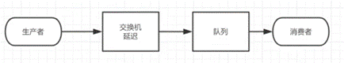

- 插件安装：

    - abbitmq插件市场：https://www.rabbitmq.com/community-plugins.html

    - 插件需要放在rabbitmq目录plugins中。

    - 执行安装命令并重启服务：

```shell
rabbitmq-plugins enable <插件名>
```
- 延迟队列插件实例：

```java
// 设置交换机其他参数
Map<String, Object> arguments = new HashMap<>();
arguments.put("x-delayed-type", "direct");

// 设置交换机类型为插件提供类型
channel.exchangeDeclare("<交换机名>", "x-delayed-message", false, false, arguments);
```


