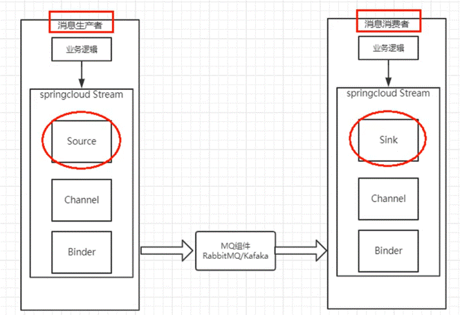

# 一、概念

- SpringCloudStream是一个构建消息驱动微服务的框架。
- 应用程序通过inputs 或者outputs来与SpringCloudStream中binder对象交互。
- 通过我们配置来binding（绑定），而 SpringCloudStream的binder对象负责与消息中间件交互。所以只需要清楚如何与SpringCloudStream交互就可以方便使用消息驱动的方式与MQ进行交互。
- 通过使用SpringIntegration来连接消息代理中间件以实现消息事件驱动。SpringCloudStream为一些供应商的消息中间件产品提供了个性化的自动化配置实现，引用了发布\订阅、消费组、分区的三个核心概念。目前仅支持RabbitMQ、Kafka。



- 常用注解：

| 组成/注解       | 作用                                                         |
| --------------- | ------------------------------------------------------------ |
| Middleware      | 中间件，仅支持RabbitMQ和Kafka                                |
| Binder          | Binder是应用与消息中间件之间的封装，通过Binder可以方便连接中间件，动态改变消息类型 |
| @Input          | 标识输入通道，接收消息进入应用程序，消费者                   |
| @Output         | 标识输入通道，发布消息离开应用程序，生产者                   |
| @StreamListener | 监听队列，即异步监听消费者                                   |
| @EnableBinding  | 指信道和交换机的绑定                                         |

- 引入依赖（以RabbitMQ为例）：
```xml
<dependency>
  <groupId>org.springframework.cloud</groupId>
  <artifactId>spring-cloud-starter-stream-rabbit</artifactId>
  <version></version>
</dependency>
```


# 二、生产者实例

- application配置：

```yaml
spring:
 # 选用rabbitmq作为实现者配置连接参数 
 rabbitmq:
  host: <rabbit-ip>
  port: 5672
  username: <密码>
  password: <用户名>
 cloud:
  stream:
   binders:
    defaultRabbit:
     # 消息组件类型 - rabbit或kafka
     type: rabbit
   # 服务的默认参数 map
   bindings:
    # 通道output - 生产者
    output:
     # 默认交换机名
     destination: studyExchange1
     # 消息传输的类型
     content-type: application/json
```
- 发送消息：

```java
// 1 绑定 - Source生产者
@EnableBinding(Source.class)
public class IMessageProvider {

  // 2 注入MessageChannel组件，并指定为output生产者对象
  @Qualifier("output")
  @Autowired
  private MessageChannel channel;
  public void send() {

    // 3 构建消息对象
    Message<String> msg = MessageBuilder.withPayload("消息").build();

    // 4 通过MessageChannel发送消息，返回值true成功，false失败
    boolean isSend = channel.send(msg);
  }
}
```

# 三、消费者实例

- application配置：

```yaml
spring:
 rabbitmq:
  host: <rabbit-ip>
  port: 5672
  username: <密码>
  password: <用户名>
 cloud:
  stream:
   binders:
    defaultRabbit:
     type: rabbit
   bindings:
    # * 通道input - 消费者
    input:
     destination: studyExchange1
     content-type: application/json
```
- 异步监听消费消息：

```java
@Component
// 1 绑定 - Sink消费者
@EnableBinding(Sink.class)
public class ReceiveMessageListenerController {
  // 监听消费注解
  @StreamListener(Sink.INPUT)
  public void input(Message<String> message) {...}
}
```


# 四、分组与持久化

- Stream默认每个消费者为不同的组，如果不配置当前所在组，那么在消费者连接后都直接分配不同的UUID，即每个消费者在不同的组。

    - 不同的分组对一个消息的消费默认是按消息订阅模型进行消费的，即一对多。

    - 而相同的分组对一个消息的消费是按rabbit工作队列模型进行消费的，即一对一。

- 配置分组（即原配置input后新增属性group）：

```yaml
# ...
input:
 # 消费者分组
 group: <所在组名>
```
- 持久化：

    - 如果配置了分组，那么将开启持久化功能，持久化功能类似与ActiveMQ中持久化主题模式，允许消费者宕机后再次上线时获取消息进行消费。


 

 

 