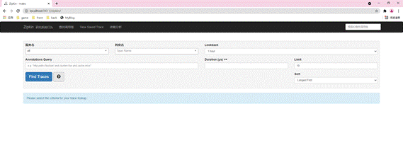

# 一、基本概念

- SpringCloudSleuth提供一套完整的服务跟踪方案，并且兼容支持Zipkin。
    - 本质是Sleuth借鉴Zipkin。并做了整合。
- Zipkin：链路展现视图的框架。即Sleuth用于监控收集，再交给Zipkin展现视图。
- Zipkin安装：
    - 高版SpringCloud下无需构建Zipkin微服务，只需下载并启动jar包即可。
    - 在maven官方下载jar包即可。
- 监控页：
    - Zipkin默认监控页端口：9411
    - 直接使用ip端口即可直接访问监控页。

# 二、监控实例

- 在需要被监控的实例中引入依赖：
```xml
<dependency>
  <groupId>org.springframework.cloud</groupId>
  <artifactId>spring-cloud-starter-zipkin</artifactId>
  <version></version>
</dependency>
```
- 配置sleuth：

```yaml
spring:
 zipkin:
  # zipkin服务地址
  base-url: http://localhost:9411
 sleuth:
  sampler:
   # 监控采样率：0-1之间，1表示全部采集
   probability: 1
```
- 配置后接口经过调用就会被记录并在Zipkin监控页中展现：




 


 