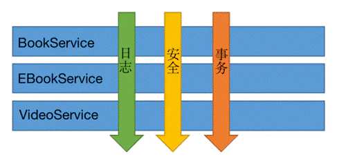

# 一、AOP概念

## （1）基本概念

- AOP是面向切面（方面）编程。与OOP一样是一种设计思想。 
- 面向切面：
    - 假设目前已经有一个对某一业务的方法。那么此时业务突然需要增加一个新的功能。这时，如果直接修改原方法以接纳此新功能，将会导致业务十分混乱。
    - 而通过面向切面的方式，可以在不修改原方法的情况下，在主干功能里添加新功能。
- 优点：利用AOP可以对业务逻辑的各个部分进行隔离，从而使业务逻辑各个部分的耦合度降低，提高程序的可重用性。
- 如图：在不修改BookService、EBookService、VideoService的情况下增加了日志、安全、事务三个功能。这三个功能就是三个切面，通过AOP的形式夹在原方法上。并且可以随时取消其中的功能。



## （2）AOP底层原理

JDK代理模式（有接口）实现类的代理对象

cglib动态代理（无接口）子类的代理对象

## （3）AOP术语

1. 连接点

- 类里面哪些方法可以被增强，这些方法称为连接点

2. 切入点

- 实际真正增强的方法，称为切入点

3. 通知（增强）

- 实际增强的逻辑的部分称为通知
- 通知的种类：
    - 前置通知：在增强方法的前面执行
    - 后置（返回）通知：在增强方法的后面执行（在增强方法return之后执行）
    - 环绕通知：在增强方法的前后执行
    - 异常通知：在增强方法出现异常后执行
    - 最终通知：方法结束后执行，类似异常的finally代码块执行

4. 切面：

- 切面指动作
- 把通知应用到切入点的过程，称为切面。

5. 示例：
```java
// 1 test1和test2方法都可以被增强，这两个方法都为连接点
class Test {

  // 2 假设实际只增强test1方法，那么此方法称为切入点
  public void test1() { }

  public void test2() { }

}

class... {
    
  // 4 在外部新增一个方法,并指定该方法应用在test1方法中，称为切面
  // 3 指定该方法在test1方法的前面执行，称为前置通知
  // 3 指定该方法在test1方法的后面执行，称为后置通知
  // 3 指定该方法在test1方法的前面和后面执行，称为环绕通知
  // 3 指定该方法在当test1方法出现异常时执行，称为异常通知
  // 3 指定该方法在test1方法执行完毕后（不管有无异常）都执行，称为最终通知
  public void newTest() { }

}
```


# 二、Spring AOP

## （1）基于AspectJ实现AOP操作

### 1、AspectJ概念

- AspectJ本身不是Spring框架的内容，它是一个独立的框架。Spring认为基于代理的框架（例如Spring AOP）和成熟的框架（例如AspectJ）都是有价值的，并且它们是互补的，而不是竞争。Spring无缝地将Spring AOP和IoC与AspectJ集成在一起，以在基于Spring的一致应用程序架构中支持AOP的所有使用。

- 使用需要引入SpringAOP相关依赖和aspects.jar依赖。


### 2、切入点表达式

- 语法结构：

    - <切入点指示符>(<权限修饰符> <返回类型> <类全路径> <方法名称> <参数列表>)

- 切入点指示符：

    - execution：用于匹配子表达式

    - within：用于匹配连接点所在的Java类或包

    - this:用于向通知方法中传入代理对象的引用

    - target：用于向通知方法中传入目标对象的引用

    - args：用于将参数传入到通知方法中


- 权限修饰符：public private protected *  // *星号表示任意修饰符


- 示例：

```java
// 1 对com.Test.dao.BookDao类中的add方法进行增强
execution(* com.Test.dao.BookDao.add(参数列表...))

// 2 对com.Test.dao.BookDao类中的所有方法进行增强
execution(* com.Test.dao.BookDao.*(参数列表...))

// 3 对com.Test.dao包中所有类的所有方法进行增强
execution(* com.Test.dao.*.*(参数列表...))
```
- 声明切入点：

    - 使用@Pointcut注解在一个方法上使用即表示声明。

    - 注意：此方法返回值必须是void类型。且方法名为该切入点的标识id。

```java
@Pointcut("<切入点表达式>")  // 可以是value = "<切入点表达式>"
privarte void anyOldTransfer() {}
```


### 3、基于注解方式实现

- 注解方式的实现本质就是使用了AspectJ。

- 实现过程：

- 1 制做主类和增强类

- 2 在增强类上方使用@Aspect注解标识这是一个通知类

- 3 在xml文件中配置启用Aspect支持

    ```xml
    // 基于完全注解开发时可以在配置类上使用
    // @EnableAspectJAutoProxy(proxyTargetClass = true)
    // 进行Aspect支持的启用
    <aop:aspectj-autoproxy/>
    ```
    
- 4 为增强类中的增强方法配置通知
  
    - 前置通知：@Before
    
    
    - 后置通知：@AfterReturning
    
    
    - 环绕通知：@Around
    
    
    - 异常通知：@AfterThrowing
    
    
    - 最终通知：@After
    
- 5 创建主类和增强类的对象：Spring会根据Bean中是否有@Aspect注解判断这个bean是否是一个增强类。
  
    - 可以开启注解扫描进行bean对象的创建
    
    
    - 可以直接配置bean对象
    
- 示例：

    - 假设当前有两个类，一个是增强类（其中有增强方法），一个是主类。

```java
// 增强类
@Component   // 5 创建bean
@Aspect  // 2 标识通知类
class Test1 {
    
  // 4 为增强类方法配置通知：@Before为前置通知
     // 标签中可以填切入点表达式或直接使用声明好的切入点方法
     // 在本类中直接使用方法即可，在别的类中使用全类名加方法即可
     // @Before("anyOldTransfer()")
  @Before(value = "execution(* Test2.test2())")
  public void test1() { }

  // ...其他切入方法

}

// 主类
@Component  // 5 创建bean
class Test2 {
  public void test2() { }
}
```

- 
    xml文件

    - 需要分别引入@Aspect和扫描器的头文件

```xml
<beans>
  <context:component-scan base-package="com.Test..."/>
  <aop:aspectj-autoproxy/>
</beans>
```

- 
    调用：

    - 此时通过getbean调用得到Test2对象后，使用该对象调用test2方法


    - 将会先执行test1方法再执行test2方法。


- 多个增强类的优先级问题：

    - 假设此时有两个增强类对同一个主类进行增强，那么此时可以通过@Order注解对两个增强类的执行顺序进行设置.

    - @Order(值)：值越小表示优先级越高，如下实例，增强类A将在增强类B之前先执行。

```java
public class ... {}  // 主类
@Order(1)

public class A {}  // 增强类A
@Order(2)

public class B {}  // 增强类B
```


### 4、基于xml配置文件实现

- xml配置文件的实现本质上是Sptring自己对AOP的一种实现。

- 实现过程：

    - 1 制做主类和增强类
    - 2 创建主类和增强类的对象
        - 可以开启注解扫描进行bean对象的创建

        - 可以直接配置bean对象

    - 3 配置aop增强：
```xml
<beans>
  <aop:config>
     // 声明切入点表达式：类似@Pointcut注解
     <aop:pointcut id="<表达式标识id>" expression="<切入点表达式>"/>
     // 配置切面：增强作用在具体的方法上
     <aop:aspect>
       // 配置切面的通知类型：类似@Before等注解
       <aop:before method="<增强的方法>" pointcut-ref="<切入点表达式id>"/> 
       <aop:afterReturning ... />
       ...  
     </aop:aspect>
  </aop:config>
</beans>  
```


