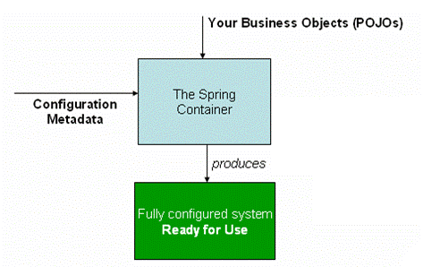
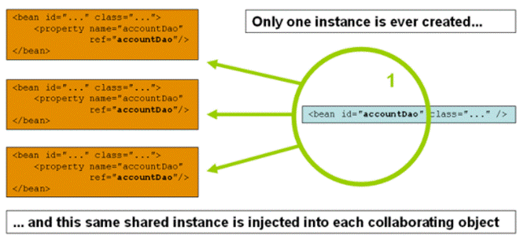
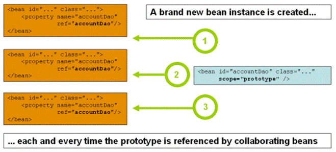

# 一、IOC概念

## （1）IOC解读

- 控制反转，把对象创建和对象之间的调用过程，交给Spring进行管理。

- 使用IOC目的：为了类之间的耦合度降低。

- Spring使用org.springframework.context.ApplicationContext接口代表Spring IoC容器，并负责实例化、配置、组装和管理对象。


## （2）IOC工作原理图



# 二、IOC底层逻辑模式

- IOC通过控制反转将对象与对象之间的耦合性不断降低，以下是各个模式下耦合性的差别。模拟两个类，其中一个类需要调用另一个类的对象方法。


## （1）最初的对象关系
```java
class UserService {
  execute() {
      // 在这个类中new另一个类的对象，再进行调用；
      UserDao dao = new UserDao();
      dao.add();
  }
}
class UserDao {
  add() {
      ...
  }
}
```
## （2）工厂模式（设计模式）的改进
```java
class UserService {
  execute() {
      // 通过工厂模式所设计的第三方类进行中转得到对象，再进行调用
      UserDao dao = UserFactory.getDao();
      dao.add();
  }
}

class UserFactory {
  public static UserDao getDao() {
      return new UserDao;
  }
}

class UserDao {
  add() {
      ...
  }
}
```
## （3）IOC容器下的最终改进
```java
// 1 配置xml文件，配置创建对象
<bean id="dao" class="UserDao" />

// 2 创建工厂类
class UserFactory {
  public static UserDao getDao() {
      String classValue = class属性值  // (1 xml解析
      Class clazz = Class.forName(classValue);  // (2 获取反射运行时类
      return (UserDao)clazz.newInstance();  // (3 通过反射创建并返回对象
  }
}

// 得到通过工厂类创建的UserDao对象，进行方法调用操作
...
```


# 三、IOC接口

## （1）接口概念

- IOC思想基于IOC容器完成，IOC容器底层就是对象工厂。

## （2）Spring提供IOC容器实现的两种接口

- BeanFactory：IOC 容器基本实现，是Spring内部的使用接口，不提供开发人员进行使用。

    - 加载配置文件时候不会创建对象，在获取对象(使用)才去创建对象。

- ApplicationContext：BeanFactory接口的子接口，提供更多更强大的功能，一般由开发人员进行使用。

    - 加载配置文件时候就会把在配置文件对象进行创建。


# 四、基于xml方式的Bean管理

- 基本概念：

    - Bean管理指的是两个操作：Spring创建对象、Spring注入属性

    - Bean管理操作有两种方式：基于xml配置文件方式、基于注解方式


## 1、创建对象
```xml
<bean id="" class="" name=""/>
// 必要属性：
id属性：唯一标识（注意:Spring官方推荐使用首字母小写的驼峰式命名）
class属性：类全路径(包类路径)
// 可选属性：
name：给id属性起别名，可以使用逗号或分号或空格将这些别名分隔

也可以通过外置alias标签对bean起别名：
<alias name="<bean标签中的id值或name值>" alias="<别名：注意只能起一个别名>"/>
```
- 在spring配置文件中，使用bean标签，标签里面添加对应属性，就可以实现对象创建。

- 创建对象时候，默认是执行无参数构造方法完成对象创建。


## 2、注入属性

- DI：依赖注入，就是注入属性。（DI是IOC的一种具体实现）


### （1）使用有参构造方法进行注入
```java
class Test {
  private int T;
  public Test(int T) {
      this.T = T;
  }
}
```
- xml配置文件
```xml
<bean id="test2" class="Test">

   // 属性的注入标签（constructor-arg）该标签可以有多个，对应构造方法的每个参数
   // type属性显示指定构造方法中形参的属性以进行匹配
  <constructor-arg type="int" value="123"/> 

  // name是构造方法中对应的形参名，value是对应的值
  <constructor-arg name="T" value="123"/>  

  // 可以用index参数索指定构造方法中的形参，注意：索引从0开始
  <constructor-arg index="0" value="123"/>

  // 当使用ref引入其他bean时可以不指定对应的参数索引或类型
  <constructor-arg ref="<bean标识id>"/>  

</bean>
```
- 注意当使用name属性直接指定相应的形参名时需要保证JDK能使用debug功能。

    - 当使用name属性指定时，Spring是通过在构造方法中查找参数名称。

    - 可以使用JDK注解@ConstructorProperties显示命名构造方法的每个参数：

```java
@ConstructorProperties({"years", "ultimateAnswer"})
public ExampleBean(int years, String ultimateAnswer) {
  this.years = years;
  this.ultimateAnswer = ultimateAnswer;
}
```
### （2）使用set方法进行注入
```java
class Test {
  private int T;
  public void setT(int T) {
      this.T = T;
  }
}
```
- xml配置文件
```xml
<bean id="test1" class="Test">
  // property该标签可以有多个，对应多个set方法
  // name是类中变量的名称，value是对应的值
  <property name="T" value="123"/>

  // 通过ref属性注入其他bean
  <property name="" ref=""/>

  // 通过内部使用ref标签注入其他类
  <property name="">
      <ref bean="<bean标识id>"/>
  </property>

</bean>
```
### （3）p名称空间注入（本质为set注入）
```xml
// 1 需要在xml的配置文件添加语句：本质上该语句是约束条件
xml文件中需要添加：xmlns:p="http://www.springframework.org/schema/p"

// 2 使用p:T直接代替类中的变量名，进行赋值
<bean id="test3" class="Test" p:T="123" [P:...=""].../>
```
### （4）注入特殊字符
```xml
// 字面量注入：标记外层省略了bean标签

  // 1 注入空值
  <property name="T">  // 变量名T以null值被赋值
      <null/>
  </property>

  // 2 注入特殊符号
  // (1 使用html转义字符代替特殊符号
  <property name="T" value="&xx"></property>
  // (2 使用CDATA形式注入特殊符号
  <property name="T">
      // <![CDATA[]]>：CDATA[]中的内容将视为纯文本内容：类似html中的pre标签
      <value><![CDATA[具体内容]]></value>  
  </property>  
```
### （5）注入对象属性
```xml
// 1 外部bean注入：（通过在xml中新建其他的对象，再将该对象以ref的形式注入原对象中）
<bean id="<对象1的标识>" class="<对象1的类>" />
<bean id="<对象2的标识>" class="<对象2的类>" >
  <property name="类2的属性" ref="<对象1的标识>"></property>
</bean>

// 2 内部bean注入：（在注入原对象的<bean>标记内新建其他对象）
  // 注意：使用内部bean时可以不需要id标识
  // 可以使用id属性，但无效，不能独立访问内部bean
<bean class="<对象2的类>" >
  <property name="类2的属性">
      //可以理解为匿名类，这个对象的创建是直接嵌在注入属性中的
      <bean class="<对象1的类>" />
  </property>

</bean>
```
### （6）符合属性注入

- 假设此时有一个ThingOne类，他有一个fred类对象属性，此对象又有一个bob属性，那么此时可以通过点的方式进行指名注入。

```xml
<bean id="something" class="things.ThingOne">
  <property name="fred.bob" value="123" />
</bean>
```
### （7）集合属性的注入
```xml
/* 根据类中的数组，list，map等属性的注入，需要一次注入多个值，在类中需要set方法 */
<bean id="tst" class="Test">

  <!--数组类型属性注入-->
  <property name="<数组属性名>">
      <array>
        <!-- 对基本属性赋值 -->
        <value>赋值</value> 
        <!-- 也可以引入其他bean赋值 -->
        <ref bean=""/>
        ...
      </array>
  </property>

  <!--list类型属性注入-->
  <property name="<list集合属性名>">
      <list>
        <value>赋值</value>
        <value>赋值</value>
        <ref bean=""/>
        ...
      </list>
  </property>

  <!--map类型属性注入-->
  <property name="<数组属性名>">
      <map>
        <entry key="KEY值" value="VAL值" />
        <value key="KEY值" value-ref="" />
        ...
      </map>
  </property>

</bean>
```
### （7.1）提取集合注入的赋值部分

- 因为按上面的写法仅仅是一个数据对应一个对象，而分离数据可以使得一个数据对应多个对象

    - 需要引入对应的包


    - 需要在xml配置中添加语句 xmlns:util="http://www.springframework.org/schema/util”


    - xsi:schemaLocation地址中需要添加：http://www.springframework.org/schema/util http://www.springframework.org/schema/util/spring-util.xsd 

```xml
// 1 提取
<util:list id="<集合名称>">
  <value></value>  
  // 如果是对象可以用<ref>标签
  <ref>
  ...
</util:list>

// 2 使用
<bean id="..." class="...">
    // 在使用时，使用ref进行导入集合
    <property name="..." ref="<集合名称>" />
</bean>
```
### （7.2）集合以对象作为泛型
```xml
<bean id="tst" class="Test">
  // 假设类中有一个list集合，泛型为一个对象
   <property name="<list集合属性名>">
      <list>
        // 以<ref>标签代替<value>标签,bean属性代表其他bean标签的id值，以对应外部的每个bean标签
        <ref bean="no1" />
        ...
        <ref bean="no2" />
      </list>
  </property>
</bean>

<bean id="no1" class="<泛型对象的类>" />
<bean id="no2" class="<泛型对象的类>" />
```


## 3、引入外部文件注入属性

- 可以使用properties文件以反射进行文件的读取。

- 配置：

```xml
// 1 创建properties文件并书写属性
name=123
user=456

// 2 引入外部配置文件
  // 需要在xml中引入名称空间http://www.springframework.org/schema/context https://www.springframework.org/schema/context/spring-context.xsd
  <context:property-placeholder location="<文件路径>"/>

// 3 使用外部配置文件
在bean中使用${<key>}即可使用key-value映射使用外部文件值。
```


## 4、bean标签的其他属性

### （1）depends-on属性

- 可以在初始化使用此元素的bean之前显式强制初始化一个或多个bean。

```xml
// 此时当初始化beanOne的时候会强制先初始化manager
// 值可以使用逗号空格和分号进行隔开如"manager,abc def;ghi"
<bean id="beanOne" class="ExampleBean" depends-on="manager"/>
<bean id="manager" class="ManagerBean" />
```
### （2）lazy-init属性

- 在ApplicationContext初始化的时候会直接创建所有的单例bean。可以使用lazy-init指定为true打开延迟加载，此时延迟初始化的bean告诉IoC容器在首次请求时（而不是在启动时）创建一个bean实例。

```xml
<bean id="lazy" class="com.something.ExpensiveToCreateBean"
  lazy-init="<boolean值>"/>
<bean name="not.lazy" class="com.something.AnotherBean"/>
```
### （3）autowire属性

- 自动注入属性：设置属性后Spring可以通过bean之间的关系进行自动注入

- 属性值：

    - no：（默认）无自动装配。Bean引用必须由ref标签定义。

    - byName：按属性名称自动注入（Spring会自动匹配set方法与bean标识id的同名进行注入）

    - byType：按类型进行注入（Spring匹配set方法中的类型与bean标识中的类型相同进行注入），同时存在多个同一类型bean会抛出异常。

    - construtor：类似于byType值的注入，但这个类型是匹配构造方法的参数产生的。


## 5、普通bean和工厂bean

- 普通bean：在配置文件中定义bean类型就是返回类型。

```xml
<bean id="..." class="<具体的类>">  // 这个具体的类就是对象返回的类型
```
- 工厂bean（FactoryBean）：在配置文件定义bean类型可以和返回类型不一样。

```java
// 具体的类实现FactoryBean<返回类型>接口即可
// 接口方法：
Object getObject();  // 返回的类型
Class<?> getObjectType();
boolean isSingleton();  // 是否是单例
```


## 6、Bean作用域

- 在bean标签中通过scope属性即可设置bean的作用域


### （1）单实例（scope="singleton"）（默认）

- 与设计模式中的单例模式一致，当Spring实例化该bean时，每个调用该bean所得到的为同一个对象。




### （2）多实例（scope="prototype"）

- 与设计模式中的原型模式一致，当Spring实例化该bean时，每个调用该bean所得到的对象是不同的，调用一次即new一个该bean的对象。




### （3）基于Web的Spring作用域

- scope基于Web的值：request、session、application

- 以request对象为例：当每次创建该bean对象时，都将把这个对象放入request域中。


## 7、Bean生命周期

- 即bean对象从创建到销毁的过程

- bean的生命周期一共有6个过程。分别调用不同的方法进行创建和销毁。


（1）通过构造器创建bean实例（无参数构造）

（2）为bean的属性设置值和对其他bean引用（调用set方法）

（3.0）调用后置处理器方法

（3）调用bean的初始化的方法（需要进行配置初始化的方法）

- bena标签init-method属性，通过赋值属性即可指定bean的初始化方法，该值为类中的方法名（方法不需要加括号）。


（3.1）调用后置处理器方法

（4）bean对象的获取（通过ApplicationContext进行获取xml配置文件）

（5）当容器关闭时候，调用bean的销毁的方法（需要进行配置销毁的方法）

- bean标签destroy-method属性，通过赋值该属性即可指定bean的销毁方法，该值为类中的方法名（方法不需要加括号）。


（6）bean对象的销毁（使用AppllicationContext接口的实现类中的close方法进行销毁）

## 7.1、后置处理器

- 该方法是在bean生命周期调用初始化方法的前后进行执行。

    - 原理：在初始化之前和之后将bean转发到后置处理器的相应方法之中，操作之后再将其return出去。

- 配置：

```java
// 1 创建类并实现BeanPostProcessor接口
// 接口方法：
  // 在初始化之前调用的后置处理器方法
Object postProcessBeforeInitialization(Object bean, String beanName);

  // 在初始化之后调用的后置处理器方法
Object postProcessAfterInitialization(Object bean, String beanName);

// 2 配置后置处理器bean：直接通过xml配置bean标签即可
  // Spring会自动识别实现了接口的后置处理器
  // 并为当前xml文件中所有的bean添加该后置处理器
<bean id="" class=""/>
```


## 8、xml文件的其他使用

（1）通过import标签引入其他xml文件中的bean元素：

- 可以通过import导入一个xml中所有的bean标签到当前xml文件中。

```xml
<beans>
  <!-- 引入三个外部xml文件 -->
  <import resource="services.xml"/>

  <!-- 鉴于这些路径是相对的，最好不要使用任何斜线 -->
  <import resource="resources/messageSource.xml"/>
  <import resource="/resources/themeSource.xml"/>

  <bean id="bean1" class="..."/>
  <bean id="bean2" class="..."/>
</beans>
```


# 五、基于注解方式的Bean管理

## 1、通过注解扫描器注册自动注册bean对象

- 注意：使用注解方式的bean管理需要引入spring-aop.jar的依赖并且开启标签组件的扫描

- 标签组件扫描：

    - 只有在xml文件中开启注解的扫描，Spring才能识别到你在哪个类中使用了注解，并根据该注解创建相应的对象。

```xml
<context:component-scan base-package="<包路径>"/>
// base-package：扫描包内所有的包和文件，多个包可以用逗号空格分号隔开

// 指定扫描：
// context:component-scan标签中的use-default-filters属性
  // 当该属性为true时（默认） -> 扫描包中的所有内容
  // 当该属性为false时（默认） -> 不进行任何扫描
// 此时在context:component-scan标签中指定子标签进行指定扫描

// 设置扫描哪些内容（include）
<context:include-filter type="annotation" expression=""/>

// 设置不扫描哪些内容（exclude）
<context:exclude-filter type="annotation" expression=""/>
```
## 2、创建对象

- Spring提供了四个创建bean对象的注解，他们提供的效果是一样的，只是作为SpringMVC三层架构的区分标识。

```java
@Component  // 组件
@Controller  // 表示层
@Service  // 业务逻辑层
@Repository  // 持久层
```
- 注解创建对象案例演示：

```java
// value属性可以省略，省略则id默认为类名首字母小写的驼峰式命名
@Component(value="<bean标识id>")
public class Test {
  public void add() {
      System.out.println("Test...");
  }
}
```


## 3、DI注入

### （1）@Autowired

- 根据属性类型进行自动注入

```java
public class Test() {
  // 可以用在属性上，此时不需要setter方法（不推荐使用）
  @Autowired
  private String name;

  // 可以用在构造方法上（该构造方法不必是public）（推荐）
  // 注意：只能在一个构造方法上使用；或者使用required属性标记
  @Autowired
  public Test(String name) {
      this.name = name;
  }

  // 可以用在传统的setter方法上
  @Autowired 
  public setName(String name) {
      this.name = name;
  } 

  // 可以用在具有任意名称和多个参数的方法上
  @Autowired
  public setNameQWER(String name) {
      this.name = name;
  }

}
```
- required属性：

    - 可以通过该属性使框架可以通过将其标记为不需要来跳过不满意的注入点

```java
@Autowired(required = <boolean值>)  // 无required属性默认为true
// 当boolean值为false时：Spring会跳过该注入点
```


### （2）@Qualifier

- 根据属性名称进行注入。

- 需要和@Autowired注解一起使用（@Autowired下方）

```java
public class Test() {
  private String name;
    
  @Autowired
  // 在构造方法的参数前使用
  public Test(@Qualifier(value = "<bean标识id>") String name) {
      this.name = name;
  }

  @Autowired
  @Qualifier(value = "<bean标识id>")  // 在普通方法的头部使用
  public getName(String name) {
      this.name = name;
  }
```


### （3）@Resource

- 可以根据类型注入，也可以根据名称注入。可以看作是@Autowired和@Qualifier一起使用的效果。但此注解不能在构造方法中使用。

- 注意：@Resource本身不是Spring中的注解，他是JDK中的注解。所以官方更建议用@Autowired和@Qualifier注解。

```java
public class Test() {
  private String name;

  // 在setter方法中使用
  @Resource(name = "<bean标识id>")
  public getName(String name) {
      this.name = name;
  }

  // 在具有任意名称和多个参数的方法上使用
  @Resource(name = "<bean标识id>")
  public getNameQWER(String name) {
      this.name = name;
  }
```


### （4）@Value

- 注入普通类型属性，如int、String等。

```java
public class Test() {

  private String name;

  // 在构造方法的参数前使用
  public Test(@Value("") String name) {
      this.name = name;
  }

  // 在setter方法上使用
  @Value("")
  public getName(String name) {
      this.name = name;
  }

  // 在具有任意名称和多个参数的方法上使用
  @Value("")
  public getNameQWER(String name) {
      this.name = name;
  }
```
- 注入外部属性：

```java
@Component
public class MovieRecommender {

  private final String catalog;

  // 通过导入外部资源后即可在@Value注解中使用${}指定
  public MovieRecommender(@Value("${catalog.name}") String catalog) {
      this.catalog = catalog;
  }

}
```
- 使用SpEL表达式：

    - SpEL表达式用法详细参考笔记SpEL表达式详解

```java
@Component
public class MovieRecommender {
  private final String catalog;
  public MovieRecommender(@Value("#{}") String catalog) {
      this.catalog = catalog;
  }
}
```


## 3、生命周期注解
```java
public class CachingMovieLister {

  // 初始化注解，同xml文件中的init-method属性
  @PostConstruct
  public void populateMovieCache() {
      // populates the movie cache upon initialization...
  }

  // 销毁注解，同xml文件中的destroy-method属性
  @PreDestroy
  public void clearMovieCache() {
      // clears the movie cache upon destruction...
  }

}
```


### （1）通过Java容器的配置注册bean对象

- 在通过通过主键扫描的过程中，无法清晰的知道bean之间的关系。所以可以使用完全注解开发的模式，以java类模拟xml文件的形式进行bean的注册。

- 这也是SpringBoot推荐的，主流的bean对象配置。

- **完全注解式开发内容补充：**
    - 参考SpringBoot自动配置原理笔记


### （2）包扫描注解

- 使用注解进行bean对象的创建和DI时其本质还是依赖了xml文件（xml中开启包内注解扫描）。

- 通过配置类代替xml注解文件：

```java
@Configuration  // 此注解标识当前类为配置类
@ComponentScan(basePackages = {"<包路径>"})  // 开启包注解扫描
public class SpringConfig {
}
```
- 目录或类的排除：

- 调用方法：

    - 原有的方法是使用了ApplicationContion接口的实现类ClassPathXmlApplicationContext进行配置xml文件从而getBean。

    - 而当使用了配置类代替xml文件时，也需要换用不同的实现类配置对应的类：

    - 一般这种基于注解类开发使用的是SpringBoot进行的整合。

```java
// 加载配置类
ApplicationContext context = new 
  AnnotationConfigApplicationContext(<配置类>.class);
// .... context.getbean .....
```


### （3）bean的实例化

- @Bean注解可以对任何被@Component注解或@Configuration标记过类的方法级别的注解。通过@Bean注解和@Configuration注解的配合即可使配置类像xml文件一样配置bean。

- 如该例子，其中配置类等价于xml文件

```java
@Configuration
public class AppConfig {

  // value属性可以省略，省略则id默认为方法名
  @Bean(value = "<bean标识id>")
  public MyService myService() {

      // 定义自己创建的实例后返回该实例即可
      return new MyServiceImpl();
  }

  // ...
}
```
- 上述配置类等价于下面的xml文件

```xml
<beans>
  <bean id="myService" class="com.acme.services.MyServiceImpl"/>
</beans>
```
- getBean
```java
ApplicationContext context = new 
  AnnotationConfigApplicationContext(AppConfig.class);
MyService my = context.getBean("myService", MyService.class);
```


### （4）Bean-DI注入

- 对方法参数注入：

    - 通过为方法名添加形参，注入到方法形参后再调用内部new中的构造方法进行实例化。

```java
@Configuration
public class AppConfig {
  // @Bean标签自动寻找依赖注入，也可以使用其他注解如@Autowired在@Bean下方使用
  @Bean
  // 注入参数到transferService方法中，然后调用Impl的构造方法注入
  public TransferService transferService(AccountRepository accountRepository) {
      return new TransferServiceImpl(accountRepository);
  }
}
```


### （5）@Bean注解和``<Bean>``标签的属性

- @Bean注解中的每个属性可以使用逗号进行分隔

    - value属性和name属性，生命周期初始化方法和销毁方法

```java
@Bean(value = "", name = "", initMethod = "", destroyMethod = "")
// 注意 value属性和name属性的效果一致，且同时只能存在一个
// value：bean标识id，同xml中<bean id="">
// name：bean标识id，同<bean id="">
// 当需要多个别名时：@Bean(name = {"","",...})直接使用大括号Spring数组即可
// 也可以是@Bean(value = {"","",...})
// 或者当只有一个别名属性时@Bean({"","",...})  // 可以直接忽略key指定

// initMethod：bean初始化方法，同xml<bean init-method="">
// destroyMethod：bean销毁方法，同xml<bean destroy-method="">
```
- 生命周期初始化销毁方法的直接调用

    - 当直接使用Java时，可以对对象执行任何操作，而不必总是依赖容器生命周期。

```java
@Configuration
public class AppConfig {
  @Bean
  public BeanOne beanOne() {
      BeanOne beanOne = new BeanOne();
      // 实例化的对象直接调用方法即可，不必依赖SpringinitMethod属性帮助调用
      beanOne.init();
      return beanOne;
  }
  // ...
}
```


### （6）@Scope注解

- @Scope注解，同xml文件中bean标签的scope属性一致，用于指定bean的作用域。

```java
@Configuration
public class MyConfiguration {
  @Bean
  @Scope("prototype")  // 取值同bean标签scope属性一致
  public Encryptor encryptor() {
      // ...
  }
}
```


### （7）@Description注解

- 可以使用此注解为有关的bean提供更详细的文本描述，以便于运行时抛出异常等暴露出bean。

```java
@Configuration
public class AppConfig {
  @Bean
  @Description("Provides a basic example of a bean")
  public Thing thing() {
      return new Thing();
  }
}
```


### （8）@import注解

- 此注解用于导入其他配置类的bean，同xml文件中的<import>标签一样。<import>导入的是xml文件的bean，而@import导入的是配置类的bean。

- 可以用于向容器中导入自己的组件，或者第三方中制定的组件。

```java
@Configuration
public class ConfigA {
  @Bean
  public A a() {
      return new A();
  }
}

@Configuration
// 导入ConfigA组件，即导入ConfigA中的bean
@Import(ConfigA.class)  // String[]
public class ConfigB {
  @Bean
  public B b() {
      return new B();
  }
}
```


