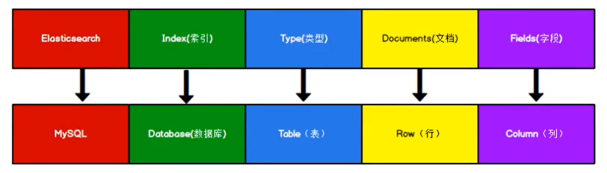

# 一、基本概念

## 1、基本概念

- Elasticsearch（ES）是一个分布式、高扩展、高实时的搜索与数据分析引擎。它能很方便的使大量数据具有搜索、分析和探索的能力。充分利用Elasticsearch的水平伸缩性，能使数据在生产环境变得更有价值。Elasticsearch 的实现原理主要分为以下几个步骤，首先用户将数据提交到Elasticsearch 数据库中，再通过分词控制器去将对应的语句分词，将其权重和分词结果一并存入数据，当用户搜索数据时候，再根据权重将结果排名，打分，再将返回结果呈现给用户。
- 官方文档：
    - 英文官方文档（ES8.x）https://www.elastic.co/guide/index.html
    - Elasticsearch权威指南（ES2.x）：https://www.elastic.co/guide/cn/elasticsearch/guide/current/index.html
    
- 数据格式：
    - Elasticsearch是面向文档型数据库，一条数据在这里就是一个文档。为了方便大家理解，我们将Elasticsearch里存储文档数据和关系型数据库MySQL存储数据的概念进行一个类比。
    - ES里的Index可以看做一个库，而Types相当于表，Documents则相当于表的行。这里Types 的概念已经被逐渐弱化，Elasticsearch 6.X中，一个index 下已经只能包含一个type
    - <font color="red">Elasticsearch 7.X中, Type的概念已经被删除了。</font>



- 在ES中，采用<font color=red>倒排索引</font>进行排序：

```
// 正排索引 （uuid -> 关键字）（mysql）
 id               content
1001        my name is zhang san
1002          my name is li si
通过拿到 1001 -> 可以找到对应的content，但是从content出发，很难检索到id

// 倒排索引 （关键字 -> uuid）
keyword       id
  name     1001, 1002
 zhang       1001
ES在插入文档（记录）的过程中，就是以keyword进行索引，所以通过索引很容易就能检索出id
```

## 2、安装

- 使用docker进行安装即可。<font color="red">！注意：在启动时必须指定JDK的堆栈空间，否则ES将直接按本机最大内存空间分配！</font>
- 端口号：在ES中，9300端口为Elasticsearch集群间组件的通信端口，9200端口为浏览器访问的 http协议RESTful端口。
- 在安装成功后可以使用http://ip:9200进行测试，返回以下数据则ES安装成功。

```json
{
  "name" : "bc3ab5409d72",
  "cluster_name" : "elasticsearch",
  "cluster_uuid" : "ZriqNdPDTfeWonzMHKmg5g",
  "version" : {
    "number" : "7.4.2",
    "build_flavor" : "default",
    "build_type" : "docker",
    "build_hash" : "2f90bbf7b93631e52bafb59b3b049cb44ec25e96",
    "build_date" : "2019-10-28T20:40:44.881551Z",
    "build_snapshot" : false,
    "lucene_version" : "8.2.0",
    "minimum_wire_compatibility_version" : "6.8.0",
    "minimum_index_compatibility_version" : "6.0.0-beta1"
  },
  "tagline" : "You Know, for Search"
}
```

- 客户端使用：
    - ES的本地客户端操作方法是使用<font color="red">REST-API风格</font>进行请求的发送，从而达到操作的效果。如果直接通过浏览器向Elasticsearch服务器发请求，那么需要在发送的请求中包含HTTP标准的方法，而HTTP的大部分特性且仅支持GET和POST方法。所以为了能方便地进行客户端的访问，本地客户端可以使用PostMan工具。

# 二、基本使用

- 以下操作ES软件所在服务器IP均为localhost:9200

## 1、索引操作（数据库）

### （1）创建索引

- 对比关系型数据库，创建索引就等同于<font color="red">创建数据库</font>。
- 索引名不能相同（幂等性操作）

```http
<put>
http://localhost:9200/<索引名>
```

### （2）获取索引

- 查看单个索引

```http
<get>
http://localhost:9200/<索引名>
```

- 查看所有存在的索引

```http
<get>
http://localhost:9200/_cat/indices?v
```

### （3）删除索引

```http
<delete>
http://localhost:9200/<索引名>
```

## 2、文档操作（记录）

### （1）创建文档

- 对比关系型数据库，创建文档就等同于<font color="red">添加关系型数据库中的表数据</font>。添加的数据格式为JSON格式
- 可以有相同的文档名（覆盖操作）（非幂等性操作）

```http
<post> 或 <put>
http://localhost:9200/<索引名>/<文档名>/[文档标识id(不指定则返回uuid)]
json-body：
{
	"title": "",
	"category: "",
	"images": "",
	"price": ""
}
```

- 响应数据

```json
{
    "_index": "shopping",    // 文档所属的索引
    "_type": "_doc",
    "_id": "VP9hyoYBfR6w50r3ncQN",    // 当前文档名的唯一标识
    "_version": 1,
    "result": "created",
    "_shards": {
        "total": 2,
        "successful": 1,
        "failed": 0
    },
    "_seq_no": 0,
    "_primary_term": 1
}
```


### （2）查询文档

- 查看单个文档

```http
<get>
http://localhost:9200/<索引名>/<文档名>/<文档标识id>
```

- 查看所有存在的文档

```http
<get>
http://localhost:9200/<索引名>/_search
```

- 条件查询
    - 参数q=<key>:<value> 其中 key为文档Json的字段名,value是其对应的条件值

```http
<get>
http://localhost:9200/<索引名>/_search?q=<字段名>:<字段值>
```

- 条件查询（指定条件）

```http
<get>
http://localhost:9200/<索引名>/_search
json-body：
{
	// 查询
	"query": {
		// 1 匹配值（部分匹配 like%%）
		"match": {
			"<字段名>": "<字段值>"
		}
		
		// 2 查询所有的文档记录，即无条件，注意：match_all不允许有字段
		"match_all": {}
	},
	
	// 分页查询 from为第几页，size为每页的记录数
	"from": 0,
	"size": 2,
	
	// 指定查询字段
	"_source": ["<字段名>"],
	
	// 排序
	"sort": {
		"<排序字段>": "asc | desc"
	}
}
```

- 指定条件JsonBody的其他查询条件

```json
{
	"query": {
        // 表示多个条件拼接
        "bool": {
            // must表示and；should表示or；
            "must": [
                // 条件1
                {
                    "match": {
						"<字段名>": "<字段值>"
					}
                },
                // 条件2
                {
                    "match": {
						"<字段名>": "<字段值>"
					}
                }
            ],
            
            // 过滤查询记录
            "filter": {
                // 范围匹配
                "range": {
                    "<字段名>": {
                        // gt表示小于等于，类似MybatisPlus中的Wrapper方法名
                        "gt": "<字段值>"
                    }
                }
            }
            
        }
	},
}
```

#### （2.1）全文检索（倒排索引）

- 在ES中，创建一个文档时，它的本质会将文档的<font color="red">value值</font>给拆开做成<font color="red">查询要用的key</font>。并且当使用query-match进行查询的时候，查询条件的值也会被拆开，分别作为value值去匹配索引中符合<font color="red">查询要用的key</font>的文档。即索引中若包含文档（小米、华为），而搜索条件为（小华），则最终会同时检索出（小米、华为）两条文档记录。这种检索方式称为<font color="red">全文检索</font>。
- 全文检索查询与精确查询

```json
{
	// 查询
	"query": {
		// 1 全文检索
		"match": {
			"<字段名>": "<字段值>"
		},
		
        // 2 精确检索
        "match_phrase": {
			"<字段名>": "<字段值>"
		}
	},
}
```

#### （2.2）高亮显示查询结果

- 可以在查询条件中指定将查询结果高亮显示，此时按照全文检索或精确检索的方式进行查询后，查询结果中会有部分单词与全文检索词相同（或者指定的字段），ES可以将这些单词使用<em>标签将其包围，进行高亮显示，然后统一返回。

```json
{
    "query": {
		"match": {
			"<字段名>": "<字段值>"
		},   
    },
    // 高亮显示
    "highlight": {
        // 指定字段条件
        "fieleds": {
            "<字段名>": {}
        }
    }
}
```

#### （2.3）聚合查询

- 聚合操作允许将查询的结果如同MySQL中的group操作一样进行分组。

```json
{
    // 聚合操作
    "aggs": {
        "<分组名>": {
            // 分组
            "terms": {
                "field": "<分组字段>"
            }
        }
    }
}

// 响应
"buckets": [
    {
        "key": 分组字段对应的值
        "doc_count": 对应的文档记录数
    },
    ...
]
```

- 聚合查询中使用聚合函数

```json
{
    "aggs": {
        "<分组名>": {
            // 聚合查询平均值
            "avg": {
                "field": "<分组字段>"
            }
        }
    }
}
```

#### （2.4）子聚合

- 如果要在聚合查询中查看2个及以上的字段，可以使用子聚合。

```json
{
    // 聚合操作
    "aggs": {
        "<分组名>": { ... },
        // 子聚合
        "aggs": {
            // 其他查询字段
            "<分组名>": {
            	// 分组
                "terms": {
                    "field": "<分组字段>"
                }
        	}
        }
    }
}
```

### （3）修改文档

- 完全覆盖性修改：
    - 修改文档，新的文档会完全的覆盖旧的文档（幂等性操作）

```http
<put>
http://localhost:9200/<索引名>/<文档名>/<文档标识id>
json-body：
{
	...
}
```

- 局部覆盖性修改：


```http
<post>
http://localhost:9200/<索引名>/_update/<文档标识id>
json-body：
{
	// doc表示这是一个数据
	"doc": {
		...修改的字段
	}
}
```

### （4）删除文档

```http
<delete>
http://localhost:9200/<索引名>/<文档名>/<文档标识id>
```

### （5）映射关系

-  ES允许对索引（数据库）中的文档记录做一个映射关系，从而指定文档记录对应的类型，可以用于规定当前文档记录的类型（是否可以被查询（索引），是否必须要精确检索）。
- 并且在查询的过程中，以文档记录的映射类型为最高优先级进行判断，其次再用查询的类型进行判断

```http
<put>
http://localhost:9200/<索引名>/_mapping
json-body：
{
	"properties": {
		"<文档名>": {
			// 该文档名的类型：text可被拆分匹配，keyword不可被拆分匹配
			"type": "text | keyword",
			// 文档是否可以被索引，不可索引即不可被查询
			"index": true | false
		}
		// ... 其他文档名
	}
}
```

## 3、其他操作

### （1）文档迁移：

- 在ES中，若索引中存在数据，则不能对索引的映射进行修改，否则对应文档会出现问题。
- 此时可以将文档从一个索引复制到另一个索引之中。

```http
<post>
http://localhost:9200/_reindex
{
	"source": {
		"index": "<原索引>"
	},
	"dest": {
		"index": "<目标索引>"
	}
}
```

# 三、Java API

- 官方文档：https://www.elastic.co/guide/en/elasticsearch/client/java-rest/current/java-rest-high.html
- 技术选型：在ES中，支持用两个端口对服务进行连接，通过9300和9200端口连接后即可操作ES。
    - 9300端口TCP请求
        - spring-data-elasticsearch:transport-api.jar与SpringData整合框架，在8.x版本中被废弃

    - 9200端口HTTP请求
        - JestClient，非官方整合，更新慢
        - Spring中自带的RestTemplate模拟HTTP请求，需要自己封装Util
        - HttpClient，模拟HTTP请求同上
        - （推荐使用）Elasticsearch-Rest-Client，官方RestClient，封装了ES操作，API层次分明

- Elasticsearch-Rest-Client
    - 本质并不是TCP长连接的封装框架，而是模拟HTTP请求与ES服务器进行通信。


### 1、引入Maven依赖

```xml
<!-- elasticsearch依赖 -->
<dependency>
    <groupId>org.elasticsearch</groupId>
    <artifactId>elasticsearch</artifactId>
    <version></version>
</dependency>

<!-- 推荐使用 high-level 对底层进行更加细致化的封装 -->
<!-- els高级客户端依赖 包含elasticsearch依赖 -->
<dependency>
    <groupId>org.elasticsearch.client</groupId>
    <artifactId>elasticsearch-rest-high-level-client</artifactId>
    <version></version>
</dependency>
```

### 2、创建客户端对象

- 其他操作均默认新建RestHighLevelClient esClient对象

```java
@Test
public void createClient() throws IOException {

    // 创建 es 客户端
    HttpHost httpHost = new HttpHost("<ip>", 9200, "http");
    RestClientBuilder builder = RestClient.builder(httpHost);
    RestHighLevelClient esClient = new RestHighLevelClient(builder);
    
    // 使用 RestHighLevelClient 对 es 进行操作
    // esClient...
    
    // 通过esClient可以拿到对应其他的客户端，然后对其进行操作
    // 具体可以参考ResthighLevelClient类首final属性
    // 如下拿到索引的客户端，可以调用其方法对索引进行操作
    IndicesClient indices = esClient.indices();

    // 关闭 es 客户端
    esClient.close();

}
```

### 3、索引操作

- 创建索引

```java
// 创建索引
// 1 获取索引客户端对象
IndicesClient indices = esClient.indices();
// 2 创建索引请求对象（Create），并构造索引所需要的参数
CreateIndexRequest createIndexRequest = new CreateIndexRequest("<索引名>");
// 3 发送请求创建，返回响应对象
// RequestOptions为请求附带的其他参数，一般默认即可
CreateIndexResponse response = indices.create(createIndexRequest, RequestOptions.DEFAULT);
// 4 拿到请求是否成功的bool值
boolean acknowledged = response.isAcknowledged();
```

- 查询索引

```java
IndicesClient indices = esClient.indices();

// 构造索引请求对象（Get）并发送请求
GetIndexRequest getIndexRequest = new GetIndexRequest("<索引名>");
GetIndexResponse response = indices.get(getIndexRequest, RequestOptions.DEFAULT);

// 拿到索引的信息，其getXXX方法对应返回的Json属性变量名
response.getAliases();
response.getSettings();
response.getMappings();
```

- 删除索引

```java
IndicesClient indices = esClient.indices();

// 同理构造 XXXIndexRequest 对象
DeleteIndexRequest deleteIndexRequest = new DeleteIndexRequest("<索引名>");
AcknowledgedResponse delete = indices.delete(deleteIndexRequest, RequestOptions.DEFAULT);
boolean acknowledged = delete.isAcknowledged();
```

### 4、文档操作

### （1）文档增删改

- 创建文档（IndexRequest）

```java
// 1 构造文档Json对象（以User-JavaBean为例）
// 并将其通过 Jackson 格式工具转换为 JSON字符串对象
User user = new User(1001L, "名字", 18, "男");
ObjectWriter writer = new ObjectMapper().writer();
String s = writer.writeValueAsString(user);

// 2 创建一个索引请求对象（XXXRequest）
// 构造需要创建文档的目标索引，文档内容，文档指定id（不指定则自动uuid）同HTTP请求
IndexRequest indexRequest = new IndexRequest();
// 链式编程 均返回 IndexRequest 对象
indexRequest.index("<索引名>").id("<文档id>").source(s, XContentType.JSON);

// 2.1 通过source重载方法直接构造Json对象
indexRequest.index("<索引名>").id("<文档id>")
    // 传入参数第一个为指定类型，后面为可变参数，并且要求必须成对传入（保持kv键值对）
    // source(XContentType.JSON, ...source);
    .source(XContentType.JSON, "key1", "value1", "keyN", "valueN", ...);

// 3 发送请求对象 并返回结果封装对象
// 注：这里直接通过普通的 esClient 客户端对象index方法发送请求即可
IndexResponse response = esClient.index(indexRequest, RequestOptions.DEFAULT);
// Result枚举结果 CREATED(0),UPDATED(1),DELETED(2),NOT_FOUND(3),NOOP(4)
Result result = response.getResult();
```

- 修改文档（UpdateRequest）

```java
// XXXRequest 改为 UpdateRequest 构造其对象
UpdateRequest updateRequest = new UpdateRequest();
updateRequest.index("<索引名>").id("<文档id>");

// 通过对象Json直接修改（全修改，按JavaBean中属性和值对应修改）
updateRequest.doc(<json string>, XContentType.JSON);
// 直接传递参数修改（部分修改）
updateRequest.doc(XContentType.JSON, "<字段名>", "<字段值>")

// 发送请求
UpdateResponse response = esClient.update(updateRequest, RequestOptions.DEFAULT);
```

- 删除文档（DeleteRequest）

```java
// 同理构造 XXXRequest 发送请求进行删除即可
DeleteRequest DeleteRequest = new DeleteRequest();
deleteRequest.index("<索引名>").id("<文档id>");
DeleteResponse response = esClient.update(deleteRequest, RequestOptions.DEFAULT);
```

- 批量操作文档（BulkRequest）

    - API提供一个类似List集合的对象来对批量新增、删除、修改操作进行收集操作，并统一发送请求给ES进行处理

    ```java
    // 1 构造 BulkRequest 对象 添加其他请求
    BulkRequest bulkRequest = new BulkRequest();
    bulkRequest.add(new IndexResponse(...));
    bulkRequest.add(new DeleteRequest(...));
    bulkRequest.add(new UpdateRequest(...));
    
    // 2 发送请求 并返回响应
    BulkResponse bulkResponse = esClient.bulk(bulkRequest, RequestOptions.DEFAULT);
    
    // 3 响应时间 ms
    TimeValue took = bulkResponse.getTook();
    // 4 每项请求的响应状态（如操作id，操作类型，操作索引名，失败原因）
    // 若未失败，则 Failure 方法返回 null
    for (BulkItemResponse item : bulkResponse.getItems()) {
        // ...
    }
    ```

### （2）文档查询

- 基本查询（GetRequest）

```java
// 1 同增删改一样 构造 XXXRequest对象（GetRequest）
GetRequest getRequest = new GetRequest();
getRequest.index("<索引名>").id("<文档id>");

// 2 直接通过普通esClient发送请求查询
GetResponse response = esClient.get(getRequest, RequestOptions.DEFAULT);

// 3 通过响应拿到Json字符串，可通过Json工具序列化成Java对象
String responseData = response.getSourceAsString();
```

- 高级查询（SearchRequest）

```java
// 1 同理构造XXXRequest（SearchRequest）
SearchRequest searchRequest = new SearchRequest();
// 指定索引名
searchRequest.indices("<索引名>");

// 2 使用 SourceBuilder 构造查询条件
SearchSourceBuilder sourceBuilder = new SearchSourceBuilder();
// QueryBuilders工具类中包含一些常规的查询条件静态方法
// 如 QueryBuilders.matchAllQuery() 全量查询
sourceBuilder.query(QueryBuilders.matchAllQuery());

// 3 将SearchSourceBuilder对象添加到SearchRequest构造中
searchRequest.source(sourceBuilder);

// 4 发送请求 并接收响应 响应返回SearchHits对象，包含符合查询条件的返回值
SearchResponse response = esClient.search(searchRequest, RequestOptions.DEFAULT);
SearchHits hits = response.getHits();
for (SearchHit hit : hits.getHits()) {
    String hitString = hit.getSourceAsString();
}
```

- 其他高级查询
    - 其他高级查询均是通过构造不同的SearchSourceBuilder来指定查询的条件

```java
// 构造 SearchSourceBuilder 其他同上
SearchSourceBuilder sourceBuilder = new SearchSourceBuilder();

// 1 全量查询 matchAllQuery
sourceBuilder.query(QueryBuilders.matchAllQuery());

// 2 条件查询 termQuery
sourceBuilder.query(QueryBuilders.termQuery("<条件字段名>", "<条件值>"));

// 3 模糊查询 fuzzyQuery
sourceBuilder.query(
    QueryBuilders.fuzzyQuery("<条件字段名>", "<条件值>")
        // fuzziness为模糊的偏差值，如记录为abcd，查询值为a，那么偏差值为3（差3个）
    	// Fuzziness枚举 ONE TWO ...
         .fuzziness(Fuzziness.TWO)
);

// 4 分页查询 from为当前页，size为每页的文档记录数
sourceBuilder.from(int);
sourceBuilder.size(int);

// 5 查询排序
sourceBuilder.sort("<排序名>", SortOrder.ASC | SortOrder.Desc);

// 6 过滤字段 指定包含的名称，排除的名称
String[] excludes = {};
String[] includes = {};
sourceBuilder.fetchSource(includes, excludes);
```

- 高级功能的Builder
    - 通过QueryBuilders的静态方法可以拿到其他更多功能的Builder，然后再将那些Builder添加到SearchSourceBuilder中，即可实现其他的查询方式。

```java
// 构造 SearchSourceBuilder 其他同上
SearchSourceBuilder sourceBuilder = new SearchSourceBuilder();

// 拿到其他功能的builder 如组合查询的Builder
BoolQueryBuilder boolQueryBuilder = QueryBuilders.boolQuery();
// 添加构建
sourceBuilder.query(boolQueryBuilder);

// 1 组合查询
BoolQueryBuilder boolQueryBuilder = QueryBuilders.boolQuery();
// 再添加其他 Builder 并选择 and or 进行组合
// must | should | notMust | notShould
boolQueryBuilder.must(QueryBuilders.matchQuery("<字段名>", "<字段值>"));
boolQueryBuilder.should(QueryBuilders.matchQuery("<字段名>", "<字段值>"));

// 2 范围查询
RangeQueryBuilder rangeQueryBuilder = QueryBuilders.rangeQuery("字段名");
// 类似 MybatisPlus 中的 Wrapper 进行条件拼装 
rangeQuery.gte(18);

// 3 高亮查询
// HighlightBuilder包含方法有
// preTags自定义高亮的前置标签，postTags自定义高亮的后置标签，field高量字段名
HighlightBuilder highlightBuilder = new HighlightBuilder();
// 添加构建
sourceBuilder.highlighter(highlightBuilder);

// 4 聚合查询 使用AggregationBuilders的静态方法获取功能builder
// 该静态方法包括常规的聚合函数，使用并构造即可
AggregationBuilder aggregationBuilder = AggregationBuilders.max();
sourceBuilder.aggregation(aggregationBuilder);
```


