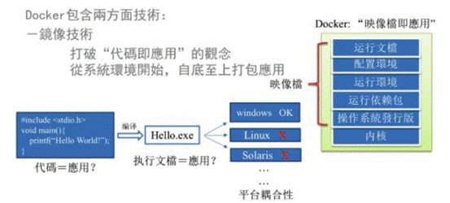
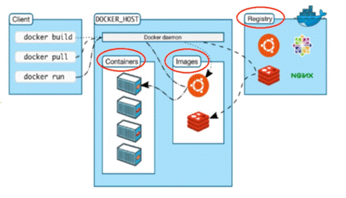
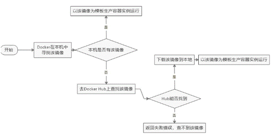
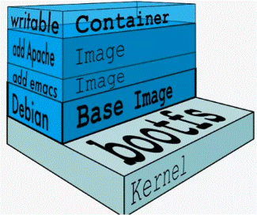
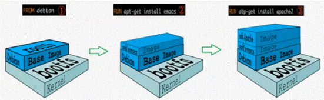
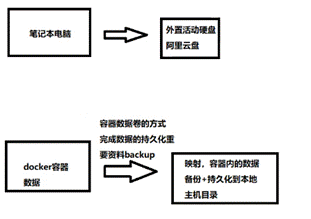
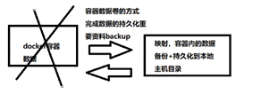

## 一、什么是Docker

 1、解决问题：用于解决系统平滑移植，容器虚拟化技术。



 2、Docker理念：一次镜像处处运行，从搬家到搬楼。（每个应用都是一个镜像，该镜像是直接可以运行的，包含了所有的配置，环境等，一次镜像，处处运行，实现从搬家到搬楼）

3、Docker与虚拟机（以CentOS为例）：

- 虚拟机是一个带环境安装的解决方案，在一个操作系统中安装另一个操作系统，附带了所有必要的或不必要的环境。（本质：对硬件的虚拟化）

- Docker则是使用Linux容器，只安装必要的环境，将软件运行所有的资源打包到一个隔离的容器之中。容器与虚拟机的不同，不需要捆绑一整套操作系统，只需要自己所需的环境即可，使得Docker的运行更加轻便，小巧。（本质：复用本地主机操作系统）


## 二、Docker三要素

### 1、镜像（lmage）

- docker镜像文件类似于Java的类模板，而docker容器实例类似于java中new出来的实例对象。Docker镜像就是一个只读的模板。镜像可以用来创建Docker容器，一个镜像可以创建很多容器。它也相当于是一个root文件系统。比如官方镜像centos7就包含了完整的一套centos7最小系统的root文件系统。相当于容器的“源代码”。

- 即每个镜像仅包含业务运行所需的runtime环境，CentOS/Ubuntu基础镜像仅170M。


### 2、容器（Container）

- 就像是Java中的类和实例对象一样，镜像是静态的定义，容器是镜像运行时的实体。Docker利用容器独立运行的一个或一组应用，应用程序或服务运行在容器里面，容器就类似于一个虚拟化的运行环境，容器是用镜像创建的运行实例。容器为镜像提供了一个标准的和隔离的运行环境,它可以被启动、开始、停止、删除。每个容器都是相互隔离的、保证安全的平台。

- 从镜像容器角度：可以把容器看作是一个简易版的Linux系统（包括root用户权限、进程空间、用户空间和网络空间等）和运行在其中的应用程序。


### 3、仓库（Repository）

- 类似与Maven仓库，GitHub。用于存放各种镜像模板的地方。仓库分为公开仓库（Public）和私有仓库（Private）两种形式。最大的公开仓库是DockerHub（https://hub.docker.com），存放了数量庞大的镜像供用户下载。国内的公开仓库包括阿里云、网易云等。


## 三、Docker架构

- 镜像、容器、仓库的关系




 

## 四、Docker安装和卸载（以CentOS为例）

- Linux安装官方文档[https://docs.docker.com/desktop/install/linux-install/](https://docs.docker.com/engine/install/)


### （1）安装

1、卸载原有旧版本Docker
```shell
sudo yum remove docker \
         docker-client \
         docker-client-latest \
         docker-common \
         docker-latest \
         docker-latest-logrotate \
         docker-logrotate \
         docker-engine
```
2、安装Docker相关环境（gcc、gcc-c++）
```shell
yum -y install gcc
yum -y install gcc-c++
```
3、安装Docker工具包和设置仓库地址
```shell
# 1 安装Docker引擎
sudo yum install -y yum-utils

# 2 设置Docker仓库（7行为国外仓库，可替换为国内阿里云仓库）
sudo yum-config-manager \
  --add-repo \
  https://download.docker.com/linux/centos/docker-ce.repo
```
- 阿里云仓库地址（entOS）
    - http://mirrors.aliyun.com/docker-ce/Linux/centos/docker-ce.repo

4、安装Docker引擎
```shell
sudo yum install docker-ce docker-ce-cli containerd.io docker-compose-plugin
```
5、启动Docker
```shell
sudo systemctl start docker
```
6、执行Docker自带的HelloWorld程序
```shell
sudo docker run hello-world
```
**（2）卸载**
```shell
# 1 停止docker运行
sudo systemctl stop docker

# 2 从yum中移除
sudo yum remove docker-ce docker-ce-cli containerd.io docker-compose-plugin

# 3 删除docker相关文件
sudo rm -rf /var/lib/docker
sudo rm -rf /var/lib/containerd
```


## 五、Docker镜像加速器配置（以阿里云为例）

- 阿里云中Docker容器镜像服务。创建个人实例，获得加速器地址，执行脚本配置即可。详见阿里云配置镜像加速器文档。


## 六、Docker Run命令的运行过程



 

## 七、镜像分层的概念

### 1、联合文件系统（Union File System）

- 是一种分层、轻量级并且高性能的文件系统，它支持对文件系统的修改作为一次提交来一层层的叠加，同时可以将不同目录挂载到同一个虚拟文件系统下。Union文件系统是Docker镜像的基础。镜像可以通过分层来进行继承，基于基础镜像（没有父镜像)，可以制作各种具体的应用镜像。

- 特点：

    - 一次同时加载多个文件系统。但从外面看起来，只能看到一个文件系统，联合加载会把各层文件系统叠加起来，这样最终的文件系统会包含所有底层的文件和目录。

    - 就像一个花卷一样。例如，你可以制作一个带有redis的centos镜像，此时，该镜像是继承原有的centos镜像，在此之上增加了redis。在镜像的加载，下载，保存等过程中，也是按照继承的方式进行一层一层的执行（不是把你的新镜像直接保存，而是保存redis，然后先加载centos，再加载你的修改，即增加redis）。


### 2、镜像加载原理（迷你版linux）

- docker的镜像实际上由一层一层的文件系统组成，这种层级的文件系统UnionFS。

- bootts(boot file system)主要包含bootoader和kernel, bootoader主要是引导加载kernel，Linux刚启动时会加载poots文件系统，在Docker镜像的最底层是引导文件系统bootfs。这一层与我们典型的LinuxUnix系统是一样的，包含boot加载器和内核。当boot加载完成之后整个内核就都在内存中了，此时内存的使用权己由bootfs转交给内核，此时系统也会卸载bootfs。

- rootfs (root file system)，在bootfs之上。包含的就是典型Linux 系统中的/ldev， /proc，/bin，/etc等标准目录和文件。rootis就是各种不同的操作系统发行版，比如Ubuntu，Centos等等。

- 即虚拟机安装都是好几个g的硬盘，而docker才200多M。


### 3、重点理解：

- Docker镜像层都是只读的，容器层是可写的

- 当容器启动时，一个新的可写层被加载到镜像的顶部。这一层通常被称作“容器层”，“容器层”之下的都叫“镜像层”。

- 所有对容器的改动，无论添加、删除、还是修改文件都只会发生在容器层中。只有容器层是可写的，容都层下面的所有镜像层都是只读的。




- Docker中的镜像分层，支持通过扩展现有镜像，创建新的镜像。类似Java继承于一个Base基础类，自己再按需扩展。新镜像是从base镜像一层一层叠加生成的。每安装一个软件，就在现有镜像的基础上增加一层。




 

## 八、容器数据卷

- 挂载目录权限访问参数（挂载时建议加上）

```shell
--privileged=true
```
### 1、什么是容器数据卷

- 完成一个容器的目录和宿主机的目录进行映射，从而达到容器备份的目的。类似redis中的rdb和aof文件，将docker容器内的数据保存到宿主机的磁盘中。

- 卷就是目录或文件，存在于一个或多个容器中，山docker挂载到容器，但不属于联合文件系统，因此能够绕过Union File System提供一些用于持续存储或共享数据的特性。

- 卷的设计目的就是数据的持久化，完全独立于容器的生存周期，因此Docker不会在容器删除时删除其挂载的数据卷。




### 2、特点：

- Docker容器产生的数据，如果不备份，那么当容器实例删除后，容器内的数据自然也就没有了。为了能保存数据在docker中，我们使用卷。


（1）数据卷可在容器之间共享或重用数据。

- 数据是双向绑定的，宿主机的绑定卷数据变化，则容器绑定卷也会变化。同理，容器内数据变化，则宿主机数据也变。就是vue的v-model。




（2）卷中的更改可以直接实时生效。

（3）数据卷中的更改不会包含在镜像的更新中。

（4）数据卷的生命周期一直持续到没有容器使用它为止。

 

