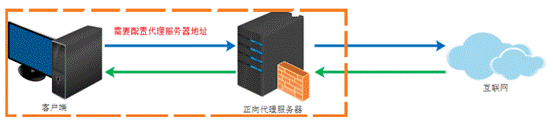
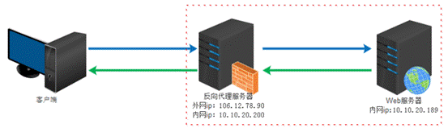

## 一、基本概念：

### 1、概念：

- Nginx是一款轻量级的Web服务器/反向代理服务器及电子邮件（IMAP/POP3）代理服务器，在BSD-like协议下发行。其特点是占有内存少，并发能力强，能支持高达5万个并发连接数。

- Nginx可以用于作正向代理、反向代理、负载均衡。


### 2、代理：

- 正向代理：

    - 正向代理类似与一个跳板机，代理访问外部资源，这个过程是客户端发起的代理。




- 反向代理：

    - 反向代理（Reverse Proxy）实际运行方式是指以代理服务器来接受internet上的连接请求，然后将请求转发给内部网络上的服务器，并将从服务器上得到的结果返回给internet上请求连接的客户端，此时代理服务器对外就表现为一个服务器。




- 负载均衡：

    - 使用反向代理将请求转发给内部服务器时的平均分配。

- 动静分离：

    - 为了加快网站的解析速度，即前后端分离项目所采用的思想，将动态的后端和静态的前端进行分离。其中后端服务可以允许在tomcat服务器上。而前端页面是纯静态的，则可以使用nginx进行部署解析。


### 3、下载安装：

- 使用yum安装即可。

- 常用命令（在nginx中sbin目录下执行）：

```shell
./nginx -v  // 查看版本号
./nginx  // 启动nginx
./nginx -s stop  // 关闭nginx
./nginx -s reload  // 重新加载配置文件
```


## 二、配置代理：

- 在nginx下的代理配置只需要操作nginx目录中nginx.conf文件即可。

- 配置文件组成：

    - 全局块：

        - 配置文件开始到events块之间的内容，用于配置nginx的用户（组），workerprocess数（越大支持的并发量越高），进程PID等变量。

    - events块：

        - 主要配置nginx服务器与用户的网络连接，如配置nginx的最大连接数等。

    - http块：

        - 用于配置代理、缓存、日志等。

        - http块也可以包含http全局块和server块。

        - http全局块主要包含文件引入、MIME-TYPE定义、连接超时时间、日志自定义、单链接请求数上限等。

    - server块（http块内）：类似与虚拟主机，而server块中又包含location块，一个http块可以有多个server块、一个server块可以有多个location块。

    - location块（server块内）：主要用与配置nginx接收到的请求URL，用于对请求进行处理等功能的配置。

```nginx
# 1 全局块
user nginx;
...

# 2 events块
events {
  worker_connections 1024;
}

# 3 http块
http {
  ...
  sendfile      on;
  tcp_nopush     on;
  tcp_nodelay     on;
  keepalive_timeout  65;
  ...

  # 4 server块
  server {
    listen    80;
    ...

    # 5 location块
    location = /404.html {
    }
  }
}
```
### 1、代理转发：

- 使用nginx接收请求后将请求转发至tomcat中。

```nginx
...
server {
  # 监听端口
  listen    80;

  # 服务名
  server_name tracejp.top;

  # 映射路径 /斜杠，映射到本机ip下
  location / {
    // 代理地址，代理后本机ip地址将等同proxy_pass地址
    proxy_pass http://<ip>:<port>;
  }
}
```
### 2、一个端口多个代理转发：

- 配置多个location即可实现访问一个端口从而根据匹配条件代理到不同的地址。

```nginx
...
server {
  listen    80;
  server_name tracejp.top;
    
  # 路径匹配 -> <server_name>/demo1 代理到 http://localhost:8081/demo1
  # 注意：路径匹配规则后的代理地址要拼接ip之后的值
  location /demo1 {
    proxy_pass http://localhost:8081;
  }

  # 区分大小写正则表达式匹配规则
  location ~ <正则> {...}

  # 不区分大小写正则表达式匹配规则
  location ~* <正则> {...}

  # server按照location从上至下进行规则查找然后匹配
  # 匹配成功后使用该规则下的代理
}
```
### 3、负载均衡配置：
```nginx
http {
  ...
  # 配置相同服务实例集群
  # 不配置weight默认为轮询策略，weight为权重，越大越容易被分配
  upstream <自定义集群名> {
    server <ip1:port1>; weight=3
    server <ip2:port2>; weight=5
    ...其他server
  }

  server {
    listen    80;
    server_name tracejp.top;
    location /{
      # 代理填集群名即可
      proxy_pass http://<集群名>;
    }
  }
}
```
### 4、服务代理常见代理头：

- 配置在location中即可。

```nginx
proxy_set_header HOST $http_host;
proxy_set_header X-Real-IP $remote_addr;
proxy_set_header REMOTE-HOST $remote_addr;
proxy_set_header X-Forwarded-For $proxy_add_x_forwarded_for;
```
### 5、代理静态文件：

- 请求后将静态文件发送给浏览器。

```nginx
server {
  listen    80;
  server_name tracejp.top;

  # <server_name> 代理到 <代理目录>
  location / {

    # root为代理目录
    root <代理目录>;

    # index为默认显示主页，可以有多个
    index index.html ...;
    
    # 展示目录下文件列表，访问
    autoindex on;
    
    文件缓存天数 - 相同客户端再此请求时直接返回缓存
    expires 7d;

  }

  // 加上匹配规则： <server_name>/demo1 代理到 <代理目录>/demo1
  location /demo1 {
    root <代理目录>;
  }

}
```


