2020.2.21

 

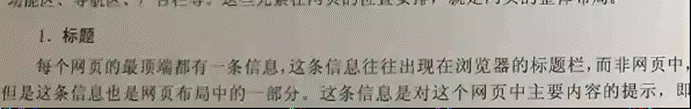

 
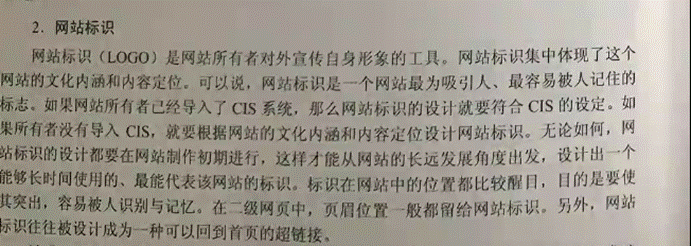

 

网站logo，配色等

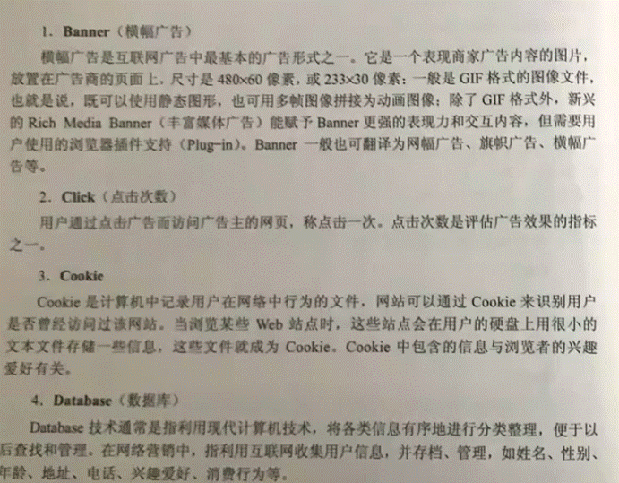

 
cookie：：网页的记录等

 

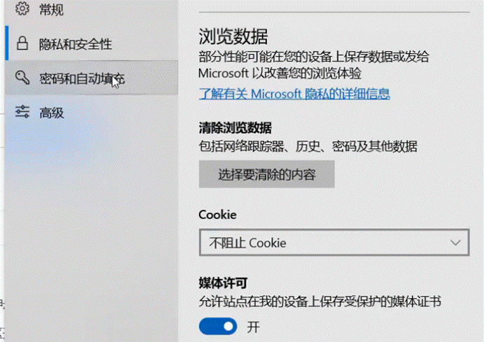

 

dw的“HelloWorld”

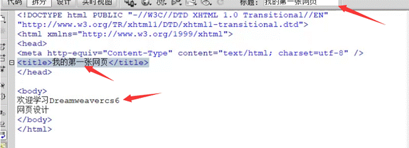

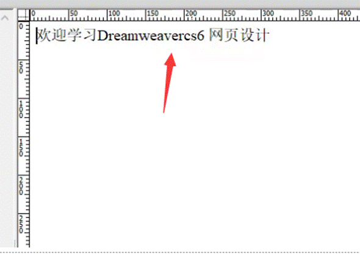

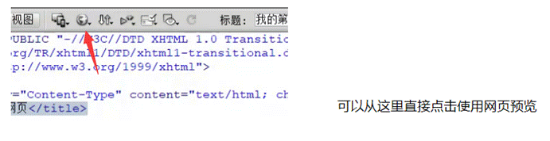

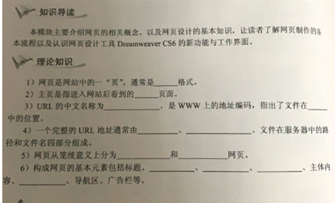

 
1.HTML

2.主

3.统一资源定位符 ， 服务器

4.协议名 ， Web服务器地址

5.静态 ， 动态

6.标题 ， 网站标识 ， 页眉 ， 页脚

2020.2.26

 

现代网站站点界面和内容一般可分为两种：

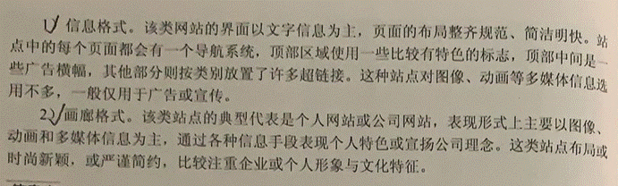

1.先找地方新建一个文件夹

 
2.单机新建站点：

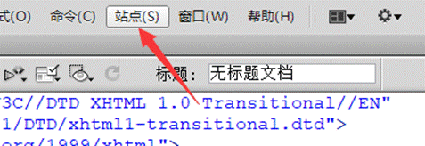

3.命名和选择创建文件夹：

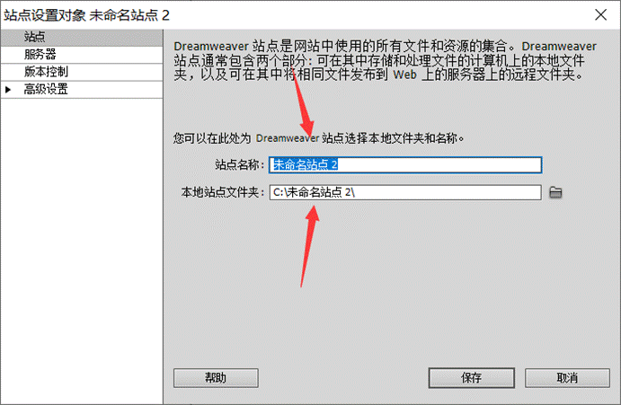

4.站点根目录：

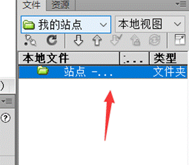
 

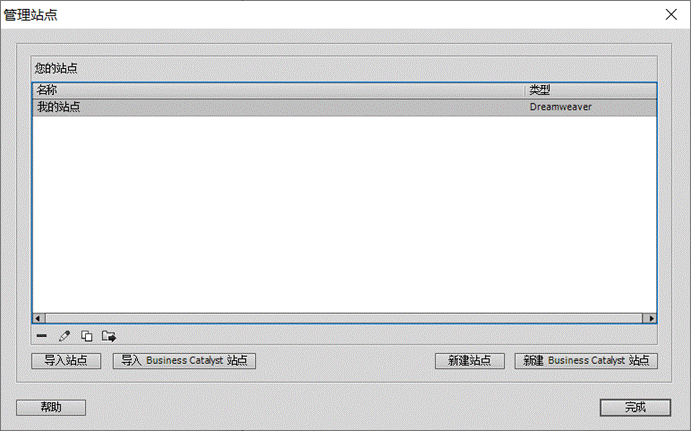

 

2020.2.28

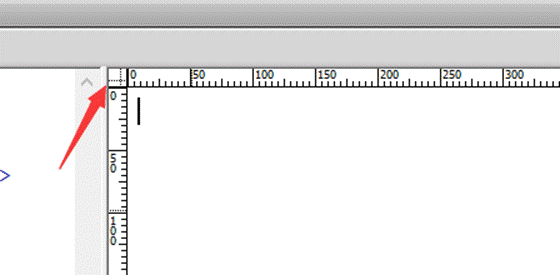

可以拖动该坐标调整原点位置
 

此时改到中间：

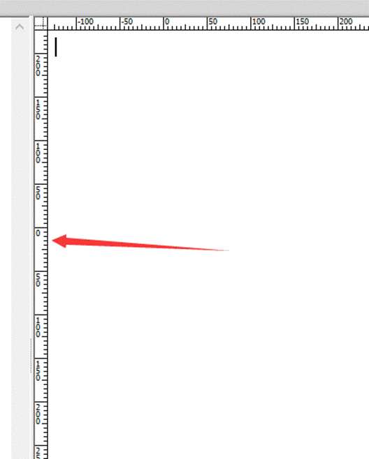

原点的改变有什么用：以单个对象的中心计算其他对象的距离更方便。

 

一般以左上角为原点。可以通过》查看/标尺/重设原点 》进行归零。

 

网格设置：

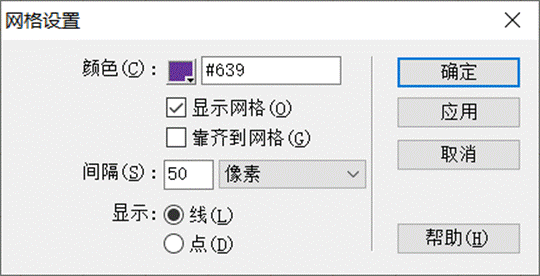

代码注释的添加：

<!--  -->

然后在空格中输入即可

eg.  <!--这是helloworld-->

 

 2020/03/06 

 

如何在网站中插入图片：

1.先在你的站点中放置你要插入的图片：

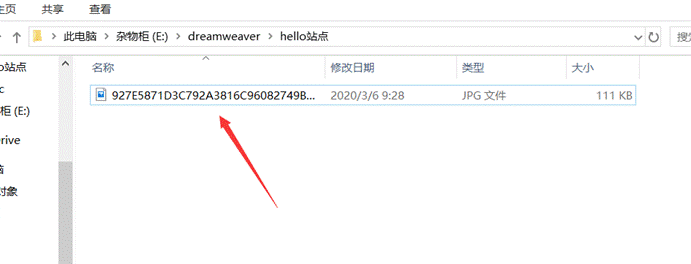

2.单击插入：

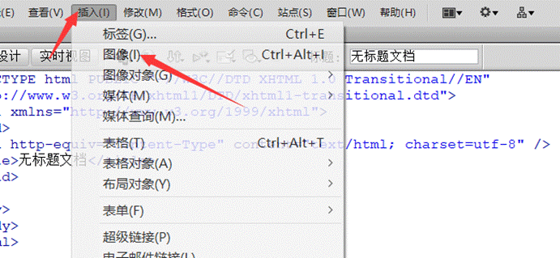

 

3.此时你的选择图像文件中出现了你所放的图片：

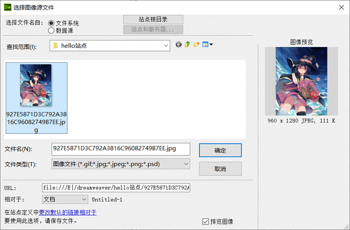

 

4.单击确定后：

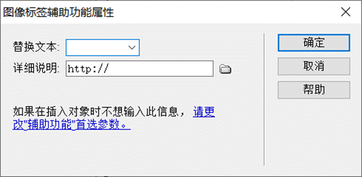

 

图片像素的更改：（可改变图片的横纵比例

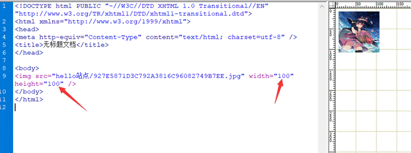

其中

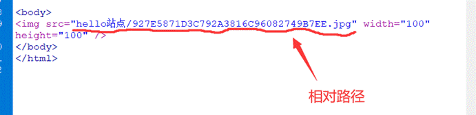

 

*当网页保存时，绝对路径变成相对路径。

所以当制作的网站需要发给其他人时，需要将站点与网页一并发送，否者一是路径错误，二是没有图片的源文件，该网站无法打开

 

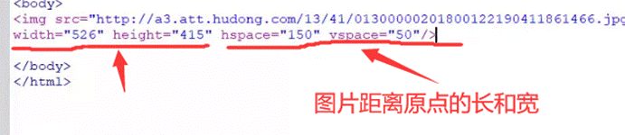

如下图：

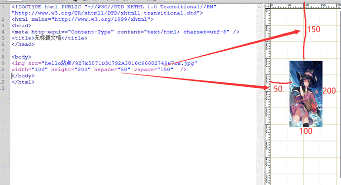

代码之间用空格分开/

图片：width    height 

坐标：hspace  vspace

 

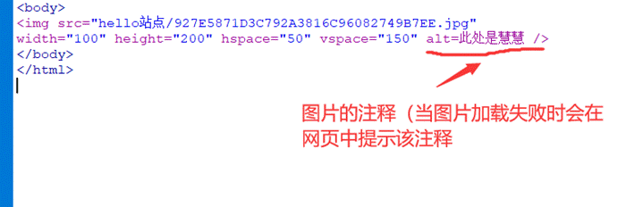

\~~~~~~~

插入列表：

 

以下是三个不同形式的插入列表：

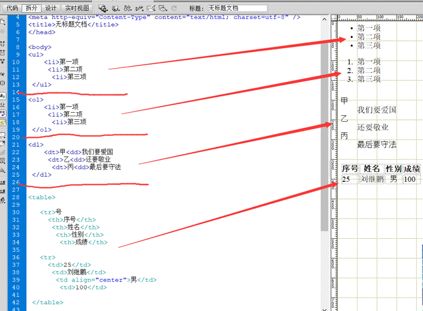

其中最后一个<table>是表格：（每一个<tr>代表一行）

align="center"表示字体居中，在<td>中使用

 

超链接：

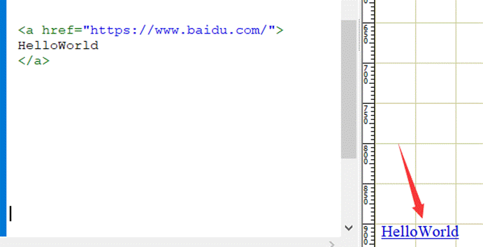

使用方法：

<a href="你想跳转的网址">

网址跳转的标记

</a>

超链接可以链接到网站，视频，图片等（exe文件，dlx文件等等）（例如跳转到一个该系统能打开的文件，他会自动启动并打开。或者跳转到exe文件时，他会提示你是否下载）

该标记可以是图片，字母，数字等，如此图

（通过将一张图片作为标记，当单机图片时便可跳转到百度）

 

css：（用于开发大量数据使用的语言）

**标记是对对象进行修饰

**类是对标记进行修饰

所以 类＞标记＞对象

 

优先级：行内式>id>class>标记

 

CSS的类型：

1.内联样式表

2.嵌入样式表

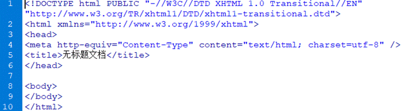

<mata标记的插入

*位置： 菜单栏\插入\HTML\头文件标签\Meta

属性http-equiv     值Content-Type   内容text/html;charset=utf-8

 

页面属性的直接修改：

*位置： 菜单栏\修改\页面属性

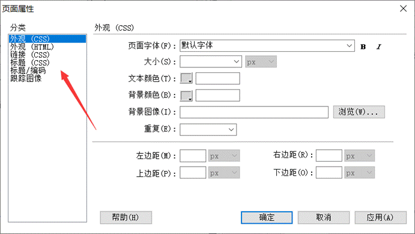

跟踪图像：通过跟踪图像可在页面插入一个图片，但是注意，此图片在网页中是看不到的，用于设计人员作为一个模板

外观设定对应代码在body中：

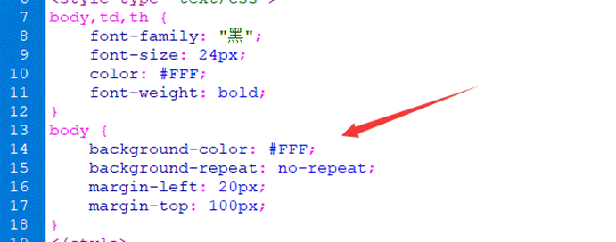

 

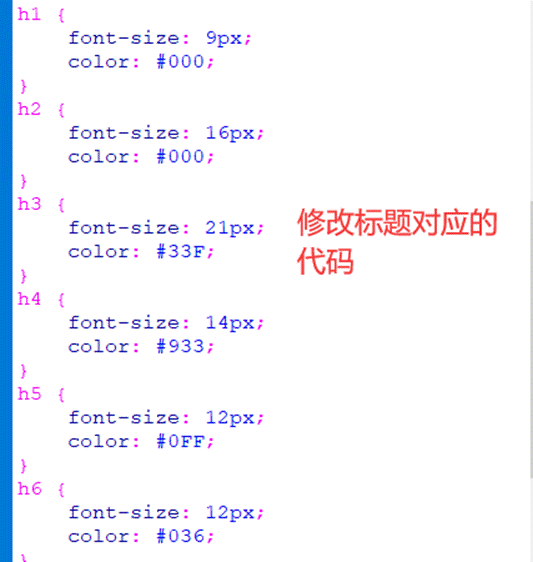

 

 作用是换行：

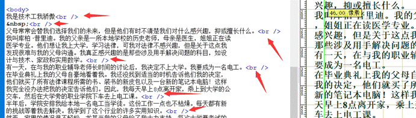

 

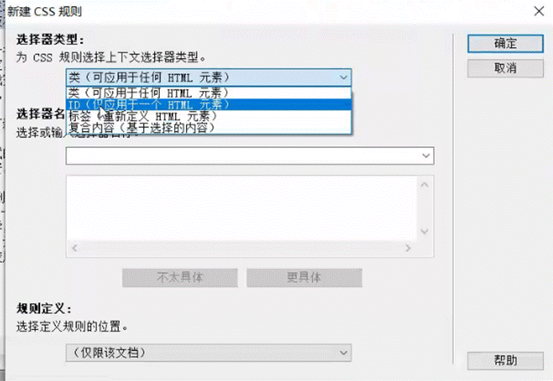

 

鼠标经过图像的插入（可以理解为贴吧幻影坦克）：

位置：插入\图像对象\鼠标经过图像

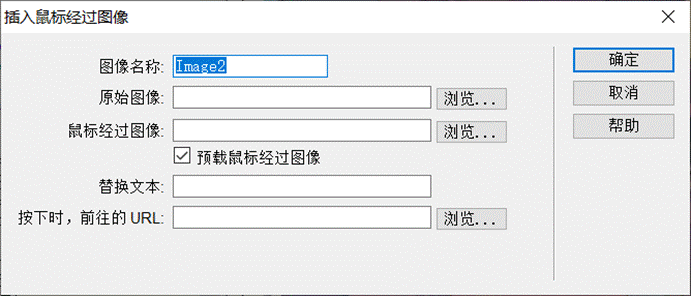

原始图像：当鼠标没有悬停在上面的时候所展示的图像

鼠标经过图像：当鼠标悬停时候的图像

 

导航条的制作：

 

插入媒体：

SWF：flash动画文件的后缀。

 

锚记标记：

跳转到局部链接。

局部：同一个网页中的某一个位置

锚会给出一个name和id

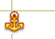

且会有个标识

此时，该锚的链接为#id

 

 

 

 2020/03/25

 

 

表格的建立：

<!--table代表开始做一个表格,一个tr代表一行，一个td代表一列--> 

<table width="300" height="300">   

<!-- 如果总宽度不够，则还会按照比例分配给行列-->

 

<tr>

<td width="100" height="100">1</td>

<td width="100" height="100">2</td>

<td width="100" height="100">3</td>

</tr>

 

<tr>

<td width="100" height="100">4</td>

<td width="100" height="100">5</td>

<td width="100" height="100">6</td>

</tr>

<tr>

<td width="100" height="100">7</td>

<td width="100" height="100">8</td>

<td width="100" height="100">9</td>

</tr>

</table>

上述代码完成功能为建立一个3x3的表格

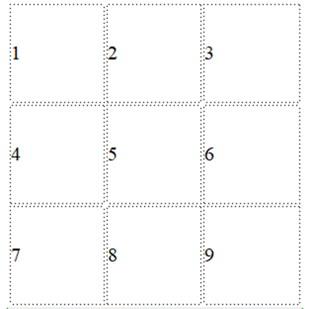

 

AP- div :

菜单栏/插入/布局对象/apdiv

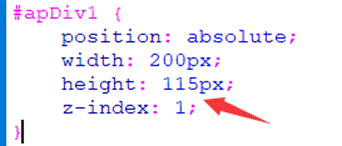

其中，z-index:1 意思为z轴的坐标，意思为第一层

 