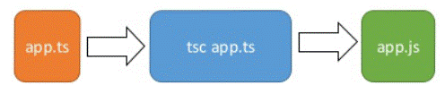

## 一、概念

### 1、概念

- 是以JavaScript为基础构建的语言，一个JavaScript的超集。可以在任何支持JavaScript的平台中执行。TypeScript扩展了JavaScript，并添加了类型。
- 即TypeScript -> 编译 -> JavaScript

### 2、安装（使用node.js安装）
```shell
npm install =g typescript
```
- 查看版本
```shell
tsc -v
```
### 3、HelloWorld
```shell
// 1 创建 .ts 文件 hello.ts
// 2 书写js代码 console.log("Hello World")
// 3 使用typescript命令进行编译
tsc hello.ts

// 4 得到编译后的js文件 hello.js
// 5 使用node命令执行js文件即可
node hello.js
```



## 二、基本语法

### 1、类型声明
```typescript
// 变量普通声明和赋值
let 变量: 类型
let 变量: 类型 = 值;

// 函数声明
funcation 函数名(形参1: 类型, 形数2: 类型, ...): 返回值类型 {
  ...
}
```
- 注意：如果变量的声明和斌值是同时进行的，TS可以自动对变量进行类型检测。例如

```typescript
let a = true  // 等同于 let a: boolean = true
```
### 2、类型表

| 类型                                            | 描述                             |
| ----------------------------------------------- | -------------------------------- |
| number                                          | 任意数字                         |
| string                                          | 任意字符串                       |
| boolean                                         | 布尔值true或false                |
| 字面量                                          | 限制变量的值就是该字面量的值     |
| any                                             | 任意类型（显式声明、关闭TS检测） |
| unknown                                         | 类型安全的any                    |
| void                                            | 没有值、undefined                |
| never                                           | 不能是任何值（连空都不是）       |
| object  {key1: value1, key2: value2, ...}       | 任意的JS对象                     |
| array  类型[] Array<类型>                       | 任意JS数组                       |
| tuple  [类型1, 类型2, ...]                      | 元组，TS新增类型，固定长度数组   |
| enum                                            | 枚举，TS中新增类型               |
| (形参1: 类型， 形参2: 类型,  ...) => 返回值类型 | 任意函数（箭头写法）             |

- any和unknown区别：

    - any变量赋值给其他变量后，其他变量也变成any。尽量避免使用any。

    - unknown变量则无法赋值给其他变量。


### 3、类型断言

- 可以用于告诉TS编译器变量的实际类型，防止误报

```typescript
let a: unknown
let b: string

// 使用断言即可免除报错，告诉ts此处a为string类型
b = a as string  // 写法1： 变量 as 类型
b = <string> a  // 写法2： <类型> 变量
```
### 4、枚举
```typescript
// 1 定义枚举
enum 自定义类型名 {
  key: value
  ...
}

// 2 使用枚举：定义后，该枚举实际上就是一个新的类型名
// 通过 类型名.key 即可调用
```
### 5、联合类型声明
```typescript
// 或 联合类型声明变量（该变量可以是多个类型，函数也类似）
let 变量: 类型1 | 类型2 | ...

// 和（建议只在对象中使用，在普通类型中无意义）
let 变量: {name: string} & {age: number}
```
### 6、创建类型别名
```typescript
type 新类型名 = 原类型名

eg. type myType = string
```


## 三、TS编译选项

### 1、编译TS
```shell
tsc <ts文件路径> [参数]
-w  // 监视模式，自动检测ts文件变化自动编译（热更新）
```
### 2、TS配置文件编译

- tsconfig.json配置文件：是ts编译器的配置文件，ts编译器可以根据它的信息来对代码进行编译。达到自定义编译效果的配置功能。

- 在ts文件目录下创建后，直接执行tsc命令，或tsc -w命令，即可对该目录下所有ts文件进行一键编译。

```json
/* tsconfig.json文件，ts下的此json文件可以使用注释 */
{
  /* 指定需要编译的文件，可以是通配符*（任意文件）或**（任意目录）。 */
  "include": ["", "", ...],

  /* 指定不需要编译的文件 */
  /* 默认值：["node_modules", "bower_components", "jspm_packages"] */
  "exclude": ["", "", ...],

  /* 定义被继承的配置文件，继承其他配置文件内容到此文件 */
  "extends": "<文件路径>"

  /* 指定需要编译的文件名，与include一致，但只能是文件名 */
  "files": ["", "", ...],

  /* compilerOptions编译器的选项 */
  "compilerOptions": {
    
    /* 指定ts编译成的js版本 */
    "target": "es6",

    /* 指定使用的模块化的规范 */
    "module": "es6",

    /* 用来指定项目中需要用到的库 */
    "Lib": [],

    /* 用来指定编译后文件所在的目录 */
    "outDir": "路径",

    /* 所有的全局作用域中的代码会合并成同—个文件中 */
    "outFiLe": "路径",

    /* 是否对JS文件进行编译，默认为faLse */
    "allowJs": false,

    /* 是否检查js文件代码是否符合语法规范 */
    "checkJs": false,

    /* 是否移除注释 */
    "removeComments":false,

    /* 不生产编译后的文件 */
    "noEmit": false,

    /* 当有错误时不生成编译后的文件 */
    "noEmitOnError": false,

    /* 所有严格检查的总开关 */
    strict": false,

    /* 用来设置编译后的js文件是否使用严格模式，默认fase */
    "alwaysStrict": false,

    /* 不允许隐式any类型 */
    "noImplicitAny": true,

    /* 不允许不明确类型的this */
    "noImplicitThis": false,

    /* 严格的检查空值 */
    "strictNullChecks": true,
  },
}
```

 


