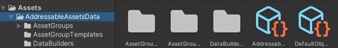

## 一、Addressables

- Addressables翻译过来是可寻址的意思，它是可寻址资源管理系统。是Unity从2018.2版本开始建议用于替代AssetBundle的高阶资源管理系统。在之后的Unity的新版本中，AssetBundle将渐渐被淘汰。

- Addressables和AssetBundle的区别：
    - Addressables是基于AssetBundle架构做的高阶流程


- Addressables的优点：
    - 自动化管理AB包打包、发布、加载
    - 可以更方便的进行本地、远程资源的加载
    - 系统会自动处理资源关联性（依赖）
    - 内存管理更方便

- 迭代更方便
- 参考文章：https://zhuanlan.zhihu.com/p/501300405

## 二、基本使用

### 1、安装

- 在Package Manager中安装即可

### 2、创建一个Addressables的配置文件

- 在菜单栏中window/Asset Management/Addressables/Groups即可打开Addressables的窗口。点击Create Addressables Settings即可创建。

- 创建完成后会在Assets文件夹下多出一个AddressableAssetsData的文件夹，里面就是Addressables的配置文件。



### 3、Addressables Groups面板讲解（与AssetBundle类似）：

- 其中每一个组就是一个AB包，一个AB包中有多个资源文件，可以通过New、Profile、Tools等选项修改AB包的配置和AB包、资源文件的增删改。

- Play Mode Script（放映模式脚本）：当在游戏开发过程中单击播放按键时，Addressables做出的行为。
    - Use Asset Database（fastest）：不做任何操作，只是使用原来的Assets文件下的资源进行映射。一般不使用此模式，无测试意义。
    - （推荐使用）Simulate Groups（advanced）：使用延迟模拟资源加载的过程。一般在开发时使用。
    - Use Existing Build（Windows）：真正的进行资源的构建和打包操作。一般在最后测试中使用。

- Build选项：进行打包，清除上次打包项（缓存）等操作。
- 列表项讲解：
    - GroupName / Addressable Name：即AB包名和资源名
    - Path：资源在Assets目录下的路径
    - Labels：当前资源的分类标签，可以通过标签来加载一类资源。


### 4、将资源加入AB包中

- 在资源的Inspector面板中勾选Addressable选项，或者将该资源拖动到Addressables Groups面板中即可表明该资源是一个可寻址的资源（AB包中的资源）。


### 5、使用AB包资源文件

- 引用资源：
    - 通过Addressables中预设的类，可以对Groups面板中的资源进行引用。
```c#
// 使用命名空间
using UnityEngine.AddressableAssets;

AssetReference  // 通用资源标识类可以用来加载任意类型资源

AssetReferenceAtlasedSprite  // 图集资源标识类

AssetReferenceGameobject  // 游戏对象资源标识类

AssetReferenceSprite  // 精灵图片资源标识类

AssetReferenceTexture  // 贴图资源标识类

AssetReferenceTexture2D

AssetReferenceTexture3D

AssetReferenceT<>  // 指定类型标识类
```
- 加载资源：
    - 注意：在Addressables中，所有的资源必须使用异步方式进行加载。也可以使用同步（被弃用）。
```c#
// 使用命名控件
using UnityEngine.ResourceManagement.AsyncOperations;

private void Start() {
  // 1 绑定资源变量（以预设体资源GameObject为例）
  AssetReference assetReference;
  // 2 加载资源（会返回一个句柄对象）
  AsyncOperationHandle<GameObject> handle = assetReference.LoadAssetAsync<GameObject>();
  // 3 向句柄对象中注册委托事件（也可以使用lambad表达式简写）
  // 通过回调的方式来执行资源异步加载后的回调函数
  handle.Completed += Handle_Completed;  
}

// 3.1 回调函数
private void Handle_Completed(AsyncOperationHandle<GameObject> handle) {
   // 4 通过句柄对象判断加载的状态
  if (handle.Status == AsyncOperationStatus.Successded) {
      // 5 加载成功，实例化对象
      Instantiate(handle.Result);
  }
}
```
- 使用lambad表达式简写：
```c#
AssetReference assetReference;

assetReference.LoadAssetAsync<GameObject>().Completed += (handle) => {
  // ...回调方法体
}
```


