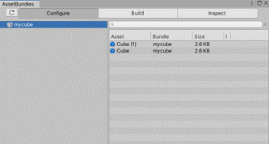

## 一、AssetBundle

- AssetBundle是特定于平台的资产压缩包，有点类似压缩文件。
    - 资产包括︰模型、贴图、预设体、音效、材质球等等；但不包括C#代码，所以热更新c#代码必须配合使用rua。

- 相对Resources下的资源，AB包更好管理资源 ，减小包体大小，热更新，可以将资源放在服务器上，通过网络进行加载。


- 热更新：


# **二、基本使用**

### 1、使用官方打包工具Asset Bundle Browser

- 注意：只能在Unity2019版本使用。在Package Manager中安装即可

### 2、将资源关联到AB包中

- 可以在Inspector面板中单选或批量选择资源或预设体（除c#代码）指定打包的组
    - 为什么能顺便打包预设体中的c#脚本：因为预设体本质是一个文件，其中的组件是通过文件uuid的形式关联其他的脚本，打包预设体，本质上就是打包关联的文件。


- 指定后在菜单栏/window/AssetBundles中即可看到关联的资源和组



### 3、打包（生成AB包资源文件）

- 通过Build选项卡即可进行打包相关的设置

    - Build Target：打包的目标平台，在AB包中，对每个平台都要单独打一次包
    - Output Path：输出路径（打包到本工程目录下的路径 + 设置的路径 + 文件名）
    - Clear Folders：清除上次打包的文件，清除缓存
    - Copy to StreamingAssets：是否将打包文件复制到工程的Assets文件夹下
        - 为什么要复制到Assets文件夹下：在Unity3D工程打包的时候，只会将Assets文件夹下的文件打包，所以外部的文件是不会打包进去的，要对AB包进行操作则只能将其导入到Assets文件夹下。
        - 并且此文件夹在PC中是可读可写，在安卓和IOS下是只读的。

    - Compression：压缩的方式，主要包括
        - No Compression：不压缩，解压快，包较大
        - LZMA：压缩率大，文件最小，但解压很慢（用包中的一个资源要解压所有资源）
        - （推荐）LZ4：压缩率小，文件比较大，解压速度快（用包中的什么就解压什么）


- 其他参数解读：


### 4、加载（使用AB包资源文件）

- 同步加载
```c#
// 1 加载AB包
// Application.streamingAssetsPath：Assets文件夹的路径
// 参数为 Assets文件夹的路径/AB包名
AssetBundle ab = AssetBundle.LoadFromFile(Application.streamingAssetsPath + "/" + "mycube");

// 2 加载AB包中的资源
// 使用AB包文件对象并指定返回的类型 和 包中的资源或预设体名 即可加载
GameObject obj = ab.LoadAsset<GameObject>("Cube");

// 3 实例话此资源即可进行操作
Instantiate(obj);
```
- 异步加载（使用协程进行异步加载）
```c#
// 开始一个协程
StartCoroutine(LoadAbResAsync("mycube", "Cube"));

IEnumerator LoadAbResAsync(string ABName, string resName)
{  
  // 创建一个异步加载AB包的请求
  AssetBundleCreateRequest abcr = AssetBundle.LoadFromFileAsync(Application.streamingAssetsPath + "/" + ABName);

  // 异步加载AB包中的资源
  AssetBundleRequest abq = abcr.assetBundle.LoadAssetAsync<GameObject>(resName);

  // 等待加载完成后返回
  yield return abq;
}
```
### 5、卸载AB包
- 注意：同一个AB包只能被加载一次。所以要再此加载之前，需要卸载已经加载的AB包
```c#
// 卸载所有加载的AB包
// 参数为true时，会把AB包中加载的资源也一并卸载，如果已经挂载到组件上则将直接丢失
AssetBundle.UnloadAllAssetBundles(false);

// 卸载单个的AB包（自己卸载自己）
// 参数为true时，会把AB包中加载的资源也一并卸载
AssetBundle ab = AssetBundle.LoadFromFile(Application.streamingAssetsPath + "/" + "mycube");

ab.Unload(false);
```
### 6、AB包的依赖关系

- 当一个资源身上用到了别的AB包中的资源（例如预设体放到了cube组中，而预设体中引用的材质放到了spr组中），此时如果只加载自己的AB包通过它创建对象会出现资源丢失的情况（因为其他的AB包没有被加载）。所以需要把依赖包一起加载了才能正常。
- 解决方法，通过主包文件查找到当前包的依赖关系，并把依赖的所有AB包都一并加载即可。
    - 主包：AB包打包的时候，会生成一个主包文件，命名为文件名
```c#
// 加载AB包
AssetBundle ab = AssetBundle.LoadFromFile(Application.streamingAssetsPath + "/" + "<AB包名>");

// 加载主包
AssetBundle abMain = AssetBundle.LoadFromFile(Application.streamingAssetsPath + "/" + "<主包名>");

// 加载主包中的固定文件（AssetBundleManifest是固定写法）
AssetBundleManifest abMainfest = abMain.LoadAsset<AssetBundleManifest>("AssetBundleManifest");

// 得到当前AB包名的依赖AB包名字符串集合
string[] strs = abMainfest.GetAllDependencies("<AB包名>"); 

// 遍历加载所有依赖的AB包
for (int i = 0; i < strs.Length; i++)
{
    AssetBundle.LoadFromFile(Application.streamingAssetsPath + "/" + strs[i]);
}
```


